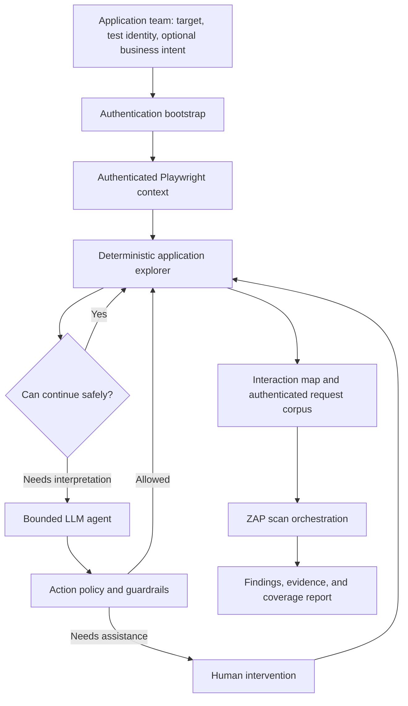

# Design Proposal: Human-Assisted Authenticated Application Discovery for Enterprise DAST

**Status:** Proposed  
**Document type:** Architecture and MVP design proposal  
**Primary security engine:** OWASP ZAP  
**Discovery technology:** Playwright-based browser automation  

## 1. Executive Summary

This proposal defines an enterprise DAST capability that reduces application-team onboarding friction while improving authenticated application coverage.

The platform will not require application teams to record every step of an authenticated workflow. Instead, it will use a **human-assisted, not human-scripted** model:

1. A human or approved automation completes authentication when login presents a difficult task such as SSO, MFA, CAPTCHA, or an unusual business-specific step.
2. A Playwright-based **Authenticated Application Explorer** continues within the established browser session.
3. Deterministic logic performs most navigation, state tracking, route discovery, and network capture.
4. A bounded LLM agent is invoked only when semantic reasoning is needed to continue safely.
5. A human is asked to intervene only when automation remains blocked or an action requires approval.
6. The discovery layer produces an **authenticated request corpus and application interaction map**, which are supplied to ZAP for security scanning.

ZAP remains the deterministic vulnerability-testing engine. The LLM does not perform the scan and is not allowed to bypass safety, authorization, or resource limits. The agent operates only inside a controlled portion of the larger DAST workflow.

## 2. Problem Statement

The existing enterprise DAST approach has significant onboarding and usability friction. Requiring application teams to define or record complete authenticated workflows shifts too much implementation burden to users and discourages adoption. It also creates brittle scripts that may fail as application interfaces change.

Traditional unauthenticated crawling is insufficient for modern applications because meaningful functionality often exists behind login and may be exposed only after JavaScript interactions, searches, forms, role-specific navigation, or API calls.

The platform therefore needs to discover authenticated application behavior with minimal human effort while remaining safe, observable, bounded, and suitable for enterprise governance.

## 3. Goals

- Minimize the work required from application teams to onboard an authenticated application.
- Reuse an authenticated Playwright browser context, including approved cookies, tokens, and browser storage.
- Discover UI routes, API endpoints, request structures, parameters, forms, and important application states.
- Use deterministic exploration for the common case and LLM reasoning only where it adds measurable value.
- Prevent destructive, privileged, irreversible, or out-of-scope interactions.
- Produce inputs that ZAP can use effectively, including request details rather than only route URLs.
- Measure discovery coverage and explain why exploration stopped.
- Provide evidence and normalized results that can eventually integrate with enterprise security attestations and deployment governance.

## 4. Non-Goals

- Replacing ZAP as the vulnerability-scanning engine.
- Giving an LLM unrestricted control of a browser or application.
- Guaranteeing exhaustive coverage of every possible UI state or business workflow.
- Automatically bypassing MFA, CAPTCHA, access controls, or application protections.
- Performing destructive business transactions in production.
- Allowing the LLM to make final authorization, safety, or policy decisions.
- Forking or deeply modifying ZAP during the initial MVP.

## 5. Core Design Principles

### 5.1 Human-assisted, not human-scripted

Humans participate at exception points rather than recording every application step. Examples include completing MFA, explaining a business-specific input, supplying approved test data, or approving an action classified as sensitive.

### 5.2 Deterministic by default

Ordinary links, safe navigation, network observation, deduplication, route normalization, queue management, retry limits, and policy enforcement are implemented in code.

### 5.3 Selective agentic reasoning

The LLM is called only when the deterministic explorer cannot confidently choose a safe and useful next action. This limits cost, latency, and nondeterminism.

### 5.4 Policy before execution

The agent may propose an action, but a deterministic action-policy layer decides whether that action is allowed, blocked, or requires human approval.

### 5.5 Requests, not routes alone

The discovery output must preserve enough HTTP context for useful scanning: method, URL pattern, parameters, body shape, content type, authentication context, and selected headers. A list of URLs is not sufficient for modern API-driven applications.

### 5.6 Bounded autonomy

All exploration is constrained by scope, permitted actions, maximum steps, runtime, retries, LLM cost, application roles, and scan environment.

## 6. Proposed Architecture



The overall process remains a controlled workflow. The bounded agent loop exists only within authenticated application discovery.

## 7. End-to-End Process

### 7.1 Onboarding and scan configuration

The application team supplies the minimum required information:

- Authorized target origins and environments.
- Approved test identity or credential reference.
- Application role to exercise.
- Authentication method and any known human-assistance requirement.
- Explicitly excluded routes, operations, or data domains.
- Optional business intent, such as `Claims`, `Policy Management`, `Billing`, or `Documents`.
- Approved test-data sources or representative identifiers, when available.

Business intent is preferable to a recorded script. It gives discovery a set of semantic goals without forcing the team to define every click.

### 7.2 Authentication bootstrap

Authentication is treated separately from application exploration.

The system first attempts an approved reusable authentication method. If the flow includes MFA, CAPTCHA, unfamiliar SSO behavior, or another unsupported step, the browser session is handed to a human. After login succeeds, the Playwright browser context retains the permitted session state and passes it to the explorer.

Authentication success must be verified using multiple signals rather than assumed from the absence of an error. Signals may include:

- Expected post-login URL or page marker.
- Presence of authenticated navigation elements.
- Absence of redirects to a login endpoint.
- Successful access to a known authenticated resource.
- Expected session cookie or token presence without exposing secret values.

### 7.3 Deterministic exploration

The explorer performs a bounded graph traversal over reachable application states. It can:

- Follow same-scope links.
- Inspect links, buttons, forms, frames, and client-side routes.
- Execute JavaScript through the browser as required by the application.
- Observe XHR, fetch, GraphQL, document, and selected WebSocket traffic.
- Identify newly reachable UI states and API requests.
- Queue unexplored safe navigation targets.
- Detect authentication loss and invoke the approved recovery path.
- Normalize resource-specific routes such as `/orders/123` and `/orders/456` into `/orders/{id}`.
- Deduplicate equivalent pages, requests, and repeated list items.
- Avoid revisiting application states that add no new coverage.

### 7.4 LLM escalation

The deterministic explorer escalates only when it cannot make safe progress. Examples include:

- A form requires a semantically valid value such as a policy number.
- Several controls exist and their meaning cannot be inferred from stable attributes.
- A multi-step interface hides routes until a business-relevant selection is made.
- The explorer must interpret whether two states are materially different.
- Optional business goals remain undiscovered and the agent must suggest a navigation strategy.

The agent receives a minimized, sanitized representation of current state rather than unrestricted secrets or the entire browser history. It may propose a structured action such as:

```json
{
  "action": "fill_and_submit",
  "target": "policy-search-form",
  "input_source": "approved_test_data.policy_number",
  "reason": "Required to reach the claims detail workflow",
  "expected_new_coverage": ["claims-detail", "claims-api"]
}
```

The orchestration layer validates this proposal before executing it through Playwright.

### 7.5 Human escalation

Human assistance is requested only when:

- Authentication requires an interactive step automation cannot complete.
- Required test data is unavailable or ambiguous.
- A potentially sensitive action has no preapproved safe substitute.
- The LLM cannot identify a safe next step with adequate confidence.
- A business-specific workflow cannot be inferred from observable application state.

The human should receive a focused request containing the current state, the blocker, the proposed next action, the risk classification, and the minimum information required to continue.

### 7.6 ZAP ingestion and scanning

After discovery reaches a stopping condition, the platform converts the collected interaction data into ZAP-compatible inputs. Depending on the application and ZAP capabilities, this may include:

- Imported requests or traffic archives.
- OpenAPI, GraphQL, or other discovered API definitions.
- ZAP context and scope configuration.
- Authentication/session handling configuration.
- Seed URLs and normalized endpoint families.
- Request bodies and parameter shapes with sensitive values removed or replaced.

ZAP then performs the approved passive and active scan stages. The scan orchestrator, not the LLM, enforces scan policy, concurrency, rate limits, timeouts, and target authorization.

## 8. Authenticated Request Corpus

The principal discovery artifact is an authenticated request corpus, not merely a route inventory.

Each normalized request record should contain fields such as:

| Field | Purpose |
| --- | --- |
| UI state or origin | Explains which interaction produced the request |
| HTTP method | Distinguishes read and mutation behavior |
| Normalized URL pattern | Groups resource instances into endpoint families |
| Parameter names and locations | Identifies path, query, header, and body inputs |
| Body schema or shape | Enables replay and testing without retaining unnecessary sensitive values |
| Content type | Supports correct request construction |
| Authentication context reference | Associates the request with a role/session without exposing credentials |
| Response status and shape | Helps validate replay and authentication state |
| Business-area label | Maps technical coverage to application intent |
| Safety classification | Records whether replay or mutation is permitted |

Secrets, raw tokens, passwords, and prohibited sensitive data must not be placed in LLM prompts or retained in ordinary discovery records.

## 9. Application Interaction and Coverage Model

The platform should maintain a graph with UI states and request families as nodes and navigation or network-trigger relationships as edges.

Coverage should be reported across several dimensions:

- Unique normalized UI routes visited.
- Unique API endpoint families observed.
- HTTP methods observed per endpoint family.
- Forms and input types encountered.
- Business areas or user-supplied intents reached.
- Roles exercised.
- GraphQL operations and WebSocket endpoints observed.
- Blocked, skipped, or approval-required interactions.
- Requests successfully replayed or accepted by ZAP.

The platform must avoid claiming complete application coverage. It should report **observed coverage**, identified gaps, and the stopping reason.

## 10. Action Safety Model

Actions are classified before execution.

| Classification | Examples | Default treatment |
| --- | --- | --- |
| Safe navigation | Follow link, open tab, expand menu, paginate | Execute automatically within scope |
| Safe read/query | Search approved test data, apply filter, view details | Execute when inputs are approved |
| Controlled mutation | Create temporary test object, save reversible preference | Require explicit policy and cleanup plan |
| High-risk or destructive | Delete, transfer money, cancel order, submit payment, change password, create credential | Block by default; require explicit exceptional approval |
| Out of scope | External origin, administrative area not authorized, production transaction | Block |

Enforcement should combine:

- Allowlisted origins and route boundaries.
- Denylists for known destructive verbs, labels, endpoints, and HTTP operations.
- Application-provided exclusions.
- Environment classification.
- Role and identity restrictions.
- Request-method and endpoint policies.
- Human approval for explicitly configured exceptions.

The LLM may contribute a risk signal but cannot override deterministic policy.

## 11. Agent Execution and Termination

The agent is an LLM operating inside a controlled execution loop:

1. Observe a sanitized representation of browser and discovery state.
2. Propose a structured action or declare that it cannot safely proceed.
3. Validate the proposal through deterministic policy.
4. Execute approved actions through Playwright.
5. Record the result and newly discovered coverage.
6. Repeat only while a termination condition has not been met.

Two kinds of stopping conditions are required.

### 11.1 Semantic stopping

Exploration may stop when:

- No unseen safe actions remain.
- No new route, request, or business-area coverage is being produced.
- All configured business intents have been reached or explained as unreachable.
- The agent determines that further actions would be duplicative or unsafe.

### 11.2 Hard stopping

The orchestration layer enforces limits such as:

- Maximum browser actions.
- Maximum pages or application states.
- Maximum agent turns.
- Maximum authentication retries.
- Maximum runtime.
- Maximum LLM cost or token use.
- Maximum requests per second.
- Maximum repeated no-progress steps.
- Scan-window and environment restrictions.

On termination, the system records the reason and passes the usable discovery corpus forward even if coverage is incomplete.

## 12. Component Responsibilities

| Component | Primary responsibility |
| --- | --- |
| Onboarding API/UI | Collect scope, identity references, exclusions, intent, and test-data configuration |
| Authentication service | Establish and verify the permitted browser session; coordinate human assistance |
| Playwright browser worker | Render the application, perform approved interactions, and capture network events |
| Deterministic explorer | Traverse states, manage queues, deduplicate, normalize, and track coverage |
| LLM agent | Interpret ambiguous UI state and propose bounded next actions |
| Action-policy engine | Allow, block, or require approval for every proposed interaction |
| Human-assistance service | Present focused exception tasks and resume suspended sessions |
| Discovery store | Persist the interaction graph, normalized request corpus, evidence, and stopping reason |
| ZAP orchestrator | Convert discovery artifacts, execute scans, and enforce scan limits |
| Findings normalizer | Normalize findings and link them to requests, routes, evidence, and coverage |
| Governance integration | Publish approved evidence or attestations for downstream policy decisions |

## 13. Trust Boundaries and Security Considerations

- Treat application page content as untrusted input and defend against prompt injection.
- Do not let page text redefine system instructions, safety rules, scope, or available tools.
- Expose only narrowly scoped, schema-validated tools to the agent.
- Keep credentials and session secrets outside model context.
- Redact tokens, cookies, personal data, and prohibited content from logs and prompts.
- Encrypt retained session and scan data and apply short, configurable retention periods.
- Use isolated, ephemeral browser and ZAP workers.
- Restrict network egress to explicitly authorized targets and required platform services.
- Maintain complete audit logs of proposed, approved, blocked, and human-authorized actions.
- Ensure active scanning is performed only against approved environments and within agreed rate limits.
- Use dedicated test identities and test data wherever possible.

## 14. Failure and Recovery Behavior

The design should explicitly handle:

- **Session expiration:** pause, reauthenticate through the approved method, verify success, and resume from the last valid state.
- **Crawler loops:** use state fingerprints, route normalization, transition limits, and no-progress detection.
- **Application instability:** retry only safe idempotent actions within configured limits.
- **LLM uncertainty:** request human input or skip the branch; do not guess with high-impact actions.
- **ZAP replay failure:** retain the original discovery evidence, report the failed request family, and distinguish discovery coverage from scan coverage.
- **Human timeout:** checkpoint the session where possible and terminate with a clear incomplete-coverage status.
- **Model or agent unavailability:** continue deterministic discovery and produce a reduced-capability result.

## 15. MVP Proposal

### Phase 0: Baseline measurement

Select representative authenticated applications and define a manual ground-truth inventory of key routes, API families, and business areas. This creates a basis for measuring discovery value.

### Phase 1: Deterministic authenticated discovery

Build the first useful path without requiring an LLM:

- Human-assisted authentication in Playwright.
- Authentication verification.
- Same-scope deterministic navigation.
- Network request capture.
- Route and request normalization.
- State deduplication and bounded traversal.
- Request-corpus export.
- ZAP ingestion and scan execution.
- Coverage and stopping-reason report.

This phase answers the most important early question: **What percentage of the authenticated application can be discovered without an LLM?**

### Phase 2: Bounded LLM escalation

Add the agent only for measured deterministic failure modes:

- Ambiguous controls.
- Semantically constrained form inputs.
- Goal-directed discovery based on business intent.
- Selection among safe alternative navigation actions.
- Detection of likely duplicate or low-value branches where deterministic rules are insufficient.

All actions remain subject to deterministic policy.

### Phase 3: Human exception workflow and enterprise hardening

- Focused assistance requests and resumable sessions.
- Approval workflow for configured sensitive actions.
- Strong isolation, audit, data retention, and operational controls.
- Multi-role discovery.
- Reliability, scale, and worker-pool management.
- Enterprise reporting and normalized evidence.

### Phase 4: Advanced testing and governance integration

- Controlled authorization testing, including carefully designed BOLA/IDOR scenarios.
- Test-data integrations.
- Change-aware rediscovery and targeted rescanning.
- Findings triage assistance.
- Security attestation and policy integration with the broader secure-delivery ecosystem, while retaining OPA or the designated policy service as the decision point.

## 16. Success Metrics

The MVP should be evaluated using measurable outcomes:

| Metric | Desired interpretation |
| --- | --- |
| Onboarding effort | Minutes of application-team work, not number of scripted steps |
| Deterministic discovery rate | Percentage of ground-truth route/request families found without LLM help |
| Incremental agent value | Additional meaningful coverage produced by LLM escalation |
| Human intervention rate | Number and duration of exception tasks per application |
| Request replay success | Percentage of captured request families successfully made usable by ZAP |
| Authenticated scan coverage | Portion of discovered authenticated request families actually scanned |
| Safety-policy effectiveness | No unauthorized or destructive action executed |
| Cost and duration | Browser, ZAP, and LLM resource use per scan |
| Stability | Repeatability of discovery and scan results across runs |
| Adoption | Applications onboarded and scans completed without specialist support |

## 17. Key Risks and Mitigations

| Risk | Mitigation |
| --- | --- |
| State-space explosion | Normalize dynamic routes, deduplicate templates, cap branching, prioritize novel coverage, and enforce hard limits |
| Destructive interaction | Deterministic action policy, blocked operations, test environments, dedicated identities, and approval gates |
| Prompt injection from the target application | Treat page content as data, minimize context, isolate instructions, constrain tools, and validate every action |
| High LLM cost or latency | Deterministic-first exploration, event-based escalation, caching, compact state representations, and cost limits |
| Missed hidden workflows | Optional business intent, approved test data, coverage gaps, multi-role runs, and targeted human hints |
| False confidence in coverage | Report observed coverage and gaps; never label the result exhaustive without evidence |
| Session leakage or secret exposure | Ephemeral workers, secret references, redaction, encryption, and limited retention |
| Captured request cannot be replayed | Capture request context and response validation; report discovery and scan coverage separately |
| Brittle UI selectors | Prefer semantic locators and stable application attributes; rely on network evidence where possible |
| Active scan affects the application | Scope controls, safe environment requirements, rate limits, scan policies, and kill switches |

## 18. Open Design Decisions

The following items require validation during the MVP:

1. Which Playwright state fingerprint best distinguishes meaningful UI states without overcounting cosmetic differences?
2. Which request-export mechanism gives ZAP the most reliable authenticated replay for the target application patterns?
3. How will browser authentication state be transferred or reproduced safely for ZAP workers?
4. Which controls are safe enough for automatic interaction, and how will application teams add exclusions?
5. What approved test-data sources are available for semantically constrained forms?
6. What minimum coverage thresholds are meaningful for different application types?
7. How should single-page applications, GraphQL, WebSockets, file uploads, and multi-tab workflows be prioritized?
8. Which human-assistance mechanism can securely pause and resume a browser session?
9. What data may be sent to the selected LLM under enterprise privacy requirements?
10. Which application categories should be excluded from active scanning or autonomous interaction during the MVP?

## 19. Recommended Initial Experiment

Implement Phase 1 against two or three representative non-production applications:

- One conventional server-rendered application.
- One JavaScript-heavy single-page application.
- One application with SSO/MFA and a form requiring meaningful business data.

For each application, compare:

1. A manually established ground-truth inventory.
2. Deterministic authenticated discovery results.
3. ZAP-ingested and actually scanned request families.
4. Points where deterministic exploration becomes blocked.

Only after collecting those failure points should the team implement the first LLM tools. This keeps the agent scope evidence-based and provides a direct measure of whether the LLM improves coverage enough to justify its cost and operational complexity.

## 20. Proposed Decision

Proceed with a deterministic-first MVP consisting of:

> **Human-assisted authentication → Playwright authenticated exploration → network/request capture → request and route normalization → ZAP ingestion → findings and coverage reporting**

Add a bounded LLM agent in the next phase only for demonstrated semantic blockers. Preserve deterministic authorization, safety, policy enforcement, resource limits, and termination controls throughout the platform.

