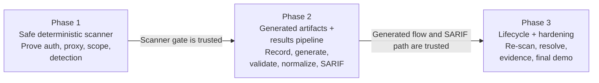
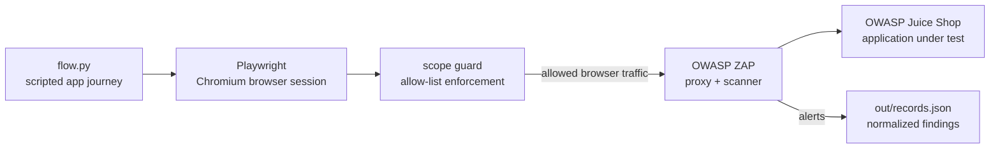

# DAST POC — Phase 1 Demo
## The Visible Minimum Viable Scanner Gate

Proving we can safely scan a live web application end-to-end — authenticate through a proxy, stay in scope, and produce a real finding — *before* any LLM generates anything.

Presenter: Cherry Yang · Developer Experience & Platform (DevXP)

---

## Agenda

* The big picture: three POC gates and where Phase 1 fits
* What Phase 1 proves (the four gate conditions)
* How the pieces fit together (architecture)
* Live demo walkthrough
* Independent proof that scanning was authenticated
* Guardrails: failing closed and staying in scope
* Evidence, wrap-up, and what comes next

---

## The Big Picture — Three Gates



The POC is split into three gates:

* Phase 1 proves the scanner can safely authenticate through ZAP, stay in scope, and produce a real finding.
* Phase 2 replaces the hand-authored flow with generated artifacts and proves the deterministic results path into SARIF / GitHub.
* Phase 3 proves lifecycle behavior: scan, fix, re-scan, and show open / resolved state.

Today is Phase 1 — because every later phase depends on this scanner gate being trustworthy.

**Look at:** `docs/dast_poc_requirements.md` — the requirements and scope boundary these three gates are derived from.

---

## What the Full POC Becomes

```mermaid
flowchart LR
  Human["User/app owner<br/>Input: app URL +<br/>login journey<br/>Output: demo intent"]
  Record["record CLI<br/>Input: app URL +<br/>browser actions<br/>Output: trace.json,<br/>index.json"]
  Generate["generate CLI<br/>Input: trace.json,<br/>contracts<br/>Output: flow.py,<br/>scope.json, policy,<br/>manifest"]
  Validate["validate CLI<br/>Input: generated bundle<br/>Output:<br/>validation-report.json"]

  Scope[/"Scope artifact<br/>scope.json<br/>Consumed as:<br/>scan boundary"/]
  Flow[/"Flow artifact<br/>flow.py<br/>Consumed as:<br/>Playwright instructions"/]
  Playwright["Playwright-controlled<br/>Chromium<br/>Launched by<br/>runner/replay.py<br/>Output: browser traffic"]
  Guard["ScopeGuard<br/>runner/scope_guard.py<br/>Output:<br/>allow/block decisions"]
  Zap["OWASP ZAP<br/>Input: proxied traffic<br/>+ scan command<br/>Output: raw alerts JSON"]
  Juice["OWASP Juice Shop<br/>Input: HTTP requests<br/>Output: app responses<br/>+ vulnerabilities"]
  Runner["runner<br/>Input: flow.py,<br/>scope.json,<br/>ZAP endpoints<br/>Output: gate result +<br/>out/records.json"]

  Normalize["normalizer<br/>Input: raw ZAP alerts<br/>Output: stable<br/>detection records"]
  Sarif["SARIF export<br/>Output: SARIF 2.1.0 file"]
  Github["GitHub code scanning<br/>Output: security alerts"]
  Lifecycle["lifecycle diff<br/>Output:<br/>open / new / resolved"]

  Human --> Record --> Generate --> Validate
  Validate --> Flow
  Validate --> Scope
  Scope --> Runner
  Flow --> Runner
  Runner --> Playwright --> Guard --> Zap --> Juice
  Zap --> Runner --> Normalize --> Sarif --> Github
  Normalize --> Lifecycle

  classDef phase1 fill:#e6f4ff,stroke:#0969da,stroke-width:2px,color:#0a3069
  classDef later fill:#f6f8fa,stroke:#8c959f,stroke-width:1px,color:#24292f
  class Scope,Flow,Playwright,Guard,Zap,Juice,Runner,Normalize phase1
  class Human,Record,Generate,Validate,Sarif,Github,Lifecycle later
```



Blue = what Phase 1 delivers today. Gray = the Phase 2 / Phase 3 pieces that build on this foundation. Slanted boxes are file artifacts; rectangles are running code or services.

**Look at:** Phase 1 code already in the repo — `runner/` and `security/dast/juice-shop/flow.py`. Results pipeline (already built) — `detections/normalizer.py`, `detections/fingerprint.py`, `detections/sarif_export.py`, `detections/github_upload.py`, `detections/lifecycle_diff.py`. Future CLIs land in `authoring/` (`record`, `generate`, `validate`).

---

## What Phase 1 Proves

Four things must all be true for the gate to pass:

1. It authenticates through the proxy — the browser session logs in via ZAP.
2. It never leaves scope — every request is checked against an allow-list.
3. It produces a real detection — an actual finding against a live vulnerable app.
4. Unsafe configuration is refused before a single packet goes out.

The point is not that a command returns green. We show the target app, show ZAP, show where Playwright is launched, show where the login flow lives, then prove ZAP saw authenticated traffic.

**Look at:** gate logic in `runner/main.py` (`evaluate_gate`); the fail-closed check in `runner/preflight.py`; requirements in `docs/dast_poc_requirements.md`.

---

## How the Pieces Fit Together



* `flow.py` — the scripted login + business journey (hand-authored for Phase 1).
* Playwright — drives a real Chromium session, launched by the runner with ZAP set as its proxy.
* ScopeGuard — attached to the browser page; checks every request against the allow-list.
* OWASP ZAP — proxy during replay, then active scanner.
* OWASP Juice Shop — the real, intentionally vulnerable application under test.

**Look at:** `security/dast/juice-shop/flow.py`, `runner/replay.py`, `runner/scope_guard.py`, `runner/scan.py`, `compose.yaml`.

---

## Demo Step 1 — Show the Wiring

Before running anything, make the moving parts visible:

* `compose.yaml` — three services: `juice` (app), `zap` (scanner/proxy on 8080), and `runner` (Python entrypoint receiving `--flow`, `--base-url`, `--zap-api`, `--zap-proxy`).
* `runner/replay.py` — where Chromium is launched with `proxy={"server": zap_proxy}`, so the browser session sends its traffic through ZAP.
* `security/dast/juice-shop/flow.py` — the login journey: register a user, fill the real login form, click login, wait for a JWT, then call `/rest/user/whoami` with `Authorization: Bearer <token>`.

Key handoff: the runner creates the Playwright `page`, attaches the scope guard, then calls `flow_module.run(page, base_url)`. So `page.goto`, `page.fill`, and `page.click` are real browser actions.

**Files / commands to look at:**

* `sed -n '1,80p' compose.yaml` — the three services and the runner's `--flow` / `--base-url` / `--zap-api` / `--zap-proxy` args
* `sed -n '40,95p' runner/replay.py` — Chromium launched with `proxy={"server": zap_proxy}`
* `sed -n '1,130p' security/dast/juice-shop/flow.py` — the hand-authored login journey
* `sed -n '55,85p' runner/replay.py` — the `flow_module.run(page, base_url)` handoff
* `sed -n '1,60p' tests/test_replay.py` — the flow-loading contract test

---

## Demo Step 2 — Bring Up the App and Scanner

Start only Juice Shop and ZAP first, so the audience can see them from the host browser:

* Juice Shop mapped to `127.0.0.1:3000` — the real intentionally vulnerable application.
* ZAP mapped to `127.0.0.1:8080` — running as a daemon, controlled through its API UI.

Before the scan, ZAP's sites/messages are empty or minimal. After Playwright runs through the proxy, ZAP's API becomes our independent proof source.

**Files / commands to look at:**

* `compose.yaml` + `compose.demo.yaml` — the demo overlay publishes `127.0.0.1:3000` and `127.0.0.1:8080`
* `podman-compose -f compose.yaml -f compose.demo.yaml up --build -d juice zap`
* `podman ps --format "table {{.Names}}\t{{.Status}}\t{{.Ports}}"`
* `curl -I http://localhost:3000/` — Juice Shop; browser `http://localhost:3000/#/login`
* `curl -s http://localhost:8080/JSON/core/view/version/` — ZAP; browser `http://localhost:8080/UI/`

---

## Demo Step 3 — Replay-Only Proof

Run the replay before the active scan to make Playwright's role visible: it loads `flow.py`, creates a browser session, logs in, and returns the flow result.

Expected result:

```text
authenticated: true
token_present: true
whoami_status: 200
requests_seen: > 0
blocked: 0
```

Plus evidence files under `out/replay-evidence/`: `active-scan.har` and `screenshot.png`.

This is the smallest live proof that `flow.py` is being consumed by Playwright — we are replaying the session, not scanning yet.

**Files / commands to look at:**

* `./demo_replay_flow.sh` — resets, builds, starts Juice/ZAP, waits, replays, prints evidence
* `runner/replay.py` — launches Chromium through ZAP and runs the flow
* `security/dast/juice-shop/flow.py` — the journey being replayed
* evidence written to `out/replay-evidence/` (`active-scan.har`, `01-login-page.png`, `02-after-login.png`, `03-basket-page.png`)

---

## Demo Step 4 — The Gate Fails Closed

Prove the guardrail in isolation, before any scan traffic:

* Valid dev scope → `preflight OK: app_id=juice-shop environment_class=dev allow_list=['localhost']`
* Flip the environment to `prod` → the scan refuses to start:

```text
PREFLIGHT ABORT: environment_class='prod' is production — refusing to scan (NFR-2).
```

Same file, environment flipped. Zero traffic is sent — it aborts before touching the network.

**Files / commands to look at:**

* `python -m runner.preflight --scope security/dast/juice-shop/scope.json` — valid dev scope
* flip `environment_class` to `prod`, then re-run preflight → `PREFLIGHT ABORT`
* `runner/preflight.py`, `security/dast/juice-shop/scope.json`, `contracts/scope.schema.json`

---

## Demo Step 5 — The Full Scan (Main Event)

One command, one network — Juice Shop, ZAP, and the runner. The phases that scroll by:

1. Runner waits for Juice Shop + ZAP to come up.
2. Playwright registers a test user and logs in through the ZAP proxy.
3. Scope guard is live during replay — every request checked against the allow-list.
4. Bounded active scan runs against the allow-listed host only.
5. Raw ZAP alerts are normalized into detection records.

Successful gate output:

```text
"gate": {
  "authenticated": true,
  "scope_ok": true,
  "has_high_or_medium": true,
  "detections": <n>,
  "passed": true
}
```

`passed: true`, exit code 0 — all four Phase 1 gate conditions in one shot.

**Files / commands to look at:**

* `./demo_full_scan.sh` — the full gate: replay + ZAP spider + active scan + normalize
* `runner/main.py` — orchestration and `evaluate_gate`
* `runner/scan.py` — ZAP spider + bounded active scan
* output written to `out/records.json`

---

## Independent Proof of Authentication

`gate.authenticated: true` is self-reported by the flow — it proves login succeeded, not that ZAP saw the traffic.

For real proof, query ZAP's own message log for requests carrying an `Authorization` header:

```text
ZAP independently recorded N request(s) carrying an Authorization header
 - GET /rest/user/whoami ...
```

This isn't our runner talking — it's ZAP's own record. If the browser had bypassed the proxy, this list would be empty no matter what our code claims. The authentication proof has two parts: the flow reports it got a token, and ZAP's log shows an authenticated request went through.

**Files / commands to look at:**

* `curl -s 'http://localhost:8080/JSON/search/view/messagesByRequestRegex/?regex=Authorization'` — ask ZAP directly
* swap the regex for `rest/user/login` to confirm the login POST was seen
* `runner/replay.py` — the proxy wiring this proves

---

## Guardrail — Scope Enforcement, Live

Point the runner at a host that is NOT on the allow-list (`localhost` instead of `juice`):

* Watch the request get blocked and logged.
* The scan fails — it is not silently ignored.
* Expect a non-zero exit and `"blocked": > 0` or a `ScopeViolation` abort.

Blocked requests are blocked, logged with a reason, and the scan fails closed — never silently continues.

**Files / commands to look at:**

* point the runner at an off-list host (`localhost` instead of `juice`):
  `podman-compose -f compose.yaml -f compose.demo.yaml run --rm --no-deps runner --scope security/dast/juice-shop/scope.json --flow security/dast/juice-shop/flow.py --base-url http://localhost:3000 --zap-api http://zap:8080 --zap-proxy http://zap:8080`
* `runner/scope_guard.py` — the `page.route` block/log/fail interceptor

---

## Evidence and Detection Output

Each normalized detection record in `out/records.json` includes:

* Rule id and severity
* Endpoint and parameter
* A stable fingerprint
* A pointer to the evidence for this scan

Note: replay HAR / screenshot evidence lives inside the container and is discarded on teardown by design. Durable evidence hosting is a Phase 2 / Phase 3 concern, tracked as a known gap — not a Phase 1 defect.

**Files / commands to look at:**

* `cat out/records.json | head -40` — normalized detection records
* `detections/normalizer.py`, `detections/fingerprint.py` — field mapping + stable fingerprint
* `runner/evidence.py` — HAR/screenshot capture and redaction
* contract: `contracts/detection.schema.json`

---

## Wrap-Up

* All four primary gate criteria met: authenticated, in-scope, ≥1 high/medium detection, unsafe config refused pre-traffic.
* Secondary checks green: HAR / screenshot captured (redacted), single-command container, run time well under the 15-minute budget.
* Versions pinned by digest (`versions.lock`) — this exact result is reproducible.
* Backup evidence: `pytest -q` → 107 passed, plus the last known-good containerized run.

Next up — Phase 2: LLM-generated `record` / `generate` / `validate` replacing the hand-authored `flow.py`, behind the code-safety boundary already scoped in the demo plan.

**Files / commands to look at:**

* `pytest -q` — 107 passed, the fallback evidence
* `compose.yaml` — Juice Shop + ZAP images pinned by digest (reproducibility)
* `Containerfile` — Playwright/Chromium base pinned to `v1.62.0-jammy`

---

## Q&A Cheat-Sheet

| Likely question | Answer |
| --- | --- |
| Is this hitting a real vulnerability? | Yes — a real ZAP active scan against a real intentionally vulnerable app (Juice Shop), not a mock. |
| What if it had scanned prod? | It can't start — preflight checks `environment_class` before any network call. |
| What happens to blocked requests? | Blocked, logged with a reason, and the scan fails closed — never silently continues. |
| Is `flow.py` hand-written or AI-generated? | Hand-authored for Phase 1, to de-risk the ZAP + Playwright + auth integration before adding LLM variability in Phase 2. |
| Why not test against prod-like data? | Out of POC scope by design. |
