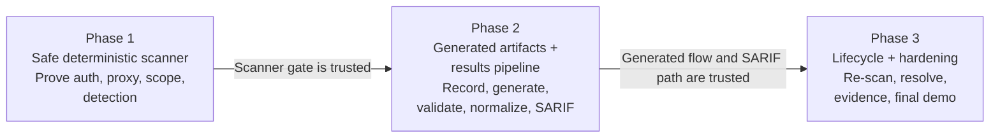
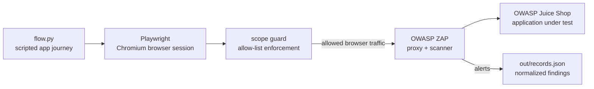

# Phase 1 Live Demo Script — Visible Minimum Viable Scanner Gate

Follow top to bottom. Each step has: the command, what to say while it runs, and what
"success" looks like on screen. Total run time budget: ~15 minutes when showing the app,
ZAP, Playwright, proxy wiring, and scan result visibly (scan itself ~4 min).
See `dast_poc_demo_plan.md` (Phase 1) for the underlying gate definition and
`docs/junior_engineer/testing_and_running_roadmap.md` for troubleshooting detail.

---

## Big picture — the three demo phases (start here, before Phase 1 commands)

Open with the overall story so the audience understands that Phase 1 is the foundation, not
the whole product.



**Say:** "The POC is split into three gates. Phase 1 proves the scanner can safely authenticate
through ZAP, stay in scope, and produce a real finding. Phase 2 replaces the hand-authored flow
with generated artifacts and proves the deterministic results path into SARIF/GitHub. Phase 3
proves lifecycle behavior: scan, fix, re-scan, and show open/resolved state. Today's live demo is
Phase 1, because every later phase depends on this scanner gate being trustworthy."

Now show what the full POC is eventually meant to become:

```mermaid
flowchart LR
  Human["User/app owner<br/>Input: app URL +<br/>login journey<br/>Output: demo intent"]
  Record["record CLI<br/>Input: app URL +<br/>browser actions<br/>Output: trace.json,<br/>index.json"]
  Generate["generate CLI<br/>Input: trace.json,<br/>contracts<br/>Output: flow.py,<br/>scope.json, policy,<br/>manifest"]
  Validate["validate CLI<br/>Input: generated bundle<br/>Output:<br/>validation-report.json"]

  Scope[/"Scope artifact<br/>scope.json<br/>Created from: app<br/>identity + allow-list<br/>Consumed as:<br/>scan boundary"/]
  Flow[/"Flow artifact<br/>flow.py<br/>Created from:<br/>app journey<br/>Consumed as:<br/>Playwright instructions"/]
  Playwright["Playwright-controlled<br/>Chromium<br/>Launched by<br/>runner/replay.py<br/>Input: flow actions +<br/>ZAP proxy setting<br/>Output: browser traffic"]
  Guard["ScopeGuard<br/>runner/scope_guard.py<br/>Attached by<br/>runner/replay.py<br/>Input: browser requests<br/>+ scope.json<br/>Output:<br/>allow/block decisions"]
  Zap["OWASP ZAP<br/>Input: proxied traffic<br/>+ scan command<br/>Output: raw alerts JSON"]
  Juice["OWASP Juice Shop<br/>Input: HTTP requests<br/>Output: app responses<br/>+ vulnerabilities"]
  Runner["runner<br/>Input: flow.py,<br/>scope.json,<br/>ZAP endpoints<br/>Output: gate result +<br/>out/records.json"]

  Normalize["normalizer<br/>Input: raw ZAP alerts<br/>Output: stable<br/>detection records"]
  Sarif["SARIF export<br/>Input: detection records<br/>Output: SARIF 2.1.0 file"]
  Github["GitHub code scanning<br/>Input: SARIF upload<br/>Output: security alerts"]
  Lifecycle["lifecycle diff<br/>Input: current<br/>fingerprints + prior state<br/>Output:<br/>open / new / resolved"]

  Human --> Record --> Generate --> Validate
  Validate --> Flow
  Validate --> Scope
  Scope --> Runner
  Flow --> Runner
  Runner --> Playwright --> Guard --> Zap --> Juice
  Zap --> Runner --> Normalize --> Sarif --> Github
  Normalize --> Lifecycle

  classDef phase1 fill:#e6f4ff,stroke:#0969da,stroke-width:2px,color:#0a3069
  classDef later fill:#f6f8fa,stroke:#8c959f,stroke-width:1px,color:#24292f
  class Scope,Flow,Playwright,Guard,Zap,Juice,Runner,Normalize phase1
  class Human,Record,Generate,Validate,Sarif,Github,Lifecycle later
```



**Say:** "Rectangles are running code or services. The slanted boxes are file artifacts, not
services. For artifacts, 'created from' means what information was used to produce the file, and
'consumed as' means how the runner uses that file. `scope.json` is consumed as the scan boundary.
`flow.py` is consumed as Playwright instructions for creating the authenticated session.
Playwright-controlled Chromium is an external runtime launched by `runner/replay.py`, not a repo
module. `ScopeGuard` is repo code in `runner/scope_guard.py`, and it is attached to the
Playwright page by `runner/replay.py`. From there, the browser session creates traffic, the guard
checks every request, ZAP sees the proxied traffic and scans Juice Shop, and the normalizer writes
stable records. The gray boxes are the Phase 2 and Phase 3 pieces that build on that foundation."

---

## 0. Pre-demo setup (do this 10-15 min BEFORE the audience arrives)

- [ ] Confirm Podman is running (`podman machine list`).
- [ ] **If on a corporate network with a proxy**, run `docs/prepull_playwright_podman_nationwide.sh`
      once ahead of time. It repairs the known stale `127.0.0.1:8888` proxy inside the Podman VM
      and pre-caches the Playwright + ZAP images, so the demo doesn't stall on a cold pull/proxy
      failure. This is the #1 live-demo risk.
- [ ] `cd` to the repo root; `git pull` to make sure you're on the latest `main`.
- [ ] Free ports 3000/8080 by tearing down any stray containers/network from a previous session
  (this environment uses **Podman**, not Docker — `docker ps` will not work here).

Run:

```bash
bash cleanup_demo_ports.sh
```

- [ ] Run `pytest -q` once and confirm **107 passed** — this is your fallback evidence if
  live infra hiccups (see §9).
- [ ] Have two terminal tabs ready:
  - Terminal A: compose/app/scan output.
  - Terminal B: inspection commands for ZAP, Playwright, proxy proof, and guardrails.

---

## 1. Talking point — what this demo proves (30 sec, no commands)

> "This is the Phase 1 gate: prove we can safely scan a live app end-to-end before we ever
> let an LLM generate anything. Four things have to be true: it authenticates through the
> proxy, it never leaves scope, it produces a real detection, and unsafe configuration is
> refused before a single packet goes out."

Then set the mental model before running anything:



**Say:** "The point is not just that a command returns green. We are going to show the target
app, show ZAP exists, show where Playwright is launched, show where the login flow is encoded,
then prove ZAP saw authenticated traffic."

---

## 2. Show what is involved before the scan runs

Show the three live services and the runtime arguments the runner receives:

```bash
sed -n '1,80p' compose.yaml
```

Point out these lines on screen:

- `juice`: OWASP Juice Shop, the application being scanned.
- `zap`: OWASP ZAP daemon on port 8080, the scanner/proxy.
- `runner`: Python entrypoint that receives `--flow`, `--base-url`, `--zap-api`, and
  `--zap-proxy`.
- `--base-url=http://juice:3000`: target URL from inside the container network.
- `--zap-api=http://zap:8080`: where the runner controls ZAP.
- `--zap-proxy=http://zap:8080`: where Playwright sends browser traffic.

Now show that Playwright is not magic; it is started by the runner with a proxy:

```bash
sed -n '40,95p' runner/replay.py
```

**Say:** "This is where Chromium is launched. The important part is `proxy={"server":
zap_proxy}`. That means the browser session created by Playwright sends traffic through ZAP."

Now show the actual session/flow format:

```bash
sed -n '1,130p' security/dast/juice-shop/flow.py
```

**Say:** "For Phase 1 this file is hand-authored. It has a simple contract:
`run(page, base_url) -> dict`. The `page` object is the Playwright browser page. The flow
registers a test user, fills the real login form, clicks login, waits for a JWT token, then
calls `/rest/user/whoami` with `Authorization: Bearer <token>`. In Phase 2, `record` and
`generate` will create this kind of flow automatically."

Answer the two important flow questions explicitly:

- **How is `flow.py` generated in Phase 1?** It is not generated. It is hand-authored as the
  Week-1 fallback artifact so the demo can isolate runner/proxy/scope/scanner risk before adding
  LLM variability.
- **How do we know it is good Playwright input?** The runner does not parse natural language. It
  dynamically loads `flow.py` and requires a callable `run(page, base_url)` function. The real
  proof is execution: Playwright receives that `page`, performs the login steps, gets a JWT token,
  calls `whoami`, and the final gate reports `authenticated: true`. Then ZAP's message log is
  queried to prove that authenticated request went through the proxy.

Show the contract test that checks the artifact shape:

```bash
sed -n '1,60p' tests/test_replay.py
```

**Say:** "This test proves the runner can load the flow artifact and that it exposes the required
`run(page, base_url)` entry point. The later live scan proves the artifact is not only loadable,
but also usable by Playwright against the real app."

Show the exact handoff from Playwright to `flow.py`:

```bash
sed -n '55,85p' runner/replay.py
```

Point out these lines:

- `context = browser.new_context(...)`: creates the Playwright browser context.
- `page = context.new_page()`: creates the Playwright page object.
- `page.route("**/*", ...)`: attaches the scope guard to browser requests.
- `result = flow_module.run(page, base_url)`: passes the Playwright page into `flow.py`.

**Say:** "This is the proof of wiring. The runner creates the Playwright `page`, attaches the
scope guard, and hands that same page object to `flow.py`. So when `flow.py` calls `page.goto`,
`page.fill`, and `page.click`, those are real Playwright browser actions."

---

## 3. Bring up Juice Shop and ZAP visibly

Start only the target app and scanner first, using the demo overlay so the audience can see
them from the host browser:

```bash
cd /c/Users/yangq4/playground/Warbler-Tech/Dast-Scanning-Tool
podman-compose -f compose.yaml -f compose.demo.yaml up --build -d juice zap
```

Show the containers and port mappings:

```bash
podman ps --format "table {{.Names}}\t{{.Status}}\t{{.Ports}}"
```

**Expect:** a Juice Shop container mapped to `127.0.0.1:3000` and a ZAP container mapped to
`127.0.0.1:8080`.

Show Juice Shop as the actual application:

```bash
curl -I http://localhost:3000/
```

Then open this in the browser and show the login page:

```text
http://localhost:3000/#/login
```

**Say:** "This is the real intentionally vulnerable application. The scanner is going to
authenticate into this app and scan it."

Show ZAP exists and is reachable as the scanner/proxy:

```bash
curl -s http://localhost:8080/JSON/core/view/version/
curl -s http://localhost:8080/JSON/core/view/sites/
```

Then open ZAP's API UI in the browser:

```text
http://localhost:8080/UI/
```

**Say:** "ZAP is running as a daemon, so we are showing the ZAP API UI rather than the desktop
ZAP application. This is enough for the demo because the runner controls ZAP through this API.
Before the runner logs in and scans, the ZAP sites/messages are empty or minimal. After
Playwright runs through the proxy, this API becomes our independent proof source."

Now run a replay-only proof before the active scan. This is faster than the full scan and makes
Playwright's role visible: it loads `flow.py`, creates a browser session, logs in, and returns the
flow result. Use the helper script instead of typing raw Compose commands; it quietly resets stale
demo containers, rebuilds the runner image, starts Juice Shop and ZAP, waits for readiness, runs
replay, and prints the evidence files.

```bash
cd /c/Users/yangq4/poc-work/ssd-dast-tool-poc
./demo_replay_flow.sh
```

If you are demoing from the `Dast-Scanning-Tool` repo instead, use that repo path and run the same
script there. The important rule is: run the helper that lives in the repo you are demoing.

**Expect:** JSON showing `authenticated: true`, `token_present: true`, `whoami_status: 200`,
`requests_seen` greater than zero, and `blocked: 0`. Then expect evidence files under
`out/replay-evidence/`:

```text
active-scan.har
screenshot.png
```

**Say:** "This is the smallest live proof that `flow.py` is being consumed by Playwright. We are
not scanning yet. We are only replaying the session. The output means Playwright executed the
instructions in `flow.py`, logged in, got a token, called `whoami`, and the scope guard observed
the browser requests. The HAR and screenshot are the visible replay evidence."

---

## 4. Show the safety gate fails CLOSED (no scan traffic, instant)

Prove the guardrail works in isolation before anything else runs.

```bash
python -m runner.preflight --scope security/dast/juice-shop/scope.json
```

**Say:** "This is the real scope file — dev, allow-list of one host." **Expect:**

```text
preflight OK: app_id=juice-shop environment_class=dev allow_list=['localhost']
```

Now break it on purpose — a prod scope must never scan:

```bash
python -c "import json; s=json.load(open('security/dast/juice-shop/scope.json')); s['environment_class']='prod'; json.dump(s, open('/tmp/prod_scope.json','w'))"
python -m runner.preflight --scope /tmp/prod_scope.json
```

**Say:** "Same file, environment flipped to prod. Zero traffic is sent — it aborts before
touching the network." **Expect:** exit code 2 and

```text
PREFLIGHT ABORT: environment_class='prod' is production — refusing to scan (NFR-2).
```

---

## 5. Run the full containerized scan — the main event

```bash
cd /c/Users/yangq4/poc-work/ssd-dast-tool-poc
./demo_full_scan.sh
```

Do not use `podman-compose run --no-deps runner` for the full scan. With Podman Compose, that
can create a one-off runner pod that conflicts with the already-running Juice Shop/ZAP dependency
containers. The helper avoids the Windows foreground `podman-compose up` signal-handler issue by
starting Juice Shop/ZAP in detached mode, then running the scanner gate with plain `podman run` on
the same network.

**While it builds/starts (~30-60s), say:**
> "One command, one network — Juice Shop, ZAP, and the runner. No manual proxy setup, no
> separate terminal juggling."

**While it runs (~3-4 min), narrate the phases as they scroll:**

1. Runner waits for Juice Shop + ZAP to come up (`wait_ready`).
2. Playwright registers a test user and logs in **through the ZAP proxy** — call out the
   authenticated request lines if visible.
3. Scope guard is live during replay — every request is checked against the allow-list.
4. Bounded active scan runs against the allow-listed host only.
5. Raw ZAP alerts are normalized into detection records.

**Expected tail (success):**

```text
runner-1 | {
runner-1 |   "scan_id": "...",
runner-1 |   "app_id": "juice-shop",
runner-1 |   "requests_seen": <n>,
runner-1 |   "blocked": 0,
runner-1 |   "gate": {
runner-1 |     "authenticated": true,
runner-1 |     "scope_ok": true,
runner-1 |     "has_high_or_medium": true,
runner-1 |     "detections": <n>,
runner-1 |     "passed": true
runner-1 |   }
runner-1 | }
runner-1 exited with code 0
```

**Say:** "`passed: true`, exit code 0 — that's all four Phase 1 gate conditions in one shot."

### 5a. Independently prove authentication went through the proxy (don't just trust the flag)

`gate.authenticated: true` above is **self-reported by the Playwright flow** (it checks for a
token in `localStorage` and a 200 from `whoami`) — that proves login succeeded, not that ZAP
actually saw the traffic. For real proof, ask ZAP itself, mid-scan, in the second terminal:

```bash
RUNNER_ID=$(podman ps --filter "name=runner" --format "{{.Names}}" | head -1)
podman exec "$RUNNER_ID" python3 -c "
import urllib.request, json
url = 'http://zap:8080/JSON/search/view/messagesByRequestRegex/?regex=Authorization'
data = json.load(urllib.request.urlopen(url))
msgs = data.get('messagesByRequestRegex', [])
print(f'ZAP independently recorded {len(msgs)} request(s) carrying an Authorization header')
for m in msgs[:3]:
    print(' -', m.get('requestHeader', '').splitlines()[0])
"
```

**Say:** "This isn't our runner talking — it's a direct query to ZAP's own message log. If the
browser had bypassed the proxy, this list would be empty no matter what our own code claims."
**Expect:** a non-zero count and at least one `GET /rest/user/whoami ...` line with a Bearer
token — this is the independent oracle, exactly like the `shasum`-vs-`hashlib` pattern used in
the unit tests (§6), applied to the live proxy claim instead of the fingerprint hash.

(Swap the regex for `rest/user/login` to independently confirm the login POST itself was seen.)

If the runner has already exited before you run the in-container command, query ZAP from the
host instead because `compose.demo.yaml` exposes the ZAP API:

```bash
curl -s 'http://localhost:8080/JSON/search/view/messagesByRequestRegex/?regex=Authorization'
```

**Say:** "The authentication proof has two parts: the flow reports it got a token, and ZAP's
own message log shows an authenticated request. If Playwright bypassed ZAP, the second proof
would be empty."

---

## 6. Show what ZAP saw after Playwright authenticated

After the runner completes, show that ZAP learned about the target and has recorded traffic:

```bash
curl -s http://localhost:8080/JSON/core/view/sites/
curl -s 'http://localhost:8080/JSON/core/view/numberOfMessages/'
```

Show a small sample of URLs ZAP recorded:

```bash
curl -s 'http://localhost:8080/JSON/core/view/urls/?baseurl=http://juice:3000&start=0&count=10'
```

**Say:** "This is ZAP's view, not the runner's. It saw Juice Shop traffic because Playwright's
browser context was configured to use ZAP as the proxy."

---

## 7. Show scope enforcement blocking (the guardrail, live)

In the second terminal tab, point the runner at a host that is NOT in the allow-list:

```bash
cd /c/Users/yangq4/playground/Warbler-Tech/Dast-Scanning-Tool
podman-compose -f compose.yaml -f compose.demo.yaml run --rm --no-deps runner \
  --scope security/dast/juice-shop/scope.json \
  --flow security/dast/juice-shop/flow.py --base-url http://localhost:3000 \
  --zap-api http://zap:8080 --zap-proxy http://zap:8080
```

**Say:** "Same command, but the target host isn't on the allow-list — `localhost` instead of
`juice`. Watch it get blocked, logged, and the scan fails — not silently ignored."
**Expect:** non-zero exit, `"blocked": >0` or a `ScopeViolation` abort message in stderr.

---

## 8. Show the evidence and detection output

```bash
cat out/records.json | head -40
```

**Say:** "Each normalized detection record — rule id, severity, endpoint, parameter, stable
fingerprint, and a pointer to the evidence for this scan." Point out `severity` and
`fingerprint` fields.

*(Evidence HAR/screenshot live inside the container and are gitignored/discarded on
teardown by design — mention this is a known Phase 1 scope choice, not a gap: "durable
evidence hosting is a Phase 2/3 concern, tracked as a known gap.")*

---

## 9. Fallback if live infra fails (proxy, registry pull, flaky network)

Don't debug live. Say the line and pivot:
> "Let's not burn demo time on network flakiness — here's the same result verified earlier
> today, plus the test suite that backs it."

```bash
pytest -q
```

**Expect:** `107 passed`. Then show `docs/junior_engineer/testing_and_running_roadmap.md`
§2 for the last known-good containerized run output as backup evidence.

---

## 10. Wrap-up talking points (30 sec)

- All four **primary gate criteria** met: authenticated, in-scope, ≥1 high/medium
  detection, unsafe config refused pre-traffic.
- **Secondary checks** also green: HAR/screenshot captured (redacted), single-command
  container, ~3m36s well under the 15-minute budget.
- Versions pinned by digest (`versions.lock`) — this exact result is reproducible.
- Next up: Phase 2 — LLM-generated `record`/`generate`/`validate` replacing the
  hand-authored `flow.py`, behind the code-safety boundary already scoped in the demo plan.

---

## Quick Q&A cheat-sheet

| Likely question | Answer |
| --- | --- |
| "Is this hitting a real vulnerability?" | Yes — real ZAP active scan against a real intentionally-vulnerable app (Juice Shop), not a mock. |
| "What if it had scanned prod?" | It can't start — preflight checks `environment_class` before any network call (§2 above). |
| "What happens to blocked requests?" | Blocked, logged with reason, and the scan fails closed — never silently continues (FR-S4). |
| "Is the flow.py hand-written or AI-generated?" | Hand-authored intentionally for Phase 1, to de-risk the ZAP+Playwright+auth integration before adding LLM variability in Phase 2. |
| "Why not test against prod-like data?" | Out of POC scope by design — see requirements §3.2. |
