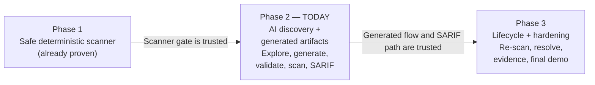
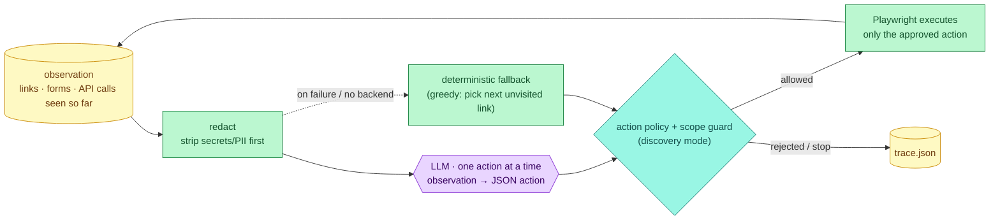
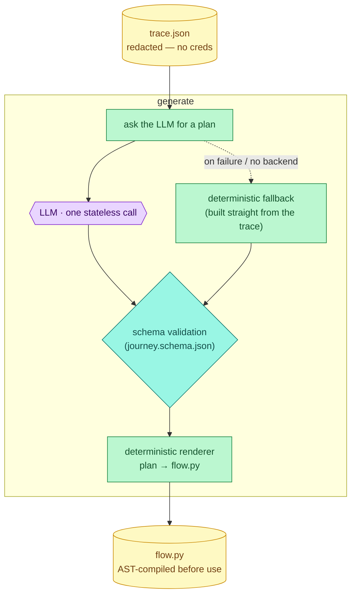

# DAST POC — Phase 2 Demo (Audience Deck)

**Audience:** stakeholders / reviewers (non-operator). No commands here — for the live
command-by-command walkthrough, see `docs/dast_poc_phase2_demo_runbook.md`.

---

## The one-line thesis

> Phase 1 proved the scanner is safe. Phase 2 proves the config that drives it can be
> **recorded, explored, and generated — with an LLM that only ever emits data, never code** —
> and that findings flow deterministically into GitHub's Security tab, without ever weakening
> Phase 1's safety guarantees.

---

## Act 1 — The problem

Phase 1 built a scanner that safely authenticates, stays in scope, and finds real
vulnerabilities — but the file that told it *how to log in and what to click*, `flow.py`, was
**hand-typed by an engineer**. That doesn't scale: every new app needs a person to walk it by
hand, and that walk is the ceiling on how much of the app ever gets tested.

Two questions Phase 2 had to answer:

1. Can `flow.py` be **recorded and generated** instead of hand-authored?
2. Can an **LLM** help widen what gets tested — without becoming a new safety risk?

The second question is the one that matters most. The answer had to be **"no risk, by
construction — not by promise."**

---

## Act 2 — The architecture (where Phase 2 sits)

The full pipeline, front to back. Authoring is where the LLM lives — and *only* there. Scanning
runs every time with **zero LLM involvement**:

```mermaid
flowchart LR
    human(["👤 Human + creds"]):::human

    subgraph AUTH["🖊️ AUTHORING — once per app (LLM lives here)"]
        direction LR
        rec["record<br/>scripted browser crawl"]:::build
        seed["seed<br/>human login → storageState"]:::build
        expl["explore<br/>seeded session · LLM loop"]:::build
        exllm{{"LLM (Copilot or Anthropic)<br/>observation → JSON action"}}:::llm
        trace[("trace.json<br/>pages · forms · API · hosts")]:::data
        gen["generate"]:::build
        llm{{"LLM (Copilot or Anthropic)<br/>trace → JSON plan"}}:::llm
        cfg[("flow.py · scope.json<br/>auth.json · zap-policy<br/>manifest · lock")]:::data
        val["validate<br/>allow-list + auth replay"]:::build
    end

    subgraph SCAN["🛡️ SCANNING — every run (no LLM)"]
        direction LR
        pre["preflight<br/>safety layer 1"]:::safety
        rep["replay<br/>auth via ZAP proxy"]:::build
        guard["scope guard<br/>safety layer 2"]:::safety
        ascan["active scan<br/>bounded to allow-list"]:::build
        raw[("raw ZAP alerts")]:::data
        norm["normalizer + fingerprint"]:::build
        recs[("detection records")]:::data
        sarif["SARIF export"]:::build
        diff["lifecycle diff<br/>new / open / resolved / not_scanned"]:::build
    end

    gh[("🌐 GitHub Security tab")]:::ext

    human --> rec --> trace
    human --> seed --> expl --> trace
    expl <--> exllm
    trace --> gen
    gen <--> llm
    gen --> cfg --> val
    cfg ==> pre ==> rep ==> guard ==> ascan ==> raw ==> norm ==> recs
    recs --> sarif --> gh
    recs --> diff

    classDef human fill:#fde68a,stroke:#b45309,color:#1f2937
    classDef build fill:#bbf7d0,stroke:#15803d,color:#14532d
    classDef llm fill:#e9d5ff,stroke:#7e22ce,color:#3b0764
    classDef data fill:#fef9c3,stroke:#ca8a04,color:#713f12
    classDef safety fill:#fed7aa,stroke:#c2410c,color:#7c2d12
    classDef ext fill:#dbeafe,stroke:#1d4ed8,color:#1e3a8a
```

**The takeaway:** the purple boxes (LLM) only ever touch the top row. Everything below
`validate` — the runner, the scope guard, the normalizer, SARIF export — is the **exact,
unchanged Phase 1 code**. The LLM never sees ZAP, never sees the live target, and never runs
during an actual scan.

---

## Act 3 — The safety argument (why this is safe by construction)

The LLM is involved in exactly **two** places, and both obey the same rule: **the model only
ever emits constrained JSON data — never executable code, and never talks to the target app
directly.**

### Touchpoint 1 — `explore`: LLM-assisted route discovery

This is the *breadth* engine. Starting from a handful of human-seeded routes, the LLM is asked,
one step at a time, "what should I look at next?" — never "go run this."

The model's vocabulary is five verbs: *follow a link, submit a form, visit an API route,
expand navigation, or stop.* It never picks up credentials, never emits a URL it invented out
of thin air (only paths already present in the observation), and never sees anything but a
redacted snapshot of the current page.

### Touchpoint 2 — `generate`: LLM-assisted plan authoring

This is the *translation* step. Once exploration is done, the LLM is asked **once** to turn the
whole recorded trace into a login recipe + an ordered list of steps.

### The same four guarantees hold for both touchpoints

| Guarantee | `explore` (route discovery) | `generate` (plan authoring) |
|---|---|---|
| The model never writes code | Returns one JSON *action* (verb + path/selector) | Returns one JSON *plan*; a fixed template renders `flow.py` |
| A bad output can't reach the browser/scanner | **Action policy + scope guard** reject anything destructive or out-of-scope before Playwright acts | `journey.schema.json` validation rejects anything off-contract before rendering |
| A malformed output fails loudly, early | Rejected action is logged and skipped mid-loop — exploration just continues | Rendered `flow.py` is **AST-compiled** before use — never executed blind |
| Never a hard dependency on the model | Deterministic fallback: the greedy "pick the next unvisited link" proposer | Deterministic fallback: `journey_from_trace`, built straight from the recorded trace |

**The one extra layer `explore` needs and `generate` doesn't:** because `explore` is driving a
live browser step-by-step (not just returning a one-shot document), it also runs the **action
policy** (default-deny state-changing verbs like POST/PUT/PATCH/DELETE, plus a deny-list —
logout, delete, purchase, admin mutations) and the **scope guard in discovery mode** (block and
log anything out of the allow-list, but keep exploring rather than abort). The model's own
"this looks safe" judgment is never trusted — deterministic code decides every single time.

---

## Act 4 — What we proved, with real numbers

All figures below are from a verified, end-to-end run against OWASP Juice Shop (2026-09-19).

### The coverage win: `explore` vs. a human walk

| Path | Pages | API calls | Out-of-scope requests |
|---|---|---|---|
| `record` (a human walk) | 3 | 22 | 0 |
| `explore` (LLM-driven, from 5 seed routes) | 12 | 27 | **0** |

The LLM-driven exploration reached **4× the pages** a human recording walked, entirely from a
handful of seed routes — with zero requests ever leaving the approved scope.

### The scan result

| Bundle source | Detections found | Wall-clock |
|---|---|---|
| `record` (hand-walked trace) | 1,214 | 2m39s |
| `explore` (LLM-widened trace) | 1,490 | 2m54s |

**~20–30% more detections** surfaced simply because the generated bundle exercised more of the
authenticated app — the direct payoff of widening coverage.

### Idempotency — the same trace always produces the same scan config

Running `generate` twice on the identical trace (deterministic path) produces a **byte-for-byte
identical** `flow.py`. This is what makes the lifecycle diff (below) trustworthy — the artifact
doesn't silently drift between runs.

### Fail-closed, proven live

- A plan referencing an out-of-scope host is **rejected before any browser opens** (allow-list
  check fails first).
- A scope file marked `prod` **aborts before any traffic is sent** — the exact Phase 1 guardrail,
  now guarding the generated path too.

---

## Act 5 — Closing the loop responsibly: coverage-aware results

GitHub's Security tab closes any alert that's *missing* from the newest SARIF upload — it has
no way to know whether a scan actually looked there. That's a real trap for an AI-driven
exploration loop, because two different LLM runs can explore different parts of the app.

**We hit this for real:** two exploration-driven scans in a row caused GitHub to mark 13
legitimate findings on `/rest/continue-code` **"fixed"** — they weren't fixed, the second
exploration simply hadn't visited that route.

**The fix:** every scan now records exactly which `(route × rule)` pairs it actually exercised.
The lifecycle diff uses that to label every finding:

| Label | Meaning |
|---|---|
| `new` | Wasn't seen before |
| `open` | Still there, still being tested |
| `resolved` | The exact route+rule *was* tested this scan, and the finding is genuinely gone |
| `not_scanned` | This scan simply didn't test that route+rule — **carried forward, never silently closed** |

Only `resolved` findings are ever dropped from what gets published — so the Security tab only
ever closes what we actually proved gone.

---

## The story in one breath

**Record → Explore → Generate → Validate → Scan → Publish.** A human seeds a session once; an
LLM widens what gets explored; a schema and a deterministic renderer are the only path from the
model's output to anything that runs; the unchanged Phase 1 runner does the actual scanning;
and a coverage-aware lifecycle diff makes sure the Security tab never lies about what was
actually tested. The LLM made the pipeline **better**, and — because of where the boundary sits
— never **riskier**.

---

## Anticipated questions

| Question | Answer |
|---|---|
| Can the LLM ever run code? | No. It returns JSON; a fixed template renders `flow.py`, and the result is AST-compiled before use. |
| What happens if the LLM is down or gives a bad answer? | A deterministic fallback produces the same artifact shape from the raw trace. The demo never blocks on the model. |
| Does this bypass the Phase 1 safety guarantees? | No — the generated bundle runs through the literal, unchanged Phase 1 runner, scope guard, and preflight. |
| Are credentials ever sent to the LLM? | No. The trace/observation the model sees is redacted; credentials only ever come from environment variables at replay time. |
| Why not just trust the LLM's "this is safe" judgment during exploration? | Because it's a judgment, not a fact. A deterministic action policy and scope guard independently check every action before it executes — the model's opinion carries no authority. |
| Which LLM is this? | Configurable — Copilot (Nationwide-approved) or Anthropic (blocked on the corporate network) — selected by an environment variable, with identical prompts and safety checks either way. |

---

## What's next — Phase 3

Two-scan lifecycle hardening, evidence redaction hardening, and the final polished end-to-end
recording.
