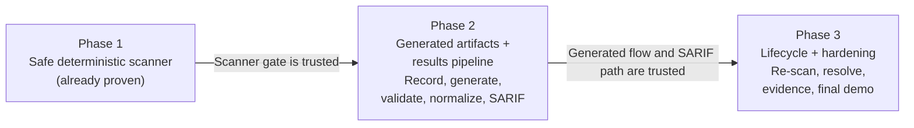
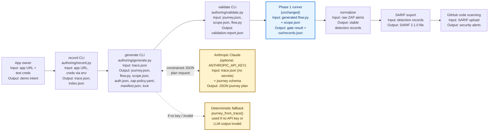

# Phase 2 Live Demo Script — Deterministic Results Pipeline + Generated Artifacts

Follow top to bottom. Each step has: the command, what to say while it runs, and what
"success" looks like on screen. Total run time budget: ~15-18 minutes. See
`dast_poc_demo_plan.md` (Phase 2) for the underlying gate definition, and
`docs/dast_poc_phase1_demo_script.md` for the Phase 1 gate this demo builds on. Reference
design doc: `docs/junior_engineer/authoring_clis_design.md`.

---

## Big picture — where Phase 2 sits (start here, before any commands)

Re-anchor the audience: Phase 1 proved the scanner is safe. Phase 2 proves the artifacts that
drive that scanner can be **generated instead of hand-authored**, without weakening any of the
Phase 1 guarantees.



**Say:** "Phase 1 proved the runner can safely authenticate, stay in scope, and detect a real
finding — but the `flow.py` it used was hand-typed by an engineer. Today's question is: can we
replace that hand-authored file with something recorded and generated, and can we get the
findings out of our own JSON and into a format the rest of the org already consumes — SARIF, in
GitHub's Security tab? And critically: does adding an LLM into that loop compromise the safety
guarantees from Phase 1? The answer has to be no, by construction, not by promise."

Now show the full Phase 2 chain end to end before running anything:



**Say:** "The yellow boxes are the only new risk surface: the LLM. Everything downstream of
`validate` — the runner, the scope guard, the normalizer, SARIF export — is the exact Phase 1
code, completely unchanged. The safety argument for today is narrow: the LLM only ever emits
**data** — a constrained JSON journey plan — never executable code. A deterministic renderer
turns that plan into `flow.py`. If the LLM is unavailable or produces something invalid, a
deterministic fallback builds a valid plan directly from the recorded trace, so the pipeline
never depends on the model being available."

---

## 0. Pre-demo setup (do this 10-15 min BEFORE the audience arrives)

- [ ] Everything from the Phase 1 pre-demo checklist (Podman running, ports free, images
  pre-pulled, `git pull` on latest `main`).
- [ ] `pip install -r requirements-dev.txt` then `python -m playwright install chromium` in the
  **host** venv you'll run commands from. `authoring/record.py`, `generate.py`, and
  `validate.py` are host-side CLIs — the `Containerfile` does not copy `authoring/` into the
  runner image, so they are not (yet) runnable inside the built container. This is an
  intentional Phase 2 boundary, not an oversight — call it out if asked.
- [ ] Run `pytest -q` once and confirm the full suite passes, including
  `tests/test_record.py`, `tests/test_generate.py`, `tests/test_validate.py` — check the actual
  count printed rather than quoting a fixed number, since it drifts as tests are added.
- [ ] Decide up front whether you are demoing the **LLM path** or the **fallback path**:
  - LLM path: export `ANTHROPIC_API_KEY` in the shell you'll run `generate` from.
  - Fallback path (no external dependency, safer for a live demo): don't set the key, or pass
    `--no-llm` explicitly. This is the recommended default for a live audience — no network
    dependency on an external LLM API mid-demo.
- [ ] Have a clean scratch directory ready, e.g. `out/phase2-demo/`, and remove it if it exists
  from a previous run so the "identical output twice" idempotency proof is convincing:

```bash
rm -rf out/phase2-demo && mkdir -p out/phase2-demo
```

- [ ] Have two terminal tabs ready:
  - Terminal A: `record` → `generate` → `validate` → runner chain.
  - Terminal B: inspection commands (cat generated files, diff runs, query ZAP/GitHub).

---

## 1. Talking point — what this demo proves (30 sec, no commands)

> "Phase 1 proved the scanner is safe. Phase 2 proves two separate things: first, that the
> `flow.py` the scanner runs can be recorded and generated instead of hand-written, without an
> LLM ever touching executable code. Second, that findings can flow deterministically out of
> our own JSON and into GitHub's Security tab as SARIF — proven with a fixture, before any live
> generation, so an external-integration risk isn't discovered on demo day."

---

## 2. Show the deterministic results pipeline FIRST (fixture, no live scan)

This is deliberate ordering: prove the downstream half — normalize → SARIF → GitHub — against a
committed fixture before showing anything LLM-related. This is the same order the team used to
de-risk the external GitHub integration in Week 1, in parallel with the runner spike.

```bash
sed -n '1,40p' contracts/sample_zap_output.json
```

**Say:** "This is a real, committed ZAP output fixture — 38 alerts, including one High-severity
SQLi. This is Engineer 1's mock of the neighbor: the results pipeline was built and tested
against this file before a single live scan ran."

Normalize it into stable detection records:

```bash
python -m detections.normalizer contracts/sample_zap_output.json --app-id juice-shop \
  --scan-id demo-fixture-1 -o out/phase2-demo/records.json
cat out/phase2-demo/records.json | head -30
```

**Say:** "Each record has a rule id, severity, endpoint, parameter, and a stable fingerprint —
the same normalized shape whether the alerts came from this fixture or a live scan."

Export SARIF and show the shape GitHub expects:

```bash
python -m detections.sarif_export out/phase2-demo/records.json --app-id juice-shop \
  --driver-version "ZAP 2.17.0" -o out/phase2-demo/results.sarif
sed -n '1,25p' out/phase2-demo/results.sarif
```

**Say:** "SARIF 2.1.0 — the standard GitHub Code Scanning consumes. This is the artifact that
turns into Security tab alerts."

If a GitHub token/repo is available, upload it live; otherwise narrate the command:

```bash
python -m detections.github_upload out/phase2-demo/results.sarif \
  --owner <org> --repo <repo> --ref refs/heads/main
```

**Say:** "This is a one-way door worth calling out explicitly: this uploads to GitHub's Security
tab for real. In today's demo we're either using a disposable/demo repo, or narrating this step
without executing it, on purpose — same caution as any command with an external side effect."

**Expect:** command prints the upload response / URL to the Security tab (or, if narrated only,
skip execution and move on).

---

## 3. Show the safety architecture before generating anything live

```bash
sed -n '1,30p' docs/junior_engineer/authoring_clis_design.md
```

**Say:** "This is the one design decision that matters most today. `generate` asks the LLM for a
constrained **JSON journey plan** — not Python. That plan is schema-validated against
`contracts/journey.schema.json`. Only after it validates does deterministic code render it into
`flow.py`. The model never authors executable code, and the rendered file is AST-compiled before
it's ever used — so a malformed plan fails loudly here, not inside a live browser session."

Show the schema the plan must satisfy:

```bash
cat contracts/journey.schema.json
```

**Say:** "Notice what's *not* in this schema: no arbitrary code, no shell, no file paths. Just a
login block of selectors and a short list of `goto` / `click` / `api_get` steps. That's the
entire vocabulary the LLM is allowed to use."

---

## 4. Run `record` — capture a real trace of the pilot app

```bash
cd /c/Users/yangq4/playground/Warbler-Tech/Dast-Scanning-Tool
podman-compose -f compose.yaml -f compose.demo.yaml up --build -d juice zap
```

```bash
AUTH_EMAIL="dast-poc@juice-sh.op" AUTH_PASSWORD="Passw0rd!" \
python -m authoring.record --app-id juice-shop --base-url http://localhost:3000 \
  --out-dir out/phase2-demo/trace
```

**Say:** "This launches a real Chromium session — the same Playwright runtime the runner uses —
registers a test user, logs in, and visits an authenticated page. Every navigation, form, and
`/rest/`/`/api/` XHR call gets recorded as a raw event, which `build_trace` — a pure, unit-tested
function — turns into a schema-valid trace."

**Expect:** `out/phase2-demo/trace/trace.json` and `index.json` written; no errors.

```bash
cat out/phase2-demo/trace/trace.json | head -40
```

**Say:** "This is `trace.json` — hosts, the page index, interactions, forms, and captured API
calls. Notice there are no passwords or tokens in this file — credentials come from environment
variables at record/replay time, never from the trace itself."

---

## 5. Run `generate` — trace to journey plan to `flow.py` + scan config

Recommended: run the **fallback path** live (no external network dependency), then show the LLM
path already-run evidence if you have it, or run it live only if you're confident in the network.

```bash
python -m authoring.generate --trace out/phase2-demo/trace/trace.json \
  --out-dir out/phase2-demo/gen --no-llm
cat out/phase2-demo/gen/journey.json
```

**Say:** "With `--no-llm`, this uses the deterministic fallback — `journey_from_trace` — which
builds a valid plan directly from the trace's recorded routes and GET calls. This is what keeps
the whole pipeline runnable even with zero external dependencies."

Show every artifact `generate` produced — call out that this is more than just `flow.py`:

```bash
ls out/phase2-demo/gen/
cat out/phase2-demo/gen/scope.json
cat out/phase2-demo/gen/auth.json
cat out/phase2-demo/gen/zap-policy.yaml
cat out/phase2-demo/gen/manifest.json
```

**Say:** "Six artifacts from one trace: the journey plan, the rendered `flow.py`, a `scope.json`
with the allow-list seeded from hosts actually seen in the trace, `auth.json` — which holds only
environment variable *names*, never secret values — a ZAP scan policy, and a manifest tying it
all together."

**Say (known gap — call this out explicitly, don't gloss over it):** "Only two of these six
files actually drive the scan today: `flow.py` and `scope.json`. `runner/scan.py`'s
`configure_policy()` only takes a time budget — it does not yet read `zap-policy.yaml`'s
`intensity` / `attack_strength` / `disabled_scanners`. `auth.json`, `manifest.json`, and `lock`
are informational scaffolding for a future runner change, not consumed yet. That's a real,
tracked gap, not a demo simplification."

Now show the generated flow itself:

```bash
cat out/phase2-demo/gen/flow.py
```

**Say:** "This looks almost identical in shape to the hand-authored Phase 1 `flow.py` — same
`run(page, base_url)` contract — but every line here was templated from the journey plan, not
typed by a person."

### 5a. Prove idempotency (FR-G4) — same trace in, byte-identical flow out

```bash
python -m authoring.generate --trace out/phase2-demo/trace/trace.json \
  --out-dir out/phase2-demo/gen2 --no-llm
diff out/phase2-demo/gen/flow.py out/phase2-demo/gen2/flow.py && echo "IDENTICAL"
```

**Say:** "Same trace, run twice, completely separate output directories — the generated
`flow.py` is byte-for-byte identical. That determinism is what makes lifecycle diffing
trustworthy later: the artifact doesn't drift between runs unless the underlying trace changes."

### 5b. (Optional) Show the LLM path

Only run this if `ANTHROPIC_API_KEY` is set and you're comfortable with the live network call:

```bash
python -m authoring.generate --trace out/phase2-demo/trace/trace.json \
  --out-dir out/phase2-demo/gen-llm
cat out/phase2-demo/gen-llm/journey.json
```

**Say:** "Same command, no `--no-llm` flag. Claude is asked for a journey plan and the exact
same schema validation and AST-compile check apply — the LLM path and the fallback path share
every safety gate downstream of the plan. If the model's output doesn't validate, `generate`
logs a warning to stderr and silently falls back to the deterministic plan — the demo never
hard-fails because a model call had a bad day."

---

## 6. Run `validate` — check the bundle before it drives a scan

```bash
AUTH_EMAIL="dast-poc@juice-sh.op" AUTH_PASSWORD="Passw0rd!" \
python -m authoring.validate --plan out/phase2-demo/gen/journey.json \
  --scope out/phase2-demo/gen/scope.json --flow out/phase2-demo/gen/flow.py \
  --base-url http://juice:3000 --zap-proxy http://localhost:8080 \
  --report out/phase2-demo/validation-report.json
```

> **Why `http://juice:3000` and not `http://localhost:3000` here:** the live replay routes
> browser traffic through the ZAP proxy, and it's **ZAP** — not this host process — that
> resolves the target host. ZAP is on the container network where `juice` resolves;
> `localhost` from ZAP's point of view is the ZAP container itself. `record` (§4) goes direct,
> no proxy, so `localhost:3000` is correct there — but anything proxied through ZAP must target
> `juice:3000`, exactly like `demo_replay_flow.sh` and `demo_full_scan.sh` already do.

**Say:** "Two checks. First, `check_allowlist` — pure, no network — confirms every host the
journey plan would touch is covered by the generated `scope.json`. Second, a **live replay**:
the generated `flow.py` is actually executed through Playwright against the running app, and we
confirm authentication succeeded. Both must pass."

**Expect:** JSON printed with `"passed": true`, exit code 0, and a written
`validation-report.json`.

```bash
cat out/phase2-demo/validation-report.json
```

**Say:** "This is the report FR-V3 requires — a per-check pass/fail, and the CLI's own exit code
mirrors it. If either check fails, this returns non-zero, so a bad bundle never silently reaches
the scanner."

### 6a. Show validate failing closed on an out-of-scope plan (fast, no live app needed)

```bash
python -c "
import json
plan = json.load(open('out/phase2-demo/gen/journey.json'))
plan['journey'].append({'action': 'goto', 'target': 'http://evil.example.com/'})
json.dump(plan, open('/tmp/bad_plan.json', 'w'))
"
python -m authoring.validate --plan /tmp/bad_plan.json \
  --scope out/phase2-demo/gen/scope.json --no-replay \
  --report /tmp/bad-validation-report.json
```

**Say:** "Same scope file, but the plan now references a host that was never in the recorded
trace. The allow-list check fails immediately, `--no-replay` skips the live browser check
entirely, and the exit code is non-zero — same fail-closed posture as the Phase 1 scope guard,
just one stage earlier in the pipeline."

**Expect:** `"passed": false`, non-zero exit, `evil.example.com` listed under `out-of-scope
hosts`.

---

## 7. Run the generated bundle through the unchanged Phase 1 runner

This is the moment that proves Phase 2 doesn't bypass Phase 1's guarantees — it's the same
runner, same scope guard, same gate, just fed a generated `flow.py` instead of a hand-authored
one. Run it the same way `authoring/validate.py` just did its live replay: as a host Python
process (same venv as `record`/`generate`/`validate`), talking to Juice Shop/ZAP through the
ports `compose.demo.yaml` already exposes. This avoids guessing container/network names, and
`runner/main.py` is plain Python — it doesn't require running inside the built image.

```bash
python -m runner.main \
  --flow out/phase2-demo/gen/flow.py --scope out/phase2-demo/gen/scope.json \
  --base-url http://juice:3000 --zap-api http://localhost:8080 --zap-proxy http://localhost:8080 \
  --records-out out/phase2-demo/live-records.json
```

> If you specifically want the containerized path (matching `demo_full_scan.sh` exactly), the
> compose project name is `ssd-dast-poc` (see `name:` in `compose.yaml`), so the network is
> `ssd-dast-poc_dast` and the built image is `localhost/ssd-dast-poc_runner:latest` — confirm
> with `podman network ls` / `podman images` first, and mount `out/phase2-demo/gen/` over
> `/app/security/dast/juice-shop` read-only. The host-Python form above is simpler and is what
> this script recommends for the live demo.

**Expect:** the same gate shape as Phase 1 — `authenticated: true`, `scope_ok: true`,
`has_high_or_medium: true`, `passed: true`, exit code 0, and `out/phase2-demo/live-records.json`
written.

**Say:** "Nothing in `runner/`, `runner/scope_guard.py`, or the normalizer changed to make this
work. The generated bundle just satisfies the exact same contract the hand-authored one did."

---

## 8. Export the live results into SARIF and close the loop

`runner.main` in §7 already wrote normalized records to `out/phase2-demo/live-records.json` via
`--records-out`, so this step only needs the SARIF export:

```bash
python -m detections.sarif_export out/phase2-demo/live-records.json --app-id juice-shop \
  --driver-version "ZAP 2.17.0" -o out/phase2-demo/live-results.sarif
```

**Say:** "This closes the Week-2 checkpoint end to end: `record → generate → validate → runner →
normalizer → SARIF`. The only difference from Phase 1's output is that every artifact upstream
of the runner was generated, not hand-typed."

---

## 9. Fallback if live infra or the LLM call fails

Don't debug live. Say the line and pivot:
> "Let's not burn demo time on a flaky model call or network — here's the deterministic fallback
> path, verified earlier today, plus the full test suite that backs every piece of this."

```bash
pytest -q
```

**Expect:** full suite passes (129+ tests, including `test_record.py`, `test_generate.py`,
`test_validate.py`). Then show `docs/junior_engineer/authoring_clis_design.md` §"Verification"
for the last known-good fallback-path run as backup evidence.

---

## 10. Wrap-up talking points (30 sec)

- The results pipeline (normalize → SARIF → GitHub) was proven against a committed fixture
  **before** any live generation — an external-integration risk retired early, not discovered
  today.
- `record` → `generate` → `validate` produces a bundle that satisfies the exact same contract
  the Phase 1 hand-authored `flow.py` did — the unchanged runner is the proof.
- The LLM only ever emits a constrained, schema-validated **JSON plan** — never executable code
  — and a deterministic renderer turns that into `flow.py`, which is AST-compiled before use.
- A deterministic fallback means the entire pipeline runs with zero external LLM dependency;
  the model is an enhancement, not a requirement.
- Idempotency is real and demonstrated live: same trace in, byte-identical `flow.py` out —
  this is what will make Phase 3's lifecycle diffing trustworthy.
- Next up: Phase 3 — two-scan lifecycle state (open/new/resolved), evidence redaction
  hardening, and the final polished end-to-end recording.

---

## Quick Q&A cheat-sheet

| Likely question | Answer |
| --- | --- |
| "Does the generated `zap-policy.yaml` actually control scan intensity?" | Not yet — `runner/scan.py`'s `configure_policy()` only takes a time budget today. `zap-policy.yaml`, `auth.json`, `manifest.json`, and `lock` are generated but not wired into the runner. Tracked gap, not a demo simplification. |
| "Can the LLM write arbitrary Python that gets executed?" | No — it only emits JSON validated against `journey.schema.json`. `flow.py` is templated by deterministic code and AST-compiled before use. |
| "What happens if the model is down or returns garbage?" | `make_plan` catches the failure, logs a warning, and falls back to `journey_from_trace` — the pipeline never blocks on the LLM being available. |
| "Does this bypass the Phase 1 scope guard or preflight?" | No — the generated bundle is run through the exact same unchanged `runner/` code, including `scope_guard.py` and `preflight.py`. |
| "Are credentials ever recorded or sent to the LLM?" | No — `trace.json` has no secrets, and `auth.json` stores only environment variable *names*, never values. |
| "Is `generate --no-llm` a lesser/demo-only mode?" | No — it's the resilience path, and it's fully covered by the same schema validation and AST-compile checks as the LLM path. |
| "What proves idempotency isn't just a claim?" | The live `diff` in §5a — two separate `generate` runs on the same trace produce a byte-identical `flow.py`. |
