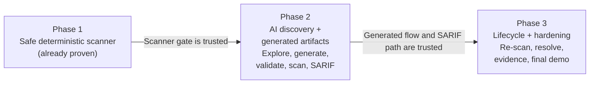

# Phase 2 Live Demo Script — AI Discovery, Generated Artifacts, and ZAP

This file holds the **talking points and Q&A** for the Phase 2 demo — the "Big picture" framing
below and the Q&A cheat-sheet at the end. For the actual click-by-click, command-by-command
steps, follow `docs/dast_poc_phase2_demo_runbook.md`, which is the maintained, field-verified
source of truth (~22–26 min total). Reference design docs: `docs/authoring_clis_design.md`
and `docs/seeded_session_exploration_design.md`.

---

## Big picture — where Phase 2 sits (start here, before any commands)

Re-anchor the audience: Phase 1 proved the scanner is safe. Phase 2 proves that an authenticated
surface can be explored with AI at authoring time, converted into deterministic scan artifacts,
and sent through the unchanged ZAP runner without weakening the Phase 1 guarantees.

```mermaid
flowchart LR
  P1["Phase 1<br/>Safe deterministic scanner<br/>(already proven)"]
  P2["Phase 2<br/>AI discovery +<br/>generated artifacts<br/>Explore, generate,<br/>validate, scan, SARIF"]
  P3["Phase 3<br/>Lifecycle + hardening<br/>Re-scan, resolve,<br/>evidence, final demo"]

  P1 -->|"Scanner gate is trusted"| P2
  P2 -->|"Generated flow and SARIF path are trusted"| P3
```

**Say:** "Phase 1 proved the runner can safely authenticate, stay in scope, and detect a real
finding — but the `flow.py` it used was hand-typed by an engineer. Today's question is: can we
replace that hand-authored file with something recorded and generated, and can we get the
findings out of our own JSON and into a format the rest of the org already consumes — SARIF, in
GitHub's Security tab? And critically: does adding an LLM into that loop compromise the safety
guarantees from Phase 1? The answer has to be no, by construction, not by promise."

Now show the full Phase 2 chain end to end before running anything. Every component names its
real input and output so the audience can see where AI stops and deterministic scanning begins:

```mermaid
flowchart LR
  Human["Operator<br/>Input: target, test creds,<br/>seed routes, deny-list<br/>Output: seed.json"]
  Seed["authoring.seed<br/>Input: base URL, creds,<br/>optional ZAP proxy<br/>Output: storageState.json"]
  Explore["authoring.explore<br/>Input: seed.json, storageState,<br/>scope.json, observations<br/>Output: expanded trace.json,<br/>index.json"]
  ActionLLM["LLM (Copilot or Anthropic,<br/>per LLM_PROVIDER)<br/>Input: redacted page links,<br/>forms, API calls + action schema<br/>Output: one JSON action"]
  Policy["Scope + action policy<br/>Input: proposed action, scope,<br/>deny-list<br/>Output: allow/block decision"]
  Record["record CLI<br/>authoring/record.py<br/>Input: app URL,<br/>creds via env<br/>Output: trace.json,<br/>index.json"]
  Generate["generate CLI<br/>authoring/generate.py<br/>Input: trace.json<br/>Output: journey.json,<br/>flow.py, scope.json,<br/>auth.json, zap-policy.yaml,<br/>manifest.json, lock"]
  Validate["validate CLI<br/>authoring/validate.py<br/>Input: journey.json,<br/>scope.json, flow.py<br/>Output:<br/>validation-report.json"]
  PlanLLM["LLM (Copilot or Anthropic,<br/>per LLM_PROVIDER)<br/>Input: trace.json + journey schema<br/>Output: JSON journey plan"]
  Fallback["Deterministic fallback<br/>Input: trace.json<br/>Output: journey.json"]

  Replay["Playwright replay<br/>Input: generated flow.py<br/>Output: authenticated traffic<br/>through ZAP"]
  ZAP["OWASP ZAP<br/>Input: proxied traffic + target<br/>Output: raw alerts JSON"]
  Runner["runner.main<br/>Input: flow.py, scope.json,<br/>ZAP API/proxy<br/>Output: gate, records.json,<br/>coverage.json, evidence"]
  Normalize["detections.normalizer<br/>Input: raw ZAP alerts<br/>Output: normalized records"]
  Sarif["detections.sarif_export<br/>Input: records.json<br/>Output: SARIF 2.1.0"]
  Github["GitHub Code Scanning<br/>Input: SARIF upload<br/>Output: security alerts"]

  Human -->|"seed routes + policy"| Seed
  Human -->|"seed.json"| Explore
  Seed -->|"storageState.json"| Explore
  Explore <-.->|"redacted observation / JSON action"| ActionLLM
  ActionLLM --> Policy
  Policy -->|"approved action"| Explore
  Policy -.->|"blocked action"| Explore
  Record -.->|"optional baseline"| Generate
  Explore -->|"expanded trace"| Generate
  Generate <-.->|"trace + schema / plan"| PlanLLM
  Generate -.->|"no key or invalid plan"| Fallback
  Generate --> Validate --> Runner
  Runner --> Replay --> ZAP --> Normalize --> Sarif --> Github
  Runner -->|"scan target + scope"| ZAP

  classDef safety fill:#fff3cd,stroke:#9a6700,stroke-width:2px,color:#402e00
  classDef phase1 fill:#e6f4ff,stroke:#0969da,stroke-width:2px,color:#0a3069
  class ActionLLM,PlanLLM,Fallback safety
  class Policy,Validate,Runner,Replay,ZAP,Normalize,Sarif,Github phase1
```

**Say:** "The yellow boxes are the LLM calls. During exploration, the model (Copilot or
Anthropic, selected via `LLM_PROVIDER` — Copilot is the Nationwide-approved path since direct
Anthropic access is policy-blocked on the corporate network) proposes one JSON action from a
redacted observation; deterministic policy code decides whether it can execute.
Everything downstream of
`validate` — the runner, the scope guard, the normalizer, SARIF export — is the exact Phase 1
code, completely unchanged. The safety argument for today is narrow: the LLM only ever emits
**data** — a constrained JSON journey plan — never executable code. A deterministic renderer
turns that plan into `flow.py`. If the LLM is unavailable or produces something invalid, a
deterministic fallback builds a valid plan directly from the recorded trace, so the pipeline
never depends on the model being available. The direct output of exploration is an expanded
trace; that trace must pass through `generate` before it can drive the scan."

---

## Step-by-step execution: see the runbook

The talking points above still hold, but the click-by-click, command-by-command execution has
moved to `docs/dast_poc_phase2_demo_runbook.md` and should be followed from there instead of
below this line. That runbook is the maintained, field-verified source of truth (last verified
end-to-end 2026-09-19) and fixes several things this script's older step list got wrong or left
out:

- Always invoke the venv interpreter as `$PY` (never bare `python`/`pip`/`pytest`) and, on
  Windows, run everything in **Git Bash** — never PowerShell or cmd.
- The idempotency proof (old §5a here) must diff two `--no-llm` runs against each other, not an
  LLM run against a fallback run — comparing those two will show real differences, not
  `IDENTICAL`.
- `seed` + `explore` (old §4a here) is a first-class part of the pipeline, not an optional
  add-on — it's what widens coverage beyond a human walk (KI4).
- SARIF export must go through `detections.lifecycle_diff` first (coverage-aware labeling)
  before `detections.sarif_export` — skipping straight from `live-records.json` to SARIF (old
  §8 here) reproduces a real bug already hit and fixed: two coverage-blind uploads once caused
  GitHub to wrongly mark 13 real findings "fixed."
- The LLM backend is selected via `LLM_PROVIDER` (Copilot is the Nationwide-approved path;
  direct Anthropic access is policy-blocked on the corporate network) — see the runbook §1.7.

The Q&A cheat-sheet below is still current and worth keeping handy during the demo.

---

## Quick Q&A cheat-sheet

| Likely question | Answer |
| --- | --- |
| "Does the generated `zap-policy.yaml` actually control scan intensity?" | Not yet — `runner/scan.py`'s `configure_policy()` only takes a time budget today. `zap-policy.yaml`, `auth.json`, `manifest.json`, and `lock` are generated but not wired into the runner. Tracked gap, not a demo simplification. |
| "Can the LLM write arbitrary Python that gets executed?" | No — it only emits JSON validated against `journey.schema.json`. `flow.py` is templated by deterministic code and AST-compiled before use. |
| "What happens if the model is down or returns garbage?" | `make_plan` catches the failure, logs a warning, and falls back to `journey_from_trace` — the pipeline never blocks on the LLM being available. |
| "Does this bypass the Phase 1 scope guard or preflight?" | No — the generated bundle is run through the exact same unchanged `runner/` code, including `scope_guard.py` and `preflight.py`. |
| "Are credentials ever recorded or sent to the LLM?" | No — `trace.json` has no secrets, and `auth.json` stores only environment variable *names*, never values. |
| "Is `generate --no-llm` a lesser/demo-only mode?" | No — it's the resilience path, and it's fully covered by the same schema validation and AST-compile checks as the LLM path. |
| "What proves idempotency isn't just a claim?" | The live `diff` in the runbook's idempotency proof — two separate `--no-llm` `generate` runs on the same trace produce a byte-identical `flow.py`. |
| "Why not export SARIF straight from the live scan records?" | Because GitHub closes any alert missing from the newest upload as "fixed" — with no idea whether that route was even scanned. `detections.lifecycle_diff` labels findings `new`/`open`/`resolved`/`not_scanned` first, and only `resolved` findings are dropped from the SARIF export. |
