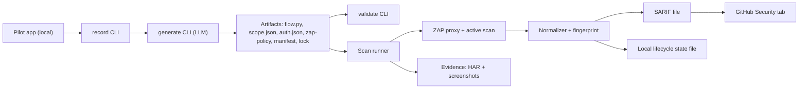

# DAST POC — Requirements Document

## 1. Purpose

Build a proof-of-concept that scans a running web application for security weaknesses, automatically, using authored configuration generated with the help of a large language model (LLM). The POC must demonstrate one full loop on a single pilot application: record the app, generate scan configuration, run an authenticated scan, and publish the results.

This document is self-contained. You do not need any other document to build the POC. Everything you need — background, definitions, requirements, data formats, and acceptance criteria — is here.

## 2. Background for the implementer

This section assumes you have not worked with dynamic security scanning before.

### 2.1 What is DAST
DAST (Dynamic Application Security Testing) tests a *running* application from the outside by sending it real HTTP requests, including malicious-looking ones, and observing the responses for signs of weakness (for example SQL injection or cross-site scripting). It differs from static analysis, which reads source code without running it.

### 2.2 The tools you will use
* OWASP ZAP (Zed Attack Proxy): the scanner. It runs as a local proxy and can perform a passive scan (just analyzing traffic it sees) and an active scan (sending crafted attack payloads). It exposes an HTTP API and a daemon mode so it can be driven by scripts. It outputs findings as JSON.
* Playwright: a browser-automation library. You use it to drive a real browser through the application (log in, click through pages) so ZAP can observe authenticated traffic it would never reach on its own.
* SARIF (Static Analysis Results Interchange Format): a standard JSON format for security results. GitHub natively ingests SARIF and renders each result as an "alert" in the repository Security tab.
* An LLM API (for example Anthropic Claude): used once, at authoring time, to turn a recording of the app into scan configuration.

### 2.3 How the pieces fit together
The browser (Playwright) is configured to send all its traffic through the ZAP proxy. Playwright logs in and walks through the app; ZAP records every request. ZAP then replays and mutates those requests during the active scan to probe for weaknesses. The results are normalized, converted to SARIF, and uploaded to GitHub.

### 2.4 Glossary
| Term | Meaning in this POC |
|------|---------------------|
| Detection | A potential weakness the scanner reported for a specific endpoint, parameter, and payload. (We avoid the word "finding".) |
| Fingerprint | A stable hash identifying the same detection across scans, computed from rule id + endpoint pattern + parameter + payload family. |
| Authenticated scan | A scan run while logged in, so protected pages are reachable. |
| Scope | The rules that bound the scan: which hosts may be contacted (allow-list), which must never be (deny-list), and which actions must never be triggered (avoid-actions). |
| Non-prod | A test environment. This POC never targets production. |
| Lifecycle diff | Comparing this scan's detections to the previous scan's to mark each as open, new, or resolved. |

## 3. Scope

### 3.1 In scope
* A single pilot application, run locally.
* Three authoring command-line tools: `record`, `generate`, `validate`.
* One scan runner that performs authenticated replay plus a ZAP active scan bounded by a scope file.
* Detection normalization with stable fingerprints.
* SARIF export and upload to the GitHub Security tab.
* A minimal lifecycle diff across two scans, using a local state file.
* Evidence capture (HTTP archive and screenshots).

### 3.2 Out of scope (do not build)
* Any scanning of production or any real Nationwide application.
* Blackbox or unauthenticated production scanning, rate limiting, circuit breakers, off-hours scheduling.
* Any data warehouse, ingestion service, or business-intelligence dashboard.
* Drift monitoring, an application registry, schedulers, on-demand consoles, or API triggers.
* Full identity-and-access controls, pull-request review automation, or multi-application support.
* Automated form test-data generation (hand-author the few inputs the pilot app needs).

## 4. Pilot target and environment

* Pilot application: OWASP Juice Shop (recommended) or DVWA — an intentionally vulnerable app with a login flow, safe to attack, with known weaknesses to detect. Run it locally via its official container.
* Runtime: Python 3.11+, OWASP ZAP (daemon/API mode), Playwright with Chromium, and an LLM API key.
* Source control: a GitHub repository with code scanning enabled (a public repo, or a private repo with GitHub Advanced Security) so SARIF upload works.
* All credentials (the pilot app test login, the LLM API key, the GitHub token) are supplied via environment variables or an untracked local file. Nothing secret is committed.

## 5. Architecture overview



## 6. Functional requirements

Each requirement has an ID and an acceptance criterion. "Must" is mandatory for the POC; "Should" is desirable but may be cut under time pressure.

### 6.1 record CLI
| ID | Requirement | Acceptance criterion |
|----|-------------|----------------------|
| FR-R1 | Must crawl the pilot app in a headless browser and record the pages and interactions visited. | Running the tool against the pilot app produces `trace.json` (interactions) and `index.json` (page list) with at least the login flow and one authenticated page captured. |
| FR-R2 | Must record the authenticated flow when given test credentials. | The trace contains a successful login sequence. |
| FR-R3 | Should record discovered forms and API calls. | `trace.json` lists form fields and XHR/API requests seen during the crawl. |

### 6.2 generate CLI (LLM)
| ID | Requirement | Acceptance criterion |
|----|-------------|----------------------|
| FR-G1 | Must send the recorded trace to an LLM and produce a runnable Playwright flow script that reproduces the login and one authenticated journey. | The generated `flow.py` runs without editing and reaches an authenticated page. |
| FR-G2 | Must produce a `scope.json` with an FQDN allow-list seeded from the recorded hosts, a deny-list, and an avoid-action list. | `scope.json` validates against the schema in section 7 and lists the pilot host in the allow-list. |
| FR-G3 | Must produce a `zap-policy` selecting scan intensity, plus a `manifest.json` and a `lock` file pinning tool versions. | All four files are emitted and parse correctly. |
| FR-G4 | Should be idempotent enough that regenerating from the same trace yields an equivalent flow. | Two runs on the same trace produce functionally equivalent flows. |

### 6.3 validate CLI
| ID | Requirement | Acceptance criterion |
|----|-------------|----------------------|
| FR-V1 | Must replay the generated flow against the pilot app and confirm authentication succeeds. | The tool reports auth success and a session established. |
| FR-V2 | Must confirm every host the flow contacts is covered by the `scope.json` allow-list. | The tool fails with a clear message if the flow would contact a host not in the allow-list. |
| FR-V3 | Must produce a validation report and stop the workflow on failure. | A `validation-report.json` with per-check pass/fail is written; a failing check returns a non-zero exit code. |

### 6.4 Scan runner
| ID | Requirement | Acceptance criterion |
|----|-------------|----------------------|
| FR-S1 | Must launch ZAP, route Playwright traffic through the ZAP proxy, and replay the flow. | ZAP records the authenticated requests generated by the flow. |
| FR-S2 | Must run a ZAP active scan bounded by the scope. | The active scan runs only against allow-listed hosts and reports raw detections. |
| FR-S3 | Must refuse to run if `scope.json` is missing, has no `environment_class`, or declares `environment_class` of `prod`. | The runner aborts before any traffic is sent, with a clear message. |
| FR-S4 | Must block and log any in-flight request to a host not in the allow-list (or present in the deny-list). | A deliberately injected out-of-scope host request is blocked and recorded in the log; the scan continues or aborts per configuration. |
| FR-S5 | Must complete a full scan of the pilot app within a reasonable POC time budget. | End-to-end runner completes in under 15 minutes on the pilot app. |

### 6.5 Normalizer and fingerprint
| ID | Requirement | Acceptance criterion |
|----|-------------|----------------------|
| FR-N1 | Must convert raw ZAP output into normalized detection records (see section 7). | Each detection has title, severity, CWE where available, endpoint, parameter, and evidence reference. |
| FR-N2 | Must compute a stable fingerprint per detection. | Scanning the unchanged app twice yields identical fingerprints for the same weakness. |

### 6.6 SARIF export and upload
| ID | Requirement | Acceptance criterion |
|----|-------------|----------------------|
| FR-X1 | Must emit a valid SARIF 2.1.0 file from the normalized detections, carrying the fingerprint as a partial fingerprint. | The SARIF file passes a SARIF validator. |
| FR-X2 | Must upload the SARIF to the pilot GitHub repository so detections appear in the Security tab. | Detections are visible in the repository Security tab with severity, description, and a link to evidence. |

### 6.7 Lifecycle diff
| ID | Requirement | Acceptance criterion |
|----|-------------|----------------------|
| FR-L1 | Must persist the current scan's fingerprint set to a local state file. | A state file is written keyed by application id. |
| FR-L2 | Must compare against the previous scan and label each detection open, new, or resolved. | After fixing one weakness and re-scanning, that detection is labeled resolved while others remain open. |

### 6.8 Evidence
| ID | Requirement | Acceptance criterion |
|----|-------------|----------------------|
| FR-E1 | Must save an HTTP archive (HAR) and at least one screenshot per scan. | Evidence files exist and are referenced from the SARIF results. |

## 7. Data formats

Provide these as the contract between components. Keep them small; extend only if needed.

### 7.1 scope.json
```jsonc
{
  "app_id": "juice-shop",
  "environment_class": "dev",              // must not be "prod"
  "target_fqdn": "localhost",
  "fqdn_allow_list": ["localhost"],        // only these hosts may be contacted
  "fqdn_deny_list": ["*.google-analytics.com"],
  "avoid_action_list": ["logout", "delete-account"]
}
```

### 7.2 Normalized detection record
```jsonc
{
  "app_id": "juice-shop",
  "scan_id": "2025-01-01T10-00-00",
  "fingerprint": "sha256:...",             // stable across scans
  "rule_id": "zap-40018",
  "title": "SQL Injection",
  "severity": "high",                      // critical|high|medium|low|info
  "cwe_id": "CWE-89",
  "endpoint": "/rest/user/login",
  "parameter": "email",
  "status": "open",                        // open|new|resolved
  "evidence_path": "evidence/2025-01-01T10-00-00/active-scan.har"
}
```

### 7.3 Fingerprint definition
```
fingerprint = sha256( rule_id + "|" + endpoint_pattern + "|" + parameter + "|" + payload_family )
```

## 8. Non-functional requirements
| ID | Requirement |
|----|-------------|
| NFR-1 | Reproducibility: pin ZAP, Playwright, and browser versions in the lock file so scans are repeatable. |
| NFR-2 | Safety: the runner must never contact a host outside the allow-list, and must never run when `environment_class` is `prod`. This is the single most important guardrail. |
| NFR-3 | Configuration: all targets, credentials, and options come from files or environment variables — nothing hardcoded, no secrets committed. |
| NFR-4 | Observability: the runner emits structured, timestamped logs covering auth, flow replay, scan progress, scope enforcement outcomes, and export. |
| NFR-5 | Packaging: the runner is containerized and runnable with a single documented command. |

## 9. Definition of done (demo acceptance)

The POC is complete when this sequence works on the pilot app and is captured as a short demo:

1. Run `record`, then `generate`, then `validate`; show that the flow and `scope.json` were produced with LLM assistance and that validation passes.
2. Run the scanner; show scope enforcement blocking a request to a host that is not in the allow-list.
3. Show detections in the GitHub Security tab as SARIF, with severity and a link to evidence.
4. Fix one weakness in the pilot app, re-scan, and show that detection flip to resolved via the fingerprint diff while the others stay open.

## 10. Suggested schedule (three weeks, 1–2 engineers)
| Week | Focus | Exit milestone |
|------|-------|----------------|
| 1 | Scan core with hand-written artifacts | End-to-end authenticated scan produces real detections, scope-bounded |
| 2 | Authoring CLIs (record, generate with LLM, validate) and the normalizer | LLM-generated artifacts drive a real scan and emit SARIF |
| 3 | SARIF into GitHub, lifecycle diff, hardening, demo | Full loop demo including lifecycle across two scans |

Build the scan core first with artifacts you write by hand, so the trickiest integration (ZAP plus Playwright plus login) is solved before the LLM work begins.

## 11. Risks and mitigations
| Risk | Mitigation |
|------|------------|
| LLM-generated flow is unreliable | Feed Playwright codegen output to the LLM as a starting point; keep a hand-authored flow as a fallback so the loop still demos. |
| ZAP-plus-Playwright session handling is finicky | Start with the simplest login on the pilot app; this is scheduled first for that reason. |
| Scope creep toward out-of-scope features | Treat section 3.2 as a hard boundary. |
| Solo-engineer capacity | Cut any optional metrics work and protect the four demo acceptance steps. |

## 12. Deliverables
* A Git repository containing the three CLIs, the runner, and the normalizer/exporter.
* A README with setup and a single run command.
* Sample artifacts (`flow.py`, `scope.json`, `manifest.json`, lock file) for the pilot app.
* A SARIF file visible as alerts in the pilot repository Security tab.
* A short demo recording or script covering the four acceptance steps.
* A brief written summary of what worked, what was cut, and recommended next steps.
