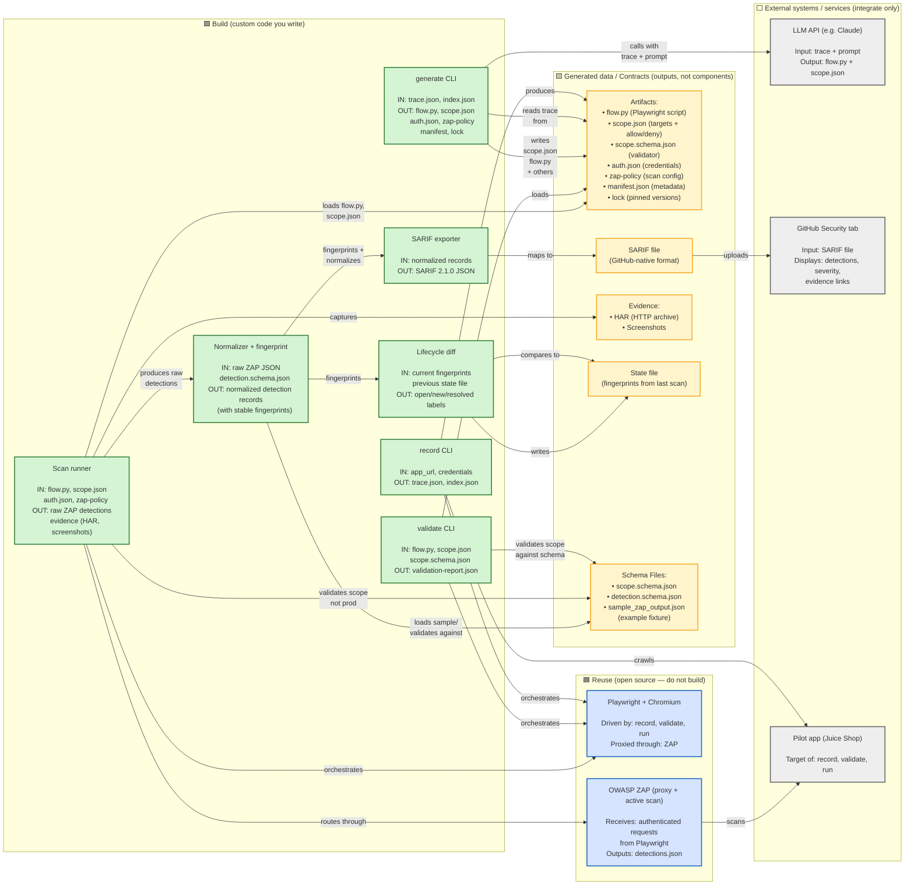

# DAST POC — Requirements Document

## 1. Purpose

Build a proof-of-concept that scans a running web application for security weaknesses, automatically, using authored configuration generated with the help of a large language model (LLM). The POC must demonstrate one full loop on a single pilot application: record the app, generate scan configuration, run an authenticated scan, and publish the results.

This document is self-contained. You do not need any other document to build the POC. Everything you need — background, definitions, requirements, data formats, and acceptance criteria — is here.

## 2. Background for the implementer

This section assumes you have not worked with dynamic security scanning before.

### 2.1 What is DAST
DAST (Dynamic Application Security Testing) tests a *running* application from the outside by sending it real HTTP requests, including malicious-looking ones, and observing the responses for signs of weakness (for example SQL injection or cross-site scripting). It differs from static analysis, which reads source code without running it.

### 2.2 The tools you will use
* OWASP ZAP (Zed Attack Proxy): the scanner. It runs as a local proxy and can perform a passive scan (just analyzing traffic it sees) and an active scan (sending crafted attack payloads). It exposes an HTTP API and a daemon mode so it can be driven by scripts. It outputs findings as JSON.
* Playwright: a browser-automation library. You use it to drive a real browser through the application (log in, click through pages) so ZAP can observe authenticated traffic it would never reach on its own.
* SARIF (Static Analysis Results Interchange Format): a standard JSON format for security results. GitHub natively ingests SARIF and renders each result as an "alert" in the repository Security tab.
* An LLM API (for example Anthropic Claude): used once, at authoring time, to turn a recording of the app into scan configuration.

### 2.3 How the pieces fit together
The browser (Playwright) is configured to send all its traffic through the ZAP proxy. Playwright logs in and walks through the app; ZAP records every request. ZAP then replays and mutates those requests during the active scan to probe for weaknesses. The results are normalized, converted to SARIF, and uploaded to GitHub.

### 2.4 Glossary
| Term | Meaning in this POC |
|------|---------------------|
| Detection | A potential weakness the scanner reported for a specific endpoint, parameter, and payload. (We avoid the word "finding".) |
| Fingerprint | A stable hash identifying the same detection across scans, computed from rule id + endpoint pattern + parameter + payload family. |
| Authenticated scan | A scan run while logged in, so protected pages are reachable. |
| Scope | The rules that bound the scan: which hosts may be contacted (allow-list), which must never be (deny-list), and which actions must never be triggered (avoid-actions). |
| Non-prod | A test environment. This POC never targets production. |
| Lifecycle diff | Comparing this scan's detections to the previous scan's to mark each as open, new, or resolved. |

### 2.5 Knowledge prerequisites

Most of the DAST-specific knowledge here is learnable *during* the POC, because you are integrating mature tools rather than inventing security techniques. The list below separates what you must have before you start from what you can pick up on the job.

**Core prerequisites — both engineers**
* Python proficiency: subprocess orchestration, JSON handling, and writing small, testable pure functions. This is the most-used skill on the POC.
* JSON and data-contract thinking: comfort reading a schema and coding to it (`scope.json`, the normalized detection record, SARIF, ZAP output).
* HTTP fundamentals:requests/responses, h eaders, cookies, status codes, query strings vs. POST bodies.
* Git and pull-request workflow.
* Basic command-line / shell use for installing and running the tools.

**Senior engineer (owns the integration core) — higher bar**
* Web proxies: how intercepting traffic works, proxy configuration, and TLS/certificate handling (ZAP sits as a man-in-the-middle proxy). This is the crux of the hardest task.
* Browser automation with Playwright: selectors, navigation, waits, and session/cookie handling.
* Authentication flows: form login, session tokens, cookies, and why reliable auth replay is hard — the component most likely to consume time.
* LLM API usage and prompt design: calling a model and robustly parsing imperfect output (for the `generate` CLI).
* General security literacy: enough vocabulary (SQL injection, XSS, CWE, "active scan") to configure ZAP sensibly and sanity-check its output. Deep pentest expertise is **not** required.

**Junior engineer (owns contract-bounded modules) — genuinely enough**
* Solid Python and JSON (as above).
* Willingness to learn SARIF (a JSON format — read the spec, map fields) and the fingerprint concept (a hash of a few fields).
* Basic set operations for the lifecycle diff (comparing two fingerprint sets).
* Can be productive on day one against a saved `sample_zap_output.json` **without** understanding ZAP internals or proxies yet — that grows through the Week 2 pairing sessions.

**Learn-as-you-go (not prerequisites)**
* OWASP ZAP: how to run it in daemon/API mode and read its JSON output.
* Playwright: codegen/record mode and the script API.
* SARIF: the results format GitHub consumes.
* HAR: the HTTP-archive evidence format (read-only understanding is enough).
* GitHub code scanning / Security tab: how SARIF is uploaded and displayed.

**Explicitly not required**
* Professional penetration-testing skills or the ability to write exploit payloads (ZAP supplies those).
* Security certifications.
* Databricks, Power BI, or data-engineering knowledge (out of scope for the POC).
* Production, infrastructure, or Harness CD expertise.

Bottom line: a strong generalist Python engineer can own the junior scope immediately. The senior seat needs one person comfortable with **proxies, browser automation, and auth flows** — that combination is the real prerequisite and the critical-path risk. If neither engineer has ZAP/Playwright experience, treat the Week 1 spike as a ramp-up, not a research project.

## 3. Scope

### 3.1 In scope
* A single pilot application, run locally.
* Three authoring command-line tools: `record`, `generate`, `validate`.
* One scan runner that performs authenticated replay plus a ZAP active scan bounded by a scope file.
* Detection normalization with stable fingerprints.
* SARIF export and upload to the GitHub Security tab.
* A minimal lifecycle diff across two scans, using a local state file.
* Evidence capture (HTTP archive and screenshots).

### 3.2 Out of scope (do not build)
* Any scanning of production or any real Nationwide application.
* Blackbox or unauthenticated production scanning, rate limiting, circuit breakers, off-hours scheduling.
* Any data warehouse, ingestion service, or business-intelligence dashboard.
* Drift monitoring, an application registry, schedulers, on-demand consoles, or API triggers.
* Full identity-and-access controls, pull-request review automation, or multi-application support.
* Automated form test-data generation (hand-author the few inputs the pilot app needs).

## 4. Pilot target and environment

* Pilot application: OWASP Juice Shop (recommended) or DVWA — an intentionally vulnerable app with a login flow, safe to attack, with known weaknesses to detect. Run it locally via its official container.
* Runtime: Python 3.11+, OWASP ZAP (daemon/API mode), Playwright with Chromium, and an LLM API key.
* Source control: a GitHub repository with code scanning enabled (a public repo, or a private repo with GitHub Advanced Security) so SARIF upload works.
* All credentials (the pilot app test login, the LLM API key, the GitHub token) are supplied via environment variables or an untracked local file. Nothing secret is committed.

## 5. Architecture overview

Read the diagram by color, not just by arrows. Every box falls into one of four categories, and the category tells you what kind of work it is. The key thing to internalize before you start: **you are not building a scanner or a browser engine.** The heavy lifting — crawling, attacking, session handling — is done by two mature open-source tools (ZAP and Playwright). Your custom code is orchestration glue and configuration generation around them.



### 5.1 What to build vs. reuse vs. integrate

Of the boxes above, only seven are custom code (and several are thin), two are reused open-source engines where the real work happens, three are external systems you connect to, and the rest are generated outputs — not components at all.

| Element | Category | Effort / what it means for you |
|---------|----------|-------------------------------|
| `record` CLI | 🟩 Build (thin) | A small CLI that drives Playwright's crawl and dumps `trace.json` / `index.json`. |
| `generate` CLI | 🟩 Build | Custom CLI, but its "intelligence" is an external LLM call plus prompt/scaffolding design. |
| `validate` CLI | 🟩 Build (thin) | Replays the generated flow and checks it against scope. |
| Scan runner | 🟩 Build (core) | The main integration work: launch ZAP, wire Playwright through the proxy, replay, active scan, enforce scope. |
| Normalizer + fingerprint | 🟩 Build | Transform ZAP JSON into normalized records and compute the stable hash. |
| SARIF exporter | 🟩 Build (thin) | Map normalized records to SARIF 2.1.0 (a SARIF helper library is fine). |
| Lifecycle diff | 🟩 Build (thin) | Compare two fingerprint sets; label open / new / resolved. |
| Playwright + Chromium | 🟦 Reuse (OSS) | Browser automation. You install and drive it — you do not build it. |
| OWASP ZAP | 🟦 Reuse (OSS) | The actual scanning engine. You drive it via its API/daemon — you do not build it. |
| LLM API | ⬜ External service | Hosted model called at authoring time; you supply a key and a prompt. |
| GitHub Security tab | ⬜ External system | SaaS; you upload SARIF to it via the code-scanning API. |
| Pilot app (Juice Shop / DVWA) | ⬜ External target (also OSS) | The thing under test. Run its container; it is not part of your tool. |
| Artifacts, SARIF, evidence, state | 🟨 Generated data | Produced at runtime by the components above; nothing to "build". |

The practical takeaway for estimation: budget your time against the seven green boxes, expect the **scan runner** to be the single largest item, and treat ZAP and Playwright as capabilities to learn and configure rather than software to write.

### 5.2 JSON files in the contracts folder and their role in the architecture

The `contracts/` folder contains schemas and fixtures that define the data contracts between components. Here is where each JSON file flows through the system:

| File | Purpose | Produced by | Consumed by | Role |
|------|---------|-------------|------------|------|
| **scope.schema.json** | JSON Schema validator for scope.json | N/A (hand-authored) | `validate` CLI, scan runner | Ensures scope.json has required fields (`app_id`, `environment_class`, `fqdn_allow_list`, `fqdn_deny_list`, `avoid_action_list`) and rejects any prod scans. **Critical safety contract.** |
| **scope.json** | Target configuration: allow-list, deny-list, avoid-actions, app_id, environment class | `generate` CLI (via LLM assistance) | `validate` CLI, scan runner | Defines which hosts/actions are in/out of scope. Scan runner validates this file exists and `environment_class != prod` before launching (FR-S3). |
| **detection.schema.json** | JSON Schema validator for normalized detection records | N/A (hand-authored) | Normalizer, quality validation, tests | Defines the shape of each normalized detection: `{app_id, scan_id, fingerprint, rule_id, title, severity, cwe_id, endpoint, parameter, status, evidence_path}`. Used to validate normalizer output. |
| **sample_zap_output.json** | Real ZAP output fixture (captures detections from a known scan) | Captured from ZAP daemon | Normalizer unit tests, spike proof-of-concept | Lets the normalizer and fingerprint logic be tested without running the full scan loop. Contains raw ZAP findings; used to validate normalization logic and refine prompt/scan configuration. |

**Data flow of JSON files:**

1. **Record phase:** `record` CLI produces `trace.json` (interactions) and `index.json` (page list) — these feed to `generate`.
2. **Generate phase:** LLM reads the trace and produces `flow.py` and `scope.json`. The `scope.json` is validated against `scope.schema.json`.
3. **Validate phase:** Loads and validates `scope.json` against `scope.schema.json` to ensure coverage; replays `flow.py` to confirm auth works.
4. **Scan runner phase:** Loads `scope.json` and validates it is not prod; if invalid or missing, aborts. Runs scan, ZAP outputs raw detections (JSON).
5. **Normalizer phase:** Ingests raw ZAP JSON and normalizes each detection to match `detection.schema.json` schema; computes stable fingerprint for each.
6. **SARIF export phase:** Reads normalized records and emits SARIF 2.1.0 JSON for GitHub ingestion.
7. **Lifecycle diff phase:** Reads current fingerprints and compares to previous `state.json`, labels each detection open/new/resolved, writes updated state file.

**Validation and safety:**
- `scope.schema.json` enforces that `environment_class` is not `"prod"` and that required allow-list/deny-list fields exist.
- `detection.schema.json` ensures every normalized detection has the required fields for SARIF export and lifecycle diff.
- `sample_zap_output.json` serves as a regression fixture for normalizer unit tests, so parsing logic remains stable even as ZAP is upgraded.

## 6. Functional requirements

Each requirement has an ID and an acceptance criterion. "Must" is mandatory for the POC; "Should" is desirable but may be cut under time pressure.

### 6.1 record CLI
| ID | Requirement | Acceptance criterion |
|----|-------------|----------------------|
| FR-R1 | Must crawl the pilot app in a headless browser and record the pages and interactions visited. | Running the tool against the pilot app produces `trace.json` (interactions) and `index.json` (page list) with at least the login flow and one authenticated page captured. |
| FR-R2 | Must record the authenticated flow when given test credentials. | The trace contains a successful login sequence. |
| FR-R3 | Should record discovered forms and API calls. | `trace.json` lists form fields and XHR/API requests seen during the crawl. |

### 6.2 generate CLI (LLM)
| ID | Requirement | Acceptance criterion |
|----|-------------|----------------------|
| FR-G1 | Must send the recorded trace to an LLM and produce a runnable Playwright flow script that reproduces the login and one authenticated journey. | The generated `flow.py` runs without editing and reaches an authenticated page. |
| FR-G2 | Must produce a `scope.json` with an FQDN allow-list seeded from the recorded hosts, a deny-list, and an avoid-action list. | `scope.json` validates against the schema in section 7 and lists the pilot host in the allow-list. |
| FR-G3 | Must produce a `zap-policy` selecting scan intensity, plus a `manifest.json` and a `lock` file pinning tool versions. | All four files are emitted and parse correctly. |
| FR-G4 | Should be idempotent enough that regenerating from the same trace yields an equivalent flow. | Two runs on the same trace produce functionally equivalent flows. |

### 6.3 validate CLI
| ID | Requirement | Acceptance criterion |
|----|-------------|----------------------|
| FR-V1 | Must replay the generated flow against the pilot app and confirm authentication succeeds. | The tool reports auth success and a session established. |
| FR-V2 | Must confirm every host the flow contacts is covered by the `scope.json` allow-list. | The tool fails with a clear message if the flow would contact a host not in the allow-list. |
| FR-V3 | Must produce a validation report and stop the workflow on failure. | A `validation-report.json` with per-check pass/fail is written; a failing check returns a non-zero exit code. |

### 6.4 Scan runner
| ID | Requirement | Acceptance criterion |
|----|-------------|----------------------|
| FR-S1 | Must launch ZAP, route Playwright traffic through the ZAP proxy, and replay the flow. | ZAP records the authenticated requests generated by the flow. |
| FR-S2 | Must run a ZAP active scan bounded by the scope. | The active scan runs only against allow-listed hosts and reports raw detections. |
| FR-S3 | Must refuse to run if `scope.json` is missing, has no `environment_class`, or declares `environment_class` of `prod`. | The runner aborts before any traffic is sent, with a clear message. |
| FR-S4 | Must block and log any in-flight request to a host not in the allow-list (or present in the deny-list). | A deliberately injected out-of-scope host request is blocked and recorded in the log; the scan continues or aborts per configuration. |
| FR-S5 | Must complete a full scan of the pilot app within a reasonable POC time budget. | End-to-end runner completes in under 15 minutes on the pilot app. |

### 6.5 Normalizer and fingerprint
| ID | Requirement | Acceptance criterion |
|----|-------------|----------------------|
| FR-N1 | Must convert raw ZAP output into normalized detection records (see section 7). | Each detection has title, severity, CWE where available, endpoint, parameter, and evidence reference. |
| FR-N2 | Must compute a stable fingerprint per detection. | Scanning the unchanged app twice yields identical fingerprints for the same weakness. |

### 6.6 SARIF export and upload
| ID | Requirement | Acceptance criterion |
|----|-------------|----------------------|
| FR-X1 | Must emit a valid SARIF 2.1.0 file from the normalized detections, carrying the fingerprint as a partial fingerprint. | The SARIF file passes a SARIF validator. |
| FR-X2 | Must upload the SARIF to the pilot GitHub repository so detections appear in the Security tab. | Detections are visible in the repository Security tab with severity, description, and a link to evidence. |

### 6.7 Lifecycle diff
| ID | Requirement | Acceptance criterion |
|----|-------------|----------------------|
| FR-L1 | Must persist the current scan's fingerprint set to a local state file. | A state file is written keyed by application id. |
| FR-L2 | Must compare against the previous scan and label each detection open, new, or resolved. | After fixing one weakness and re-scanning, that detection is labeled resolved while others remain open. |

### 6.8 Evidence
| ID | Requirement | Acceptance criterion |
|----|-------------|----------------------|
| FR-E1 | Must save an HTTP archive (HAR) and at least one screenshot per scan. | Evidence files exist and are referenced from the SARIF results. |

## 7. Data formats

Provide these as the contract between components. Keep them small; extend only if needed.

### 7.1 scope.json
```jsonc
{
  "app_id": "juice-shop",
  "environment_class": "dev",              // must not be "prod"
  "target_fqdn": "localhost",
  "fqdn_allow_list": ["localhost"],        // only these hosts may be contacted
  "fqdn_deny_list": ["*.google-analytics.com"],
  "avoid_action_list": ["logout", "delete-account"]
}
```

### 7.2 Normalized detection record
```jsonc
{
  "app_id": "juice-shop",
  "scan_id": "2025-01-01T10-00-00",
  "fingerprint": "sha256:...",             // stable across scans
  "rule_id": "zap-40018",
  "title": "SQL Injection",
  "severity": "high",                      // critical|high|medium|low|info
  "cwe_id": "CWE-89",
  "endpoint": "/rest/user/login",
  "parameter": "email",
  "status": "open",                        // open|new|resolved
  "evidence_path": "evidence/2025-01-01T10-00-00/active-scan.har"
}
```

### 7.3 Fingerprint definition
```
fingerprint = sha256( rule_id + "|" + endpoint_pattern + "|" + parameter + "|" + payload_family )
```

## 8. Non-functional requirements
| ID | Requirement |
|----|-------------|
| NFR-1 | Reproducibility: pin ZAP, Playwright, and browser versions in the lock file so scans are repeatable. |
| NFR-2 | Safety: the runner must never contact a host outside the allow-list, and must never run when `environment_class` is `prod`. This is the single most important guardrail. |
| NFR-3 | Configuration: all targets, credentials, and options come from files or environment variables — nothing hardcoded, no secrets committed. |
| NFR-4 | Observability: the runner emits structured, timestamped logs covering auth, flow replay, scan progress, scope enforcement outcomes, and export. |
| NFR-5 | Packaging: the runner is containerized and runnable with a single documented command. |

## 9. Definition of done (demo acceptance)

The POC is complete when this sequence works on the pilot app and is captured as a short demo:

1. Run `record`, then `generate`, then `validate`; show that the flow and `scope.json` were produced with LLM assistance and that validation passes.
2. Run the scanner; show scope enforcement blocking a request to a host that is not in the allow-list.
3. Show detections in the GitHub Security tab as SARIF, with severity and a link to evidence.
4. Fix one weakness in the pilot app, re-scan, and show that detection flip to resolved via the fingerprint diff while the others stay open.

## 10. Suggested schedule (three weeks, 1–2 engineers)
| Week | Focus | Exit milestone |
|------|-------|----------------|
| 1 | Scan core with hand-written artifacts | End-to-end authenticated scan produces real detections, scope-bounded |
| 2 | Authoring CLIs (record, generate with LLM, validate) and the normalizer | LLM-generated artifacts drive a real scan and emit SARIF |
| 3 | SARIF into GitHub, lifecycle diff, hardening, demo | Full loop demo including lifecycle across two scans |

Build the scan core first with artifacts you write by hand, so the trickiest integration (ZAP plus Playwright plus login) is solved before the LLM work begins.

## 11. Risks and mitigations
| Risk | Mitigation |
|------|------------|
| LLM-generated flow is unreliable | Feed Playwright codegen output to the LLM as a starting point; keep a hand-authored flow as a fallback so the loop still demos. |
| ZAP-plus-Playwright session handling is finicky | Start with the simplest login on the pilot app; this is scheduled first for that reason. |
| Scope creep toward out-of-scope features | Treat section 3.2 as a hard boundary. |
| Solo-engineer capacity | Cut any optional metrics work and protect the four demo acceptance steps. |

## 12. Deliverables

Note on scope: only the 🟩 green components in section 5.1 are deliverables you build. ZAP and Playwright are installed dependencies; the LLM API, GitHub, and the pilot app are external systems you connect to — none of them are things you deliver as code.

* A Git repository containing the three CLIs, the runner, and the normalizer/exporter.
* A README with setup and a single run command.
* Sample artifacts (`flow.py`, `scope.json`, `manifest.json`, lock file) for the pilot app.
* A SARIF file visible as alerts in the pilot repository Security tab.
* A short demo recording or script covering the four acceptance steps.
* A brief written summary of what worked, what was cut, and recommended next steps.

## 13. Build methodology (Speckit vs. spike)

This POC pairs a spec-driven-development tool (GitHub Spec Kit, "Speckit") with hands-on exploratory spikes. The rule of thumb: if an acceptance criterion is checkable against a fixture, it is a Speckit spec; if the acceptance criterion is "the two real tools cooperate," it is a spike. Speckit is used selectively for the deterministic, contract-bounded modules and is deliberately kept off the critical-path integration until that integration is empirically proven.

### 13.1 Speckit-first (deterministic, fixture-testable)

These have crisp input/output contracts and clear pass/fail criteria — the sweet spot for spec-driven generation. Primary owner: Engineer 1.

| FR | Module | Why Speckit-suitable |
|----|--------|----------------------|
| FR-G2 | scope.json emission | Deterministic transform (hosts to allow-list); validates against the section 7 schema |
| FR-G3 | zap-policy / manifest / lock | Pure file emission with a parse-correctly check |
| FR-G4 | generate idempotency | Testable property: same trace yields an equivalent flow |
| FR-V2 | allow-list coverage check | Deterministic set-membership check |
| FR-V3 | validation report + exit code | Structured output plus non-zero exit contract |
| FR-N1 | normalizer | sample_zap_output.json to normalized record; fully fixture-driven |
| FR-N2 | fingerprint | Deterministic formula; twice-scan stability is a unit test |
| FR-X1 | SARIF export | Emit valid SARIF 2.1.0; passes a validator |
| FR-L1 | state persistence | Write fingerprint set keyed by application id |
| FR-L2 | lifecycle diff | Deterministic open/new/resolved labeling |
| FR-R3 | forms/API capture | Parsing and serialization into trace.json |

### 13.2 Spike-first (empirical; the critical-path risk)

Here the hard part is making it work against real tools, not writing clean code from a spec. Explore hands-on, then back-fill a spec only once behavior is proven. Primary owner: Engineer 2.

| FR | Module | Why Speckit is the wrong tool up front |
|----|--------|----------------------------------------|
| FR-S1 | ZAP proxy + Playwright replay | Core integration unknown: proxy/TLS handshake, traffic interception, session persistence |
| FR-S2 | ZAP active scan via API | ZAP API wiring is discovered by experiment, not specified |
| FR-R2 | authenticated-flow recording | Entangled with auth replay; the spec emerges from the spike |
| FR-S5 | 15-minute time budget | Emergent performance property — measured, not built |
| NFR-5 | containerized single-command run | Packaging ZAP + browser + runner is fiddly integration work |

### 13.3 Hybrid / pair (spec the logic, spike the mechanism)

Split each of these: the policy/logic half is Speckit-able; the enforcement/integration half needs the spike.

| FR | Speckit half | Spike half |
|----|--------------|------------|
| FR-G1 | flow-script schema and structure | LLM prompt/output quality — does flow.py actually run? |
| FR-V1 | validation-report shape | Auth replay actually succeeding (depends on FR-S1) |
| FR-S3 | refuse-if-prod / invalid-scope guard logic | Mostly Speckit — critical safety, spec and test heavily |
| FR-S4 | out-of-scope block policy | The proxy-level interception mechanism to enforce it |
| FR-X2 | SARIF upload payload | GitHub code-scanning API auth/integration |
| FR-E1 | SARIF evidence references | HAR/screenshot capture wired into the runner |
| FR-R1 | trace.json/index.json output contract | Reliable headless crawl behavior |

Cross-cutting NFRs (NFR-2 safety, NFR-3 secrets/config, NFR-4 structured logging) belong in the Speckit constitution — house rules applied to every generated module — rather than as standalone specs. NFR-1 (lock file) rides along with FR-G3.

### 13.4 Sequencing and handoff boundaries

* Day 1 (both): agree the shared contracts — scope.json schema, normalized detection record, fingerprint formula — and hand-capture a real sample_zap_output.json. This one fixture unblocks all of section 13.1 before the scan runner exists.
* Week 1: Engineer 2 runs the section 13.2 spike (ZAP + Playwright + auth replay) with zero Speckit ceremony. In parallel, Engineer 1 uses Speckit on section 13.1 against the fixture and schemas, with no dependency on the runner.
* Week 2: the spike has proven what works, so back-fill FR-S1/S2 specs if useful and pair on section 13.3 where the two halves meet. Engineer 1 finishes exporter and diff.
* Week 3: integrate end-to-end. The three handshake checkpoints (Day 1 contracts, Week 1 spike result, Week 2 integration) are the gates.

### 13.5 Adoption caveat

Adopt the full Speckit toolkit only if at least one engineer already knows it, or the Week 1 ramp-up is accepted as part of the budget. If both engineers are new to Speckit, default to plain AI-assisted coding against this requirements document — the numbered FRs already function as specs, capturing most of the value without piloting a methodology on the critical path.
