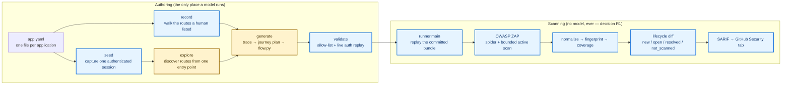
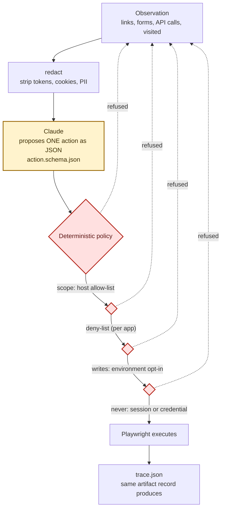
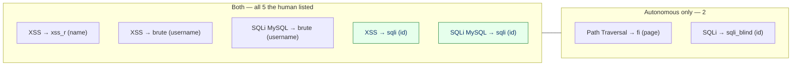
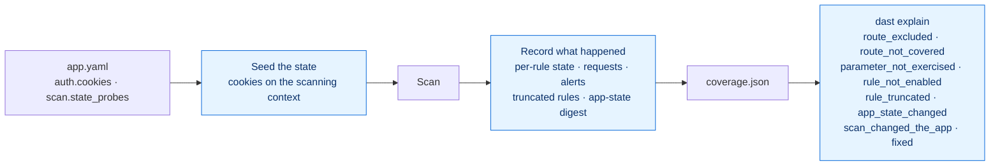
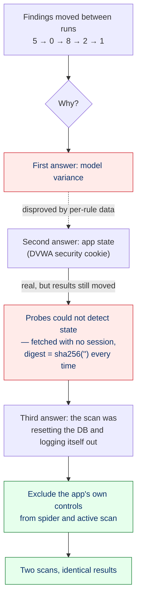
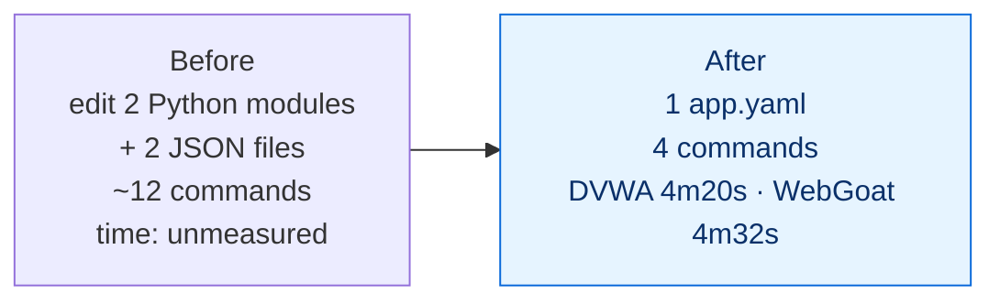

# Deterministic vs. LLM-guided discovery — what we built, and what it found

How the two authoring paths differ, what each is measurably good at, and what running them
against three real applications taught us. Every number here comes from a run on this
project's own infrastructure between 2026-09-27 and 2026-09-28; nothing is projected.

---

## 1. The two paths

Both end at the same place — a committed bundle that a deterministic scanner replays — and
they differ only in how the authenticated surface is discovered.



Yellow is where a model may run. Everything else is deterministic, and the scan half has no
model in it at all — that is decision **R1**, and it is what makes `resolved` mean anything:
if a model could change what a scan does, a finding disappearing might only mean the model
chose differently today.

### What each path actually is

| | Deterministic path | LLM-guided path |
|---|---|---|
| Entry | `record` walks `record.authenticated_routes` | `explore` starts from one seed route |
| Who chooses routes | A human, in `app.yaml` | The model, one validated action at a time |
| Who decides what may execute | Code | **Code** — the model only proposes |
| Repeatability | Exact | Varies run to run |
| Cost | None | ~1 API call per step |
| Fails to | Miss what nobody listed | Wander, and vary |

---

## 2. Where the model is allowed to act, and where it is not

The safety architecture is the reason the LLM path is usable at all. The model emits **data**;
deterministic code decides whether that data may execute, and renders it into code.



Four gates, each of which has refused something real during development:

| Gate | Caught, in practice |
|---|---|
| Scope allow-list | A captcha lesson pulling `google.com` — blocked during discovery, and it would have failed the scan |
| Per-app deny-list | `setup`, `phpinfo`, `captcha` on DVWA |
| Write opt-in | Every POST, until an environment is declared disposable |
| Session/credential rule | A password-change form that had already emptied DVWA's admin password once (see §5) |

---

## 3. What each path found — measured

All figures from DVWA, one application, same ZAP, same policy unless stated.

### The headline

| Path | Routes given by a human | Pages reached | High-severity findings |
|---|---|---|---|
| Hand-picked `record` | 5 | 5 | **5** |
| LLM `explore`, earlier best run | **0** | 27–29 | 8 (but only **3 of the human's 5**) |
| LLM `explore`, after W6-11 + W6-12 | **0** | 23 | **7 — including all 5 of the human's** |

*Re-measured 2026-10-03:* the hand-picked `record` path now finds **19** high-severity findings
on DVWA. The result was identical before and after the `parallel-poc-branch` merge. The increase
comes from the DOM-XSS pass and the later scan fixes (see
[`status_and_roadmap.md`](status_and_roadmap.md)). The LLM rows were not re-run, so the comparison
above stands as measured at the time.

**Autonomous discovery now contains the hand-picked result.** With zero routes supplied by a
person, the run finds every finding the hand-picked list produced, plus two more:



The two highlighted are the ones it used to miss, and they were not a model failure. Seed
routes were walked *before* the exploration loop began, so only the **last** one was ever
observed and `untried_form()` — which only judges the page in front of it — never saw the
others. DVWA's seeds end with `xss_r`, which is exactly the page whose form was submitted;
`/vulnerabilities/sqli` was walked straight past and visited bare, so `?id=` never entered the
journey and no scan built from that bundle could reach it. Queue the seeds through the loop,
remember forms on pages the model leaves, and the journey goes from **one** parameterised
target to **seven**:

```
/vulnerabilities/sqli/?id=1&Submit=Submit          ← never present before
/vulnerabilities/sqli_blind/?id=1&Submit=Submit
/vulnerabilities/xss_r/?name=dast-test
/vulnerabilities/xss_d/?default=English
/vulnerabilities/brute/?username=admin&password=&Login=Login
/vulnerabilities/fi/?page=include.php · ?page=file1.php
```

This is the one claim in this document that changed direction. It was previously written here
that autonomous discovery "does not strictly dominate" and that its blind spot moves. On this
application that is no longer true: the blind spot was an ordering bug in our loop, not an
inherent property of letting a model choose. Three earlier autonomous findings are absent from the new run, each for a different and
now-visible reason, which is the point of the whole measurement apparatus:

| Absent finding | Why, from the artifacts |
|---|---|
| `SQLi → setup.php (create_db)` | The route is excluded by W6-11. A deliberate decision, reported as `route_excluded`, not lost |
| `SQLi → brute (password)` | `route_params` shows `['Login', 'username']` — the journey submits the form with an empty password, so the parameter was never sent. Reported by the reachability line |
| `SQLi → xss_d (default)` | `route_params` shows `['default']`, so it **was** exercised, and rule 40018 completed 467 requests and raised 3 alerts elsewhere. It simply did not reproduce — the one of the three that is a genuine finding-level difference rather than a coverage one |

The first two are coverage facts the tool can state about itself. Only the third is a question
about the finding, and that is the distinction this project exists to make.

### Two other things worth knowing

**The scanner is exactly repeatable.** Two scans of one bundle produced byte-identical finding
sets — 213 fingerprints, 744 records, identical severity histograms. That is what makes the
lifecycle diff trustworthy, and it is why the variance below can be attributed to the model
rather than to ZAP.

**Surface beats posture.** Raising attack strength to high and the alert threshold to low added
23 findings and no highs. Adding four parameterised GETs — `?id=1&Submit=Submit` — took the
same scan from **0 highs to 5**. ZAP can only attack a parameter it has seen.

---

### The single most important measurement in this project

For one stretch the same pipeline produced **7 highs, then 2, then 0**, and the obvious
explanation — the model's route choices vary — was wrong. ZAP's own per-rule record settled
it:

| | Before | After |
|---|---|---|
| Rule 40018 (SQL Injection) | `Complete, 660 requests, **0 alerts**` | `Complete, 661 requests, **5 alerts**` |

Same rule, effectively the same request count, opposite outcome. The rule was never starved
and never truncated; **the application was not in a vulnerable state while the scan ran.**
DVWA keeps its security level in a cookie, the scanner never set it, and nothing recorded
that it had changed. An autonomous run had also, earlier, submitted a password-change form
and emptied the admin credential.

Findings therefore depended on application state the tool neither controlled nor observed.
Both halves are now addressed:



**The lesson generalises past DVWA.** Any application has state a scan depends on — a feature
flag, a seeded dataset, a tenant's configuration — and if the tool neither sets it nor records
it, then "we found nothing" and "there was nothing to find" are the same sentence. That is not
a lab curiosity; it is the difference between a scan report an internal team can act on and
one they cannot.

**That was the smaller half of the problem.** The cookie was real, and setting it did move
five findings from invisible to visible — but it did not make the results stable, and the
section below is what finally did.

---

### The larger half: the scan was attacking the application's own controls

After the state fix, results still moved: 8 highs, then 2, then 1. `explain` said `fixed` for
six findings against an application nobody had fixed. The state probes could not contradict it,
because they were fetched **without the scan's session** — `/security.php` answered `302` to the
login page and digested to `sha256("")` on every run, so `app_state_changed` was unreachable by
construction. A state oracle that always matches is worse than none: it lends confidence.

With the probes given the scan's own session, they answered, and ZAP's message store explained
the rest. Over one 10-minute scan:

| What the scan was doing to the app it was scanning | Count |
|---|---|
| Submissions of DVWA's **"Create / Reset Database"** form (`setup.php?create_db`) | **~325** |
| POSTs to the **login form** (`/login.php`) | **~1,000** |
| `/vulnerabilities/*` responses that were redirects to the login page | **~half** |

The scan was resetting the database and logging itself out, mid-scan, repeatedly. Findings
depended on whether the session happened to be alive when a given rule ran. `scope.avoid_actions`
had named `logout` and `setup` all along — but it was only ever enforced during *exploration*.
ZAP was never told.

Telling it (W6-11) changed the result more than any tuning did:

| Same bundle, same app, same policy | Before | After |
|---|---|---|
| Records | 996 | 617 |
| **High-severity findings** | **1** | **5** |
| Rule 40018 (SQL Injection) | 868 requests, **0 alerts** | 468 requests, **2 alerts** |
| Rule 40012 (Reflected XSS) | 97 requests, **0 alerts** | 50 requests, **2 alerts** |

**Five times the high-severity findings for half the requests** — because the requests now land
on a logged-in application instead of a login page. The 379 records that went away are the
excluded routes' own findings; `explain` attributes 80 of them to `route_excluded`, and none of
them to `fixed`.

And the result stopped moving. Two consecutive scans produced **identical** output: 267
fingerprints, 80 routes, identical `route_params`, the same five highs, and `dast explain`
reporting `nothing disappeared`. The instability that had been written off as model variance
was, in the end, the scanner sabotaging itself.



**Coverage had to follow the exclusions**, or the fix would have caused the exact bug this
project exists to prevent: a route the scanner is told to skip would still appear in
`accessed_routes`, so every finding on it would have resolved itself the moment the exclusion
was added. Excluded routes are subtracted from coverage and `explain` names the pattern
responsible.

**Parameter-level coverage is now closed too (W6-10).** Coverage records the query parameters
ZAP actually sent per route, `resolved` requires the finding's own parameter, and `explain` has a
`parameter_not_exercised` reason. It fired on real data immediately: `/vulnerabilities/brute` was
visited but never with `password`, which the old code would have called `fixed`.

---

## 4. Onboarding cost, which is the point of the whole exercise



Three applications are onboarded, deliberately different in every dimension that mattered:

| | juice-shop | dvwa | webgoat |
|---|---|---|---|
| Stack | Angular SPA | PHP | Spring Boot |
| Login | email | username | username |
| Session | JWT in `localStorage` | PHPSESSID cookie | JSESSIONID cookie |
| Proof of auth | `js` | `route` | `selector` |
| API convention | `/rest/`, `/api/` | none | `/service/` |
| Onboarding | the original | 4m20s | **4m32s, zero code changes** |

WebGoat is the one that proves the claim: `git status` after the whole loop showed one new
path, `security/dast/webgoat/`, and no diff to any module. DVWA did not — it needed the live
half of the auth-proof work finished first, and that is stated plainly in the plan.

---

## 5. What running it taught us that reading it did not

Every defect below was found by running the pipeline against a real application. None was
visible in a passing test suite, and several were invisible *because* the suite passed.

| Defect | How it presented | Why it hid |
|---|---|---|
| ZAP hijacks any target on its own port | A 400 with body `Bad Format`; the app never saw a request | Juice (3000) and DVWA (80) never collided — it took a third app on 8080 |
| The model's login block failed validation | LLM path fell back **silently**; you had to diff plans to notice | Tests patched the function that contained the bug |
| Absolute journey targets glued onto `base_url` | `page.goto("http://dvwahttp://dvwa/…")` | Only appeared once the LLM path worked at all |
| `f.id` returned an HTML element | Selector `#[object HTMLInputElement]` | A form's named controls shadow its properties — only DVWA had an `<input name="id">` |
| Every page's first form looked "already tried" | 2–3 form submissions per run regardless of budget | The selector `form >> nth=0` is page-relative; `visited` was global |
| **The loop changed DVWA's admin password** | Every later login failed | The guard judged the *selector*, which was anonymous; the page URL and field names both said "password change" |
| **The scan depended on state nobody set or recorded** | 5 highs became 0 with the rule running 660 requests | Coverage recorded which rules were *enabled*, never what they *did*, and nothing described the application's own condition |
| **The state oracle could not see state** | Two runs differing by five highs produced identical fingerprints | Probes were fetched with no session, so every one digested the login page — `sha256("")`, forever equal |
| **The scan attacked the app's own controls** | ~325 database resets and ~1,000 login POSTs in one scan; half of all responses redirected to login | `avoid_actions` was enforced during exploration only; ZAP was never told, and a passing suite cannot see what a scanner does to a live app |
| **Only the last seed route was ever observed** | Two hand-picked findings unreachable from any autonomously authored bundle | Seed routes were walked *before* the loop; `untried_form()` judges only the current page. Every test was of a pure function, and the defect lived entirely in the loop's ordering |
| **A form policy refuses stayed pending forever** | Exploration reached 6 pages instead of 28, returning to one page 23 times | Found only by reading the trace's own form records after a live run — the fix for one defect created it, and the suite was green throughout |
| **The fix for the scanner attacking its own controls excluded all of Juice Shop** | A scan passed its gate with 60 passive findings instead of ~1,400; coverage showed 0 routes | A hash-routed login (`/#/login`) has path `/`, so the derived exclusion matched every URL. Tests used `/login.php`; live checks ran on DVWA. Caught before upload by coverage's `0 routes` — the measurement work catching a defect in its own fix |

The last one is the one to carry into any real environment. An autonomous loop submitted a
password-change form and destroyed the credential the scan depended on, and the rule written
to prevent precisely that did not fire. Actions are now judged by where they are and what they
carry, not only by what they target.

### The measurement problem, now mostly solved

That same spread — 7 highs, then 2, then 0 — was originally written off here as variance. It
was not — and it took three passes to reach the bottom of it. The rule had run to completion, so
it was not budget. The application was not in a vulnerable state, so the cookie mattered. But the
results still moved after that, and the real cause was that the scan was resetting the database
and logging itself out. Almost all of it turned out to be fixable rather than inherent:

| Source of variation | Status |
|---|---|
| **The scan attacking the app's own controls** | **Fixed (W6-11)** — `avoid_actions` and the login page are excluded from spider and active scan. This was the dominant cause |
| Application state | **Fixed** — set it (`auth.cookies`) and record it (`scan.state_probes`) |
| State probes that could not see state | **Fixed** — probes carry the scan's session; the digest was `sha256("")` before |
| "Did the rule even run?" | **Fixed** — per-rule state, requests and alerts in `coverage.json` |
| "Why did this finding go?" | **Answerable** — `dast explain`, attributed with evidence |
| Route-level vs parameter-level coverage | **Fixed (W6-10)** — coverage records parameters; `fixed` requires the finding's own parameter |
| Forms on every page but the last going unsubmitted | **Fixed (W6-12)** — seed routes are queued through the loop and forms on pages the model leaves are drained. This is what unlocked the last two hand-picked findings |
| Parameters the app exposes but the scan never sends | **Now reported** — `dast report` prints the shortfall by name instead of it being a silent miss |
| The model's route choices | **Inherent**, but far smaller than it looked. Two consecutive scans of one bundle are now identical; what still varies is which routes a *fresh authoring pass* proposes. The answer is protocol — compare unions of repeated passes, never single runs |

The generalisable lesson is the first row. Any application has state a scan depends on, and if
the tool neither sets it nor records it, *"we found nothing"* and *"there was nothing to find"*
become the same sentence.

---

## 6. Honest scorecard

| Claim | Status |
|---|---|
| An application onboards from configuration alone | **Proven** — WebGoat, zero code diff, 4m32s |
| The LLM can discover routes a human did not list | **Proven** — and it now *contains* the human's list: 5 of 5 hand-picked highs plus 2 more, from zero supplied routes |
| The LLM can reach parameters behind forms | **Proven** — `sqli`, `sqli_blind`, `brute`, `xss_r`, `fi` |
| Deterministic scanning is repeatable | **Proven twice** — byte-identical across two scans of one bundle, and again end-to-end after W6-11: 267 fingerprints, 80 routes, 5 highs, `nothing disappeared` |
| Safety policy holds against an autonomous agent | **Partly** — five gates hold; one failed live (a password-change form) and is now fixed |
| A disappeared finding can be explained | **Yes** — `dast explain` attributes it from recorded evidence, now at parameter granularity (`parameter_not_exercised`) and naming deliberate gaps (`route_excluded`). Measured: 80 disappearances correctly attributed to exclusions, 0 called `fixed` |
| The scanner leaves the application it scans intact | **Now yes, and it did not before** — it was submitting DVWA's database-reset form ~325 times per scan |
| The LLM beats the deterministic proposer | **Not established** — the best autonomous run wins on count, but run-to-run variance exceeds the difference |
| Autonomous discovery dominates hand-picking | **Now yes, on this application** — 7 highs including all 5 the human listed. The previous "no" was an ordering bug in our own loop (seed routes walked before the loop began), not a property of model-chosen routes |
| A single run is a reliable measure | **For the findings, yes** — two consecutive scans of the new bundle produced the same 7 highs and `nothing disappeared`. Not byte-identical overall: 608 vs 626 records over 78 vs 80 routes, because the spider reached two more routes on the second pass. Findings are stable; total record count is not |
| Every parameter on a reached route gets tested | **Not always, and it now says so.** `dast report` prints `reachability: 8/12 exposed parameters exercised` and names the misses. The two that remain on DVWA are `brute?password` and the `csrf` password fields — the latter is the credential-change form the action policy refuses, reported as a gap because it genuinely is one |

**The defensible summary:** autonomous discovery finds more than a human's list *and now
contains it* — all five hand-picked highs plus two more, from zero supplied routes, at zero
marginal human cost, inside a policy that has been tested by an agent actively trying to click
everything, including once destroying the credential it depended on, which the policy now
refuses. For a given bundle the findings repeat exactly. What it still cannot promise is that a
*fresh authoring pass* proposes the same routes, so the protocol for a real comparison remains
to repeat and compare unions — and `dast report` now names the parameters a pass left
untouched, so the shortfall is a number rather than an unknown.

The most transferable result is not a finding count. It is that "the scan found nothing" had
several indistinguishable causes — the rule never ran; the rule ran and found nothing; the
application was not in a testable state; the parameter was never sent; the route was excluded on
purpose; or **the scan had broken the application underneath itself** — and the tool now tells
them apart from its own artifacts. Before any pilot argues about detection rates, that
distinction is what makes the numbers mean anything.

The sharpest lesson for a nationwide rollout is the last cause. A scanner pointed at an internal
application will find that application's administrative controls, and it will use them. Ours
reset a database ~325 times in ten minutes and read the resulting silence as "no vulnerabilities
here". The configuration that would have prevented it already existed and was simply never
handed to the scanner. On a shared environment that is not a lost finding; it is an incident.

---

*Sources: runs on this machine 2026-09-27/28 against OWASP Juice Shop, DVWA and WebGoat
through ZAP 2.17.0; artifacts under `out/<app>/scans/<scan_id>/`. Commits `622650c` through
`ce43e27`. Test suite 499 passing. The before/after figures in §3 are scans `20260928T044101Z`
(996 records, 1 high) and `20260928T044609Z` (617 records, 5 highs); the repeatability pair for that
change is `20260928T044609Z` and `20260928T044940Z`. The 7-high autonomous result in §3 is
`20260928T155332Z`, repeated as `20260928T155811Z`.*
