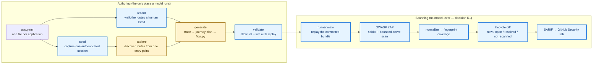
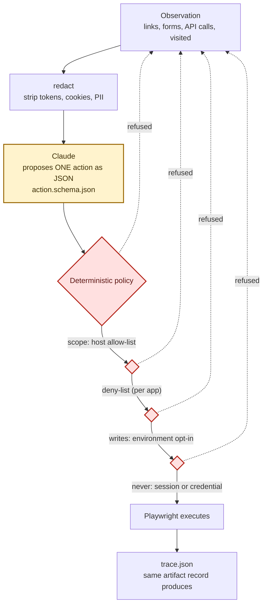
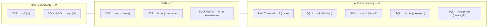
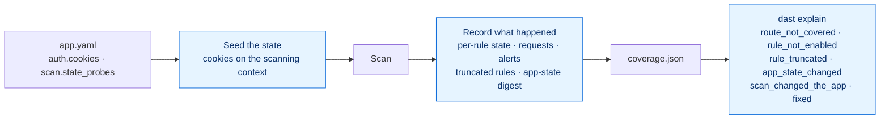
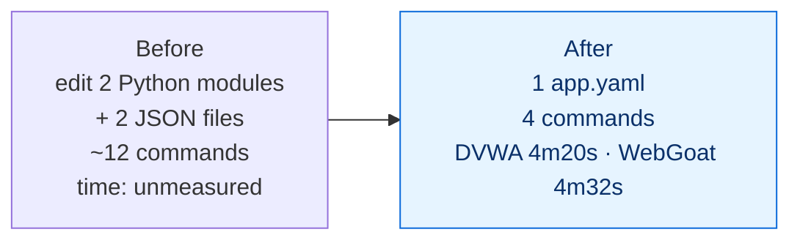

# Deterministic vs. LLM-guided discovery — what we built, and what it found

How the two authoring paths differ, what each is measurably good at, and what running them
against three real applications taught us. Every number here comes from a run on this
project's own infrastructure between 2026-09-27 and 2026-09-28; nothing is projected.

---

## 1. The two paths

Both end at the same place — a committed bundle that a deterministic scanner replays — and
they differ only in how the authenticated surface is discovered.

Yellow is where a model may run. Everything else is deterministic, and the scan half has no
model in it at all — that is decision **R1**, and it is what makes `resolved` mean anything:
if a model could change what a scan does, a finding disappearing might only mean the model
chose differently today.

### What each path actually is

| | Deterministic path | LLM-guided path |
|---|---|---|
| Entry | `record` walks `record.authenticated_routes` | `explore` starts from one seed route |
| Who chooses routes | A human, in `app.yaml` | The model, one validated action at a time |
| Who decides what may execute | Code | **Code** — the model only proposes |
| Repeatability | Exact | Varies run to run |
| Cost | None | ~1 API call per step |
| Fails to | Miss what nobody listed | Wander, and vary |

---

## 2. Where the model is allowed to act, and where it is not

The safety architecture is the reason the LLM path is usable at all. The model emits **data**;
deterministic code decides whether that data may execute, and renders it into code.

Four gates, each of which has refused something real during development:

| Gate | Caught, in practice |
|---|---|
| Scope allow-list | A captcha lesson pulling `google.com` — blocked during discovery, and it would have failed the scan |
| Per-app deny-list | `setup`, `phpinfo`, `captcha` on DVWA |
| Write opt-in | Every POST, until an environment is declared disposable |
| Session/credential rule | A password-change form that had already emptied DVWA's admin password once (see §5) |

---

## 3. What each path found — measured

All figures from DVWA, one application, same ZAP, same policy unless stated.

### The headline

| Path | Routes given by a human | Pages reached | High-severity findings |
|---|---|---|---|
| Hand-picked `record` | 5 | 5 | **5** |
| LLM `explore`, best run | **0** | 27–29 | **8** |

The autonomous run found **3 of the 5** the hand-picked run found, **plus 5 it never did**:

`sqli_blind`, `xss_d` and `fi` are separate lessons nobody had listed. **Autonomous discovery
does not strictly dominate:** the two it misses are both on `/vulnerabilities/sqli?id=`, and
they are missing for a reason its own artifacts now explain — that pass never submitted that
page's form, so the parameter never entered the journey. A different pass reaches it and
misses something else. Each path has a blind spot; the autonomous one is wider and its blind
spot moves.

### Two other things worth knowing

**The scanner is exactly repeatable.** Two scans of one bundle produced byte-identical finding
sets — 213 fingerprints, 744 records, identical severity histograms. That is what makes the
lifecycle diff trustworthy, and it is why the variance below can be attributed to the model
rather than to ZAP.

**Surface beats posture.** Raising attack strength to high and the alert threshold to low added
23 findings and no highs. Adding four parameterised GETs — `?id=1&Submit=Submit` — took the
same scan from **0 highs to 5**. ZAP can only attack a parameter it has seen.

---

### The single most important measurement in this project

For one stretch the same pipeline produced **7 highs, then 2, then 0**, and the obvious
explanation — the model's route choices vary — was wrong. ZAP's own per-rule record settled
it:

| | Before | After |
|---|---|---|
| Rule 40018 (SQL Injection) | `Complete, 660 requests, **0 alerts**` | `Complete, 661 requests, **5 alerts**` |

Same rule, effectively the same request count, opposite outcome. The rule was never starved
and never truncated; **the application was not in a vulnerable state while the scan ran.**
DVWA keeps its security level in a cookie, the scanner never set it, and nothing recorded
that it had changed. An autonomous run had also, earlier, submitted a password-change form
and emptied the admin credential.

Findings therefore depended on application state the tool neither controlled nor observed.
Both halves are now addressed:

**The lesson generalises past DVWA.** Any application has state a scan depends on — a feature
flag, a seeded dataset, a tenant's configuration — and if the tool neither sets it nor records
it, then "we found nothing" and "there was nothing to find" are the same sentence. That is not
a lab curiosity; it is the difference between a scan report an internal team can act on and
one they cannot.

**What is still weak here, stated plainly:** coverage is recorded per *route*, not per
*parameter*. `/vulnerabilities/sqli` counts as covered even when it was only ever visited
without `?id=`, so `explain` would call the two findings on that parameter `fixed` when the
truth is that nothing ever tested them. The same flaw sits under `resolved`. It is recorded as
W6-10, and until it is closed a `fixed` verdict is only as trustworthy as route granularity
allows.

---

## 4. Onboarding cost, which is the point of the whole exercise

Three applications are onboarded, deliberately different in every dimension that mattered:

| | juice-shop | dvwa | webgoat |
|---|---|---|---|
| Stack | Angular SPA | PHP | Spring Boot |
| Login | email | username | username |
| Session | JWT in `localStorage` | PHPSESSID cookie | JSESSIONID cookie |
| Proof of auth | `js` | `route` | `selector` |
| API convention | `/rest/`, `/api/` | none | `/service/` |
| Onboarding | the original | 4m20s | **4m32s, zero code changes** |

WebGoat is the one that proves the claim: `git status` after the whole loop showed one new
path, `security/dast/webgoat/`, and no diff to any module. DVWA did not — it needed the live
half of the auth-proof work finished first, and that is stated plainly in the plan.

---

## 5. What running it taught us that reading it did not

Every defect below was found by running the pipeline against a real application. None was
visible in a passing test suite, and several were invisible *because* the suite passed.

| Defect | How it presented | Why it hid |
|---|---|---|
| ZAP hijacks any target on its own port | A 400 with body `Bad Format`; the app never saw a request | Juice (3000) and DVWA (80) never collided — it took a third app on 8080 |
| The model's login block failed validation | LLM path fell back **silently**; you had to diff plans to notice | Tests patched the function that contained the bug |
| Absolute journey targets glued onto `base_url` | `page.goto("http://dvwahttp://dvwa/…")` | Only appeared once the LLM path worked at all |
| `f.id` returned an HTML element | Selector `#[object HTMLInputElement]` | A form's named controls shadow its properties — only DVWA had an `<input name="id">` |
| Every page's first form looked "already tried" | 2–3 form submissions per run regardless of budget | The selector `form >> nth=0` is page-relative; `visited` was global |
| **The loop changed DVWA's admin password** | Every later login failed | The guard judged the *selector*, which was anonymous; the page URL and field names both said "password change" |
| **The scan depended on state nobody set or recorded** | 5 highs became 0 with the rule running 660 requests | Coverage recorded which rules were *enabled*, never what they *did*, and nothing described the application's own condition |

The last one is the one to carry into any real environment. An autonomous loop submitted a
password-change form and destroyed the credential the scan depended on, and the rule written
to prevent precisely that did not fire. Actions are now judged by where they are and what they
carry, not only by what they target.

### The measurement problem, half solved

That same spread — 7 highs, then 2, then 0 — was originally written off here as variance. It
was not. Pushed on the claim, the data disproved it in ten minutes: the rule had run to
completion and the application simply was not vulnerable at the time. Two thirds of the
problem turned out to be fixable rather than inherent:

| Source of variation | Status |
|---|---|
| Application state | **Fixed** — set it (`auth.cookies`) and record it (`scan.state_probes`) |
| "Did the rule even run?" | **Fixed** — per-rule state, requests and alerts in `coverage.json` |
| "Why did this finding go?" | **Answerable** — `dast explain`, attributed with evidence |
| The model's route choices | **Inherent.** 5–29 pages across runs; the answer is protocol, not code — compare unions of repeated passes, never single runs |
| Route-level vs parameter-level coverage | **Open (W6-10)** — a parameter never exercised still looks covered, so `fixed` can be wrong |

The generalisable lesson is the first row. Any application has state a scan depends on, and if
the tool neither sets it nor records it, *"we found nothing"* and *"there was nothing to find"*
become the same sentence.

---

## 6. Honest scorecard

| Claim | Status |
|---|---|
| An application onboards from configuration alone | **Proven** — WebGoat, zero code diff, 4m32s |
| The LLM can discover routes a human did not list | **Proven** — 4 highs unique to autonomous discovery |
| The LLM can reach parameters behind forms | **Proven** — `sqli`, `sqli_blind`, `brute`, `xss_r`, `fi` |
| Deterministic scanning is repeatable | **Proven** — byte-identical across two scans |
| Safety policy holds against an autonomous agent | **Partly** — five gates hold; one failed live (a password-change form) and is now fixed |
| A disappeared finding can be explained | **Yes, with a caveat** — `dast explain` attributes it from recorded evidence, but route-level coverage can still mislabel a parameter-level miss as `fixed` (W6-10) |
| The LLM beats the deterministic proposer | **Not established** — the best autonomous run wins on count, but run-to-run variance exceeds the difference |
| Autonomous discovery dominates hand-picking | **No.** It found 5 the human missed and missed 2 the human found. Wider coverage, moving blind spot |
| A single run is a reliable measure | **No.** Repeat, or compare unions |

**The defensible summary:** autonomous discovery finds more than a human's list, at zero
marginal human cost, inside a policy that has now been tested by an agent actively trying to
click everything — including once destroying the credential it depended on, which the policy
now refuses. What it does not yet do is find everything *reliably in one run*.

The most transferable result is not a finding count. It is that "the scan found nothing" had
three indistinguishable causes — the rule never ran, the rule ran and found nothing, or the
application was not in a testable state — and the tool now tells them apart from its own
artifacts. Before any pilot argues about detection rates, that distinction is what makes the
numbers mean anything.

---

*Sources: runs on this machine 2026-09-27/28 against OWASP Juice Shop, DVWA and WebGoat
through ZAP 2.17.0; artifacts under `out/<app>/scans/<scan_id>/`. Commits `622650c` through `dd3aab6`. Test suite 436 passing.*
