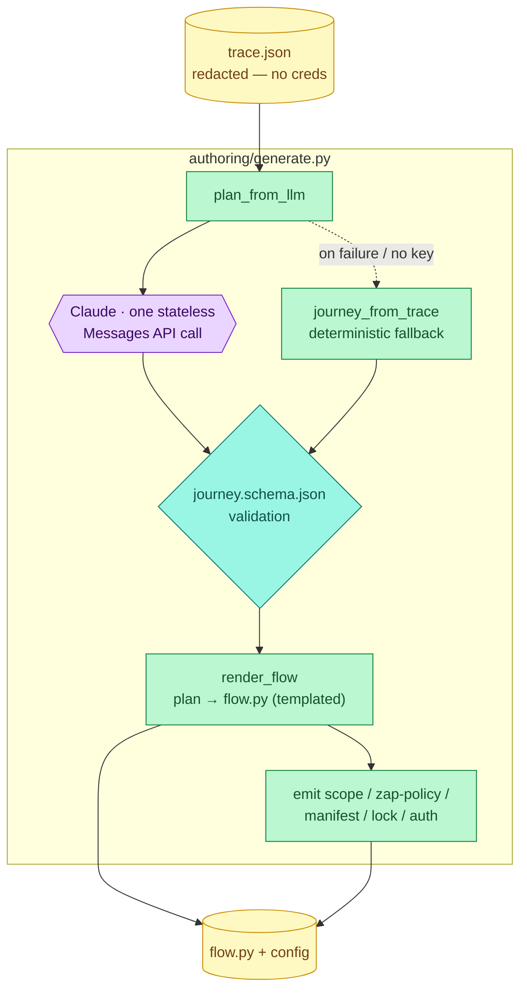
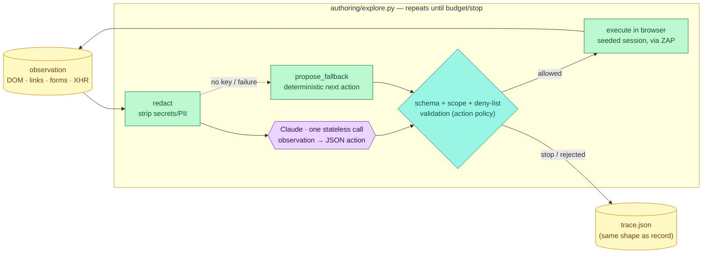
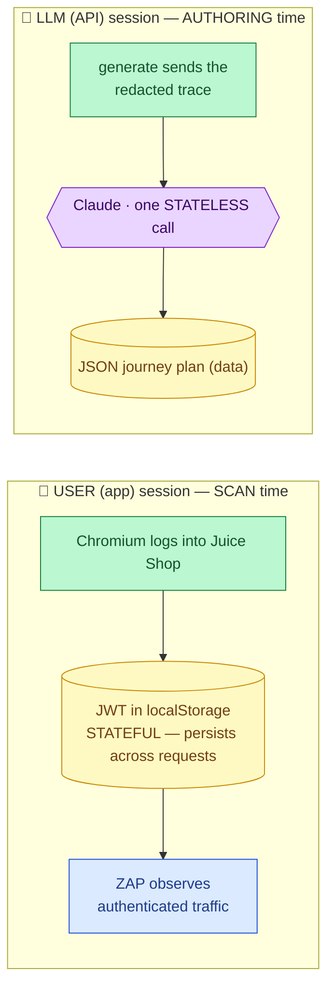
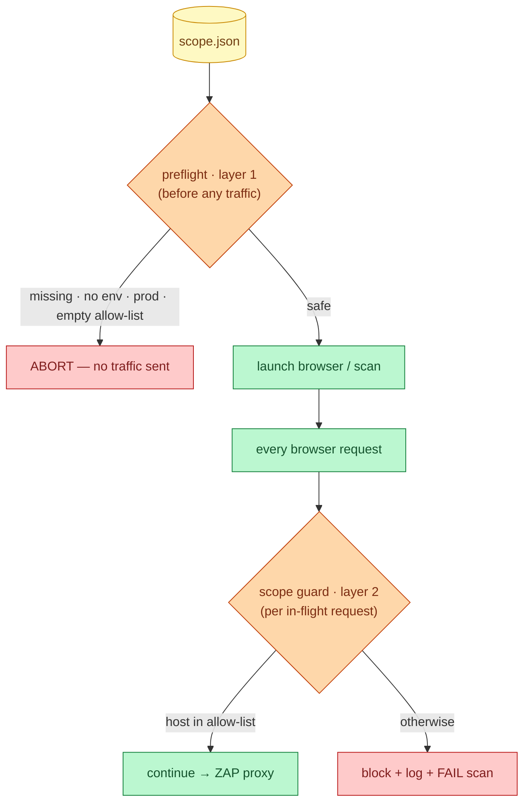
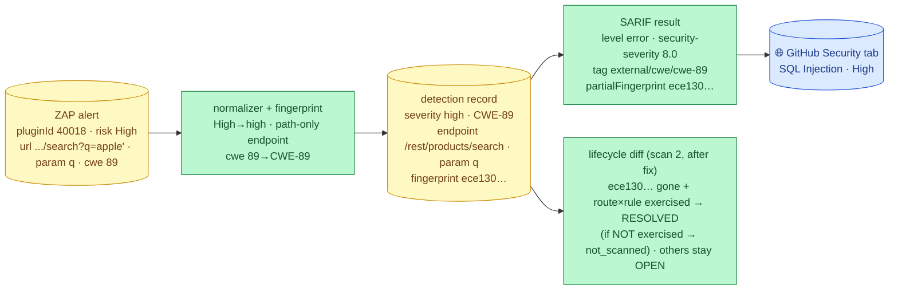

# DAST POC — Architecture Overview (front to back)

The single doc that explains **what's been built and how every part fits together** — the
authoring CLIs, the runner, the detections pipeline, the contracts, the safety model, and
exactly where (and how narrowly) the LLM is used. Start here; the per-component design docs
(`runner_design.md`, `authoring_clis_design.md`, `sarif_exporter_design.md`, …) go deeper.

> **Diagram legend (colors used throughout):**
> 🟨 human input · 🟩 our code (a build step) · 🟪 the LLM (Claude) · 🟦 external system
> (GitHub / target app) · 🟧 safety gate · 🟥 abort/block · pale-yellow cylinders = data artifacts.

---

## 1. What this is

An **authenticated, non-prod, LLM-assisted DAST loop**: record a login + a short journey
through a web app, use an LLM to turn that recording into scan config, run OWASP ZAP against the
authenticated app inside a hard safety boundary, normalize the findings with stable
fingerprints, and publish them to the GitHub Security tab with lifecycle tracking across scans.

Pilot app: **OWASP Juice Shop** (intentionally vulnerable, safe to attack). Scanner: **OWASP
ZAP**. Browser automation: **Playwright + Chromium**. LLM: **Claude** (Anthropic API).

**Status:** both halves built, tested (188 tests), and verified end-to-end on real data — the
full loop runs from a single containerized command, and the four proof points all pass. A
**seeded-session + LLM exploration** authoring path (`seed` + `explore`) and a **coverage-aware
lifecycle diff** are also built and verified — see §2, §4, §6 and
`seeded_session_exploration_design.md`.

---

## 2. The whole pipeline, front to back

Two phases, and the seam between them is the generated `flow.py` + `scope.json`. **Authoring**
turns a login journey into scan config (the LLM lives here and only here) — via either `record`
(a scripted browser crawl) **or** `seed` + `explore` (a human-seeded session an LLM-driven loop
then explores for breadth). Both emit the same `trace.json`, so everything downstream is identical.
**Scanning** executes a safe authenticated scan and processes the results (no LLM runs during a
scan); the lifecycle diff is coverage-aware.

```mermaid
flowchart LR
    human(["👤 Human + creds"]):::human

    subgraph AUTH["🖊️ AUTHORING — once per app (LLM lives here)"]
        direction LR
        rec["record<br/>scripted browser crawl"]:::build
        seed["seed<br/>human login → storageState"]:::build
        expl["explore<br/>seeded session · LLM loop"]:::build
        exllm{{"LLM · Claude<br/>observation → JSON action"}}:::llm
        trace[("trace.json<br/>pages · forms · API · hosts")]:::data
        gen["generate"]:::build
        llm{{"LLM · Claude<br/>trace → JSON plan"}}:::llm
        cfg[("flow.py · scope.json<br/>auth.json · zap-policy<br/>manifest · lock")]:::data
        val["validate<br/>allow-list + auth replay"]:::build
    end

    subgraph SCAN["🛡️ SCANNING — every run (no LLM)"]
        direction LR
        pre["preflight<br/>safety layer 1"]:::safety
        rep["replay / replay_seeded<br/>auth via ZAP proxy"]:::build
        guard["scope guard<br/>safety layer 2"]:::safety
        ascan["active scan<br/>bounded to allow-list"]:::build
        raw[("raw ZAP alerts")]:::data
        norm["normalizer + fingerprint"]:::build
        cov[("coverage<br/>route×rule exercised")]:::data
        recs[("detection records")]:::data
        sarif["SARIF export"]:::build
        diff["lifecycle diff<br/>new / open / resolved / not_scanned"]:::build
    end

    gh[("🌐 GitHub Security tab")]:::ext

    human --> rec --> trace
    human --> seed --> expl --> trace
    expl <--> exllm
    trace --> gen
    gen <--> llm
    gen --> cfg --> val
    cfg ==> pre ==> rep ==> guard ==> ascan ==> raw ==> norm ==> recs
    ascan --> cov --> diff
    recs --> sarif --> gh
    recs --> diff

    classDef human fill:#fde68a,stroke:#b45309,color:#1f2937
    classDef build fill:#bbf7d0,stroke:#15803d,color:#14532d
    classDef llm fill:#e9d5ff,stroke:#7e22ce,color:#3b0764
    classDef data fill:#fef9c3,stroke:#ca8a04,color:#713f12
    classDef safety fill:#fed7aa,stroke:#c2410c,color:#7c2d12
    classDef ext fill:#dbeafe,stroke:#1d4ed8,color:#1e3a8a
```



---

## 3. The three subsystems

### 3a. Authoring CLIs (`authoring/`) — produce the config

| CLI | FRs | What it does |
|-----|-----|--------------|
| `record.py` | R1/R2/R3 | Drives Chromium through register → login → an authenticated page; captures `trace.json` (interactions, forms, API/XHR, hosts) + `index.json` |
| `seed.py` | — (KI4) | Human logs in once (SSO/MFA/CAPTCHA by hand); saves Playwright `storageState` (gitignored) so scans start already authenticated |
| `explore.py` | — (KI4) | Seeded, **LLM-driven** exploration loop (observe → redact → LLM JSON action → validate → execute → capture); emits the same `trace.json` as `record`, expanding breadth from seed routes |
| `generate.py` | G1–G4 | **LLM** turns the trace into a JSON *journey plan*; deterministic code renders `flow.py`; also emits `scope.json`, `auth.json`, `zap-policy.yaml`, `manifest.json`, `lock` |
| `validate.py` | V1/V2/V3 | Checks every host the plan would contact is in the allow-list (FR-V2), replays the generated `flow.py` to confirm auth (FR-V1), writes `validation-report.json` + non-zero exit on failure (FR-V3) |

### 3b. Runner (`runner/`) — execute a safe scan

| Module | FRs | Role |
|--------|-----|------|
| `preflight.py` | S3, NFR-2 | **Safety layer 1** — refuse to scan before any traffic if scope is missing/`prod`/unbounded |
| `replay.py` | S1, R2 | Launch Chromium proxied through ZAP; run the flow (`replay`) or a seeded session (`replay_seeded` + `prove_auth_live`) so ZAP observes authenticated traffic |
| `scope_guard.py` | S4, NFR-4 | **Safety layer 2** — `page.route` interceptor; block/log/fail out-of-allow-list requests. Phase-split: `enforce` (fail closed) for scans, `discovery` (block-and-continue) for exploration |
| `action_policy.py` | — | Exploration safety: default-deny state-changing verbs + `avoid_action_list`; decides if an LLM-proposed action may execute (never trusts the LLM's label) |
| `redact.py` | — | Scrub JWT/bearer/secret-keys/email from DOM/XHR observations **before** they reach the LLM |
| `scan.py` | S1, S2 | Port of the capture-script choreography: spider + bounded active scan → raw ZAP JSON |
| `coverage.py` | — (R2) | Capture the `(route × rule)` surface a scan actually exercised (ZAP accessed URLs × enabled scanners) for the coverage-aware diff |
| `evidence.py` | E1 | Capture HAR + screenshot, **redact secrets**, reference from records/SARIF |
| `main.py` | all | Chain preflight → fresh ZAP session → replay (or seeded) → scan → normalize (+ coverage); exit code = the Phase 1 gate |

### 3c. Detections pipeline (`detections/`) — process the results

| Module | FRs | Role |
|--------|-----|------|
| `normalizer.py` | N1 | Raw ZAP alert → contract-shaped detection record (streaming) |
| `fingerprint.py` | N2 | Stable `sha256(rule_id \| endpoint_pattern \| parameter \| payload_family)` |
| `sarif_export.py` | X1 | Records → SARIF 2.1.0 (severity→level, `security-severity`, CWE tags, fingerprint in `partialFingerprints`) |
| `github_upload.py` | X2 | gzip+base64 the SARIF, POST to the code-scanning API |
| `lifecycle_diff.py` | L1/L2 | Compare two scans' fingerprint sets → label new/open/resolved; **coverage-aware** (R2): a previous-only finding is `resolved` only if its `(route × rule)` pair was exercised this scan, else `not_scanned`. Persist state (+ coverage) |

### 3d. Contracts (`contracts/`) — the frozen interfaces

`scope.json`(+schema), `detection.schema.json` (status enum incl. `not_scanned`), the fingerprint
formula (`README.md`), `trace.schema.json`, `journey.schema.json`, `seed.schema.json` (seed config),
`action.schema.json` (the LLM exploration action contract), the vendored `sarif-2.1.0.schema.json`,
and the real `sample_zap_output.json` fixture. Everything is written *to* these; they're the seams
that let each part be built and tested independently.

---

## 4. Where the LLM fits (and where it doesn't)

The LLM is used **only at authoring time**, in two places, both behind the **same** boundary:
`generate` (one stateless call: trace → JSON *journey plan*) and `explore` (a loop of stateless
calls: each redacted observation → one constrained JSON *action*). In both, the model emits
**data** validated against a schema; deterministic code renders/executes it. The model never
authors executable code and never runs during a scan.



`explore` applies the **same boundary in a loop**: each observation is redacted, the LLM proposes
one JSON *action*, and deterministic code validates it (schema + scope + deny-list) before executing
it in the seeded browser. The loop's output is a `trace.json` identical to `record`'s.



Key properties:
- **Data in, data out.** The model receives redacted data (a trace, or an observation) and returns
  data (a plan, or an action). Everything is schema-validated; deterministic code renders/executes
  it. → decision **D8** (also enforced for `explore` via `action_policy`).
- **LLM-optional.** With `ANTHROPIC_API_KEY` set it's the primary path; otherwise deterministic
  fallbacks (`journey_from_trace`, `propose_fallback`) keep both pipelines runnable. → decision **D9**.
- **Stateless.** Each Anthropic Messages request is independent — no persistent agent; `explore`
  is a *loop* of such stateless calls, not a conversation. The model never connects to the app or ZAP.
- **Authoring-time only; committed output replays deterministically.** After authoring, the LLM is
  done. `validate`, `runner`, and every detection stage involve **no LLM**. The reviewed
  `trace.json`/bundle is committed and re-scans replay it without calling the model — so the
  lifecycle diff stays deterministic. → decision **R1**.

### The two "sessions" — different things that share a word



| | **User (app) session** | **LLM (API) session** |
|---|---|---|
| **What it is** | The authenticated login to the app — the JWT/cookies in the browser context, from a form login **or a human-seeded `storageState`** | Calls to the Claude API (one in `generate`; a loop of stateless calls in `explore`) |
| **Where / when** | `runner/replay.py` (`replay` / `replay_seeded`), at scan time (established live each run, or loaded from a seed) | `authoring/generate.py` and `authoring/explore.py`, at authoring time (before any scan) |
| **Stateful?** | **Yes** — JWT/cookies persist so ZAP reaches authenticated endpoints | **No** — single request/response, nothing persists |
| **Talks to** | The target app, via the ZAP proxy | api.anthropic.com only — never the target, never ZAP |
| **Carries secrets?** | **Yes** — real creds + JWT (why HAR is redacted, creds from env) | **No** — receives a *redacted* trace, emits only a plan |
| **Trust** | Trusted (our creds, our target) | **Untrusted output** — schema-validated, rendered by deterministic code |

The user session is the stateful authenticated connection **to the app being scanned** (what
makes the scan "authenticated"). The LLM session is a stateless config-authoring call that never
touches the app, ZAP, or any secret.

---

## 5. The safety model (NFR-2 — the top guardrail)

Two independent, fail-closed layers, so a bug in one can't send unsafe traffic.



Plus: evidence HARs are **redacted** (auth headers, cookies, tokens, passwords) at capture,
before anything could publish them; credentials come from env, never committed; the LLM only
ever sees a redacted trace/observation.

The LLM exploration path adds three matching guardrails (all deterministic, so the model's
suggestions are never trusted on faith):
- **Action policy** (`runner/action_policy.py`): default-deny state-changing verbs
  (POST/PUT/PATCH/DELETE) unless explicitly allow-listed, plus `avoid_action_list` matching — the
  LLM's own "non-destructive" label carries no weight.
- **Phase-split scope guard**: the same `page.route` layer runs in `discovery` mode during
  exploration (block-and-continue, so one stray request can't abort the crawl) and `enforce` mode
  during the scan (block/log/**fail**).
- **Redactor** (`runner/redact.py`): scrubs JWTs, bearer tokens, secret-named fields, and emails
  from every observation before it reaches the model.

---

## 6. Data & contract flow (one concrete example)

Following the High SQL Injection from raw scan to Security-tab alert. The **fingerprint** is the
thread that ties it together — the stable identity SARIF carries into GitHub (so re-uploads
dedupe) and the key the lifecycle diff compares across scans.



For how `journey.schema` steps become `flow.py` and then authenticated requests ZAP records,
see §4 above + `authoring_clis_design.md`.

---

## 7. The four proof points (definition of done)

| # | Proof point | Delivered by |
|---|-------------|--------------|
| 1 | Authenticated scan | runner (`replay` through ZAP) — ZAP records `Authorization: Bearer` requests |
| 2 | Scope enforcement blocks out-of-list requests | `scope_guard` (block/log/fail), proven live |
| 3 | Detections in the GitHub Security tab | `sarif_export` + `github_upload` (38 alerts, SQLi = High) |
| 4 | Fingerprint lifecycle across two scans | `lifecycle_diff` (fix → resolved, others open) |

All four are demonstrable end-to-end on real data, and the **generated** `flow.py` (LLM path
verified) drives a passing runner gate — the Week-2 checkpoint. Proof point #4 is now
**coverage-aware** (R2): `resolved` is asserted only for `(route × rule)` pairs the scan actually
exercised, so a disabled rule or dropped route reads as `not_scanned`, not a false fix.

---

## 8. How to run

**One command (containerized):**
```bash
docker compose up --build --abort-on-container-exit --exit-code-from runner
```

**Authoring + scan (local dev), with the LLM:**
```bash
export ANTHROPIC_API_KEY=…  AUTH_EMAIL=…  AUTH_PASSWORD=…  RUNNER_CHROMIUM_NO_SANDBOX=1
python -m authoring.record   --app-id juice-shop --base-url http://juice:3000 --zap-proxy http://localhost:8080 --out-dir rec/
python -m authoring.generate --trace rec/trace.json --out-dir rec/            # LLM → flow.py + config
python -m authoring.validate --plan rec/journey.json --scope rec/scope.json --flow rec/flow.py   # allow-list + live auth
python -m runner.main        --scope rec/scope.json --flow rec/flow.py --records-out rec/records.json --coverage-out rec/coverage.json
python -m detections.sarif_export rec/records.json -o out.sarif
python -m detections.github_upload out.sarif --owner <owner> --repo <repo>
python -m detections.lifecycle_diff rec/records.json --app-id juice-shop --state rec/state.json --coverage rec/coverage.json  # R2
```

**Alternative authoring route — seeded session + LLM exploration** (replaces `record`; rejoins at
`generate`):
```bash
python -m authoring.seed    --base-url http://juice:3000 --zap-proxy http://localhost:8080 --assisted --storage-state .secrets/storageState.json
python -m authoring.explore --seed security/dast/juice-shop/seed.json --scope security/dast/juice-shop/scope.json --zap-proxy http://localhost:8080 --out-dir rec/
```

Full run/verify guide (both paths, containerization gotchas, troubleshooting):
`testing_and_running_roadmap.md`.

---

## 9. Testing philosophy (why you can trust it)

Objective, **test-first** where it counts: expectations are anchored to **independent oracles**
— an external SHA tool, the official OASIS SARIF schema, published CWE facts, the raw fixture,
and sensitivity/negative checks — not to the code itself. Safety-critical and pure modules
(preflight, scope guard, fingerprint, lifecycle diff, the authoring transforms) were committed
**red first**, then implemented to green, and each suite was proven to *bite* via a
break/restore. Live/integration parts (the crawl, the LLM call, the auth replay, the ZAP scan)
are validated by running them. See `validation_and_testing.md`.

---

## 10. Repo map

```
contracts/       frozen interfaces: scope/detection/trace/journey/seed/action schemas, fingerprint
                 formula, vendored SARIF schema, sample_zap_output.json fixture
authoring/       record.py · seed.py · explore.py (LLM) · generate.py (LLM) · validate.py
runner/          preflight · replay · scope_guard · action_policy · redact · scan · coverage ·
                 evidence · main · capture_zap_fixture.sh
detections/      normalizer · fingerprint · sarif_export · github_upload · lifecycle_diff
security/dast/juice-shop/   hand-authored flow.py + app scope.json (+ gitignored evidence/, .secrets/)
tests/           objective suites (188 tests) — one per module + acceptance suites
docs/            requirements, 3-week plan, demo plan, day-1 runbook, phase-1 demo script
docs/junior_engineer/   this file + all design/decision docs
Containerfile · compose.yaml · versions.lock · requirements*.txt · pyproject.toml
```

## 11. Decisions & known gaps

Every design decision (D1–D10) and known limitation (KI1–KI4) is logged with rationale and a
"how to interrogate later" note in `decisions_and_known_issues.md` — including the LLM safety
boundary (D8), LLM-optional+fallback (D9), the OpenAPI/crawl route-discovery direction (D10), the
two-layer safety model (D2), and the deferred items (endpoint-pattern heuristic, scope edge cases,
evidence hosting, exploration coverage KI4). The seeded-session + LLM exploration loop and the
coverage-aware lifecycle diff are specified in `seeded_session_exploration_design.md` (decisions
R1/R2).
