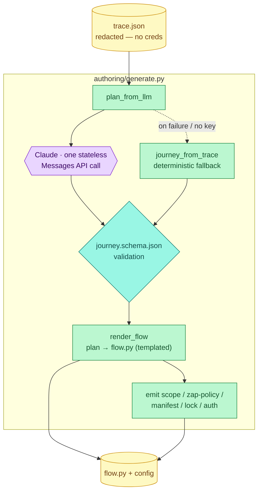
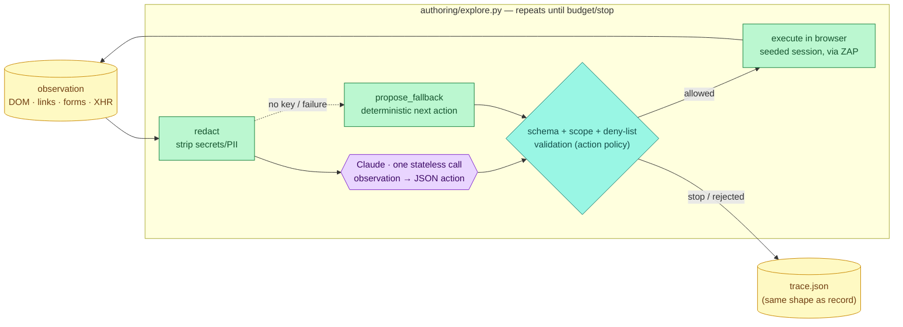
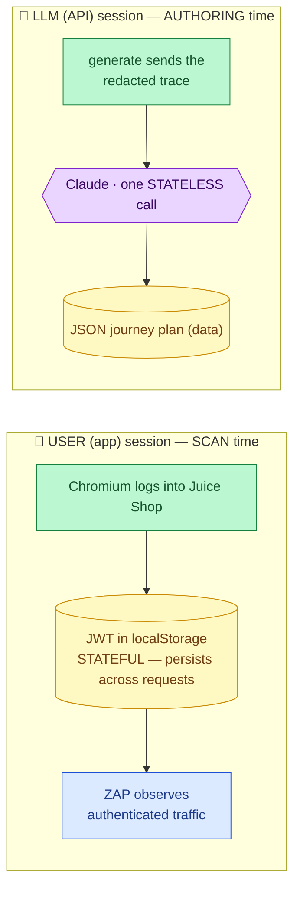
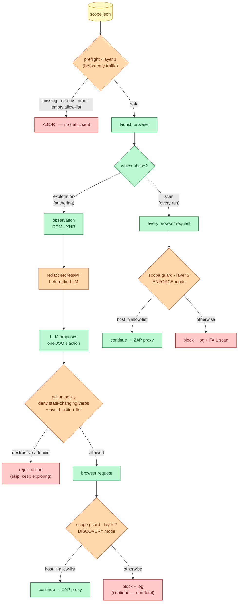
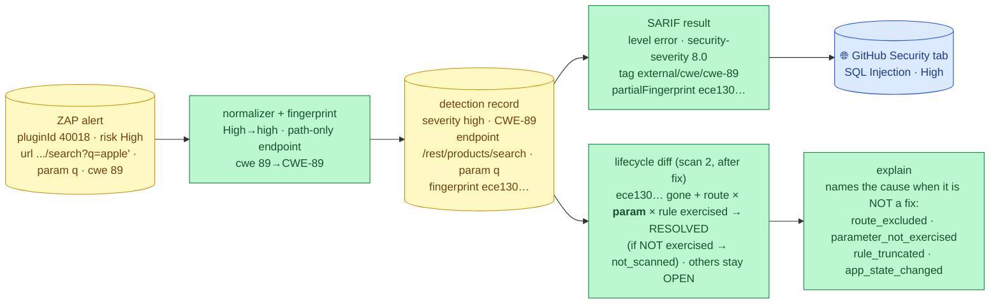

# DAST POC — Architecture Overview (front to back)

The single doc that explains **what's been built and how every part fits together** — the
authoring CLIs, the runner, the detections pipeline, the contracts, the safety model, and
exactly where (and how narrowly) the LLM is used. Start here; the per-component design docs
(`runner_design.md`, `authoring_clis_design.md`, `sarif_exporter_design.md`, …) go deeper.

> **Diagram legend (colors used throughout):**
> 🟨 human input · 🟩 our code (a build step) · 🟪 the LLM (Claude) · 🟦 external system
> (GitHub / target app) · 🟧 safety gate · 🟥 abort/block · pale-yellow cylinders = data artifacts.

---

## 1. What this is

An **authenticated, non-prod, LLM-assisted DAST loop**: describe an application in one config
file, have the tool log in and explore it, run OWASP ZAP against the authenticated app inside a
hard safety boundary, normalize the findings with stable fingerprints, and publish them to the
GitHub Security tab with lifecycle tracking across scans.

**Onboarding an application is configuration, not code.** Everything app-specific lives in
`security/dast/<app>/app.yaml`; nothing under `authoring/` or `runner/` may name an application,
and `tests/test_no_app_specifics.py` fails the build if it does. Three applications are onboarded
— **Juice Shop** (Angular SPA, JWT in `localStorage`), **DVWA** (PHP, `PHPSESSID` cookie,
username login) and **WebGoat** (Spring Boot, registered account). WebGoat took 4m32s from
`dast onboard` to a passing gate with zero code changed.

Scanner: **OWASP ZAP** 2.17.0. Browser automation: **Playwright + Chromium**. LLM: **Claude**
(Anthropic API), at authoring time only.

**Status:** built, tested (674 tests, run on every push) and verified end-to-end on real data. The headline result:
against DVWA, autonomous discovery with **zero hand-picked routes** finds **7 high-severity
findings including all 5** a human's hand-written route list produced, and two consecutive scans
return the same set. Getting there meant fixing five defects that a green test suite could not
see — they are worth reading before trusting any scanner's silence, and they are in §12.

---

## 2. The whole pipeline, front to back

Two phases, and the seam between them is the generated `flow.py` + `scope.json`. The input to
both is **`app.yaml`** — the one artifact an operator writes.

**Authoring** turns a login journey into scan config (the LLM lives here and only here) — via
either `record` (a scripted walk of routes the config lists) **or** `seed` + `explore` (a
human-seeded session that an LLM-driven loop explores for breadth). Both emit the same
`trace.json`, so everything downstream is identical. **Scanning** executes a safe authenticated
scan and processes the results; **no LLM runs during a scan**. The lifecycle diff is
coverage-aware, and `explain` attributes anything that disappears.

The operator sees four verbs, not fifteen modules — `dast.py` is a thin facade over them:

```
dast onboard <app>   # write an app.yaml skeleton (--discover: model proposes the auth block)
dast author  <app>   # record (or seed+explore) -> generate -> validate
dast scan    <app>   # preflight -> replay -> ZAP -> normalize + coverage
dast report  <app>   # lifecycle diff -> SARIF -> (--upload) GitHub
dast explain <app>   # why did findings disappear between the last two scans?
dast triage  <app>   # propose suppressions from GitHub dismissals, for review
```


```mermaid
flowchart LR
    human(["👤 Human writes app.yaml<br/>+ credentials in env"]):::human
    appcfg[("app.yaml<br/>scope · auth · explore · scan<br/>output · publish")]:::data

    subgraph AUTH["🖊️ AUTHORING — once per app (LLM lives here)"]
        direction LR
        rec["record<br/>walk the listed routes"]:::build
        seed["seed<br/>human login → storageState"]:::build
        expl["explore<br/>seeded session · LLM loop"]:::build
        exllm{{"LLM · Claude<br/>observation → JSON action"}}:::llm
        pol["action policy<br/>deny-list · write mode"]:::safety
        trace[("trace.json<br/>pages · forms · API · hosts")]:::data
        gen["generate"]:::build
        llm{{"LLM · Claude<br/>trace → JSON plan"}}:::llm
        cfg[("flow.py · scope.json<br/>auth.json · zap-policy<br/>manifest · lock")]:::data
        val["validate<br/>allow-list + auth replay"]:::build
    end

    subgraph SCAN["🛡️ SCANNING — every run (no LLM)"]
        direction LR
        pre["preflight<br/>safety layer 1"]:::safety
        rep["replay / replay_seeded<br/>auth via ZAP proxy"]:::build
        guard["scope guard<br/>safety layer 2"]:::safety
        excl["exclusions<br/>keep ZAP off logout/setup/login"]:::safety
        ascan["active scan<br/>bounded to allow-list"]:::build
        raw[("raw ZAP alerts")]:::data
        norm["normalizer + fingerprint"]:::build
        cov[("coverage.json<br/>routes · params · rules<br/>rule outcomes · app state")]:::data
        recs[("detection records")]:::data
        sarif["SARIF export<br/>+ fix · evidence · confidence<br/>+ automation category"]:::build
        diff["lifecycle diff<br/>new / open / resolved / not_scanned"]:::build
        expl2["explain · reachability<br/>why a finding went, what was never sent"]:::build
    end

    gh[("🌐 GitHub Security tab")]:::ext

    human --> appcfg
    appcfg --> rec --> trace
    appcfg --> seed --> expl --> trace
    expl <--> exllm
    expl --> pol
    appcfg --> gen
    trace --> gen
    gen <--> llm
    gen --> cfg --> val
    appcfg ==> pre
    cfg ==> pre ==> rep ==> guard ==> excl ==> ascan ==> raw ==> norm ==> recs
    ascan --> cov --> diff
    cov --> expl2
    recs --> sarif --> gh
    recs --> diff --> expl2

    classDef human fill:#fde68a,stroke:#b45309,color:#1f2937
    classDef build fill:#bbf7d0,stroke:#15803d,color:#14532d
    classDef llm fill:#e9d5ff,stroke:#7e22ce,color:#3b0764
    classDef data fill:#fef9c3,stroke:#ca8a04,color:#713f12
    classDef safety fill:#fed7aa,stroke:#c2410c,color:#7c2d12
    classDef ext fill:#dbeafe,stroke:#1d4ed8,color:#1e3a8a
```

---

## 3. The three subsystems

### 3a. Authoring CLIs (`authoring/`) — produce the config

| CLI | FRs | What it does |
|-----|-----|--------------|
| `appconfig.py` | W2 | Loads and validates `app.yaml` against `app.schema.json`, and is the single place every app-specific value comes from: scope, login steps, auth proof, seed routes, test data, budgets, cookies, probes, output dir, publish target. Credentials appear only as env var **names** (NFR-3) |
| `discover.py` | W2-16 | `dast onboard --discover`: the model reads the login page and proposes login steps plus candidate auth proofs; deterministic code then **verifies** each by logging in, accepting a proof only if it holds authenticated and fails on the login page. Session-ending candidates are refused before evaluation. The model's confidence is never the reason anything is accepted |
| `record.py` | R1/R2/R3 | Drives Chromium through register → login → an authenticated page; captures `trace.json` (interactions, forms, API/XHR, hosts) + `index.json` |
| `seed.py` | — (KI4) | Human logs in once (SSO/MFA/CAPTCHA by hand); saves Playwright `storageState` (gitignored) so scans start already authenticated |
| `explore.py` | — (KI4) | Seeded, **LLM-driven** exploration loop (observe → redact → LLM JSON action → validate → execute → capture); emits the same `trace.json` as `record`, expanding breadth from seed routes |
| `generate.py` | G1–G4 | **LLM** turns the trace into a JSON *journey plan*; deterministic code renders `flow.py`; also emits `scope.json`, `auth.json`, `zap-policy.yaml`, `manifest.json`, `lock` |
| `validate.py` | V1/V2/V3 | Checks every host the plan would contact is in the allow-list (FR-V2), replays the generated `flow.py` to confirm auth (FR-V1), writes `validation-report.json` + non-zero exit on failure (FR-V3) |

### 3b. Runner (`runner/`) — execute a safe scan

| Module | FRs | Role |
|--------|-----|------|
| `preflight.py` | S3, NFR-2 | **Safety layer 1** — refuse to scan before any traffic if scope is missing/`prod`/unbounded, or if a `test`/`staging` scope names bare hosts instead of exact origins (W4-2) |
| `zapapi.py` | W4-4 | The **one** way to call ZAP's API: sends `X-ZAP-API-Key` from `$ZAP_API_KEY`, and turns a refusal — a keyed ZAP *hangs up* on a bad key rather than answering 401 — into a clear key error. At scan start an unkeyed probe records whether the API is open; a `test`/`staging` scan refuses an open one |
| `replay.py` | S1, R2 | Launch Chromium proxied through ZAP; run the flow (`replay`) or a seeded session (`replay_seeded` + `prove_auth_live`) so ZAP observes authenticated traffic |
| `scope_guard.py` | S4, NFR-4 | **Safety layer 2** — `page.route` interceptor; block/log/fail out-of-allow-list requests. An allow entry is an **origin** (scheme + host + port, default ports normalised) or a bare host (any scheme, any port; `dev` only). Redirect hops — which `page.route` never sees — are checked from the context's request events and fail the scan when off-scope; `scope.exclude` paths are answered locally with a 403 so the browser never reaches them. Phase-split: `enforce` (fail closed) for scans, `discovery` (block-and-continue) for exploration |
| `action_policy.py` | — | Exploration safety: default-deny state-changing verbs + `avoid_action_list`; decides if an LLM-proposed action may execute (never trusts the LLM's label) |
| `redact.py` | W5-5 | Scrub secrets before anything leaves the boundary: JWTs, bearer tokens, secret-named JSON and form fields, emails, and the values of credential headers (`Cookie`, `Authorization`, `Set-Cookie`, API-key headers). Used on everything the LLM sees, every evidence excerpt and every stored request/response. **Linear in its input** — the text comes from the target, so its length is not ours to choose |
| `scan.py` | S1, S2 | Spider + bounded active scan → raw ZAP JSON. Also applies **scan exclusions** (W6-11): the `avoid_actions` the config already declares, plus the login page, are excluded from spider and active scan alike — without this the scanner attacks the application's own controls and destroys the state its findings depend on. **Safety layer 3** (W4-1): each scan runs inside its own ZAP context whose include regexes are the allowed origins, so ZAP's *own* spider and active scan — which the browser-side guard never sees — are bounded too. Applies `scan.throttle` (W4-3); on Ctrl-C it tells ZAP to stop both scans before exiting. Imports `scan.openapi` (W6-4), and runs DOM-XSS (40026) as a separate bounded pass after the main results are saved (W6-3) |
| `env_registry.py` | W4-6 | Is the declared `environment_class` true? Production-looking hosts are refused outright; a registered host must match its class; a test/staging host must be registered. A YAML file today (`security/dast/environments.yaml`), behind a one-method interface |
| `session_store.py` | W5-3 | The stored browser session: from `env:VAR` (a secret store), written to disk only for the run; or a file, refused when stale, readable by others, or committable |
| `session_refresh.py` | W5-2 | Points ZAP's attacks at the CURRENT session with Replacer rules (`Cookie`, optionally `Authorization: Bearer`), for the active scanner and spider only — the active scan otherwise replays the cookies it recorded |
| `reset.py` | W6-1 | A disposable app's own data reset, driven in a browser through ZAP before the scan; `verify` must pass or the scan does not start |
| `liveness.py` | W5-1 | Did the session survive the scan? Probes one path with and without the session at the start (identical answers ⇒ *unknown*), re-checks during the active scan at most once a minute and **always once at the end**. Lost = 401/403, redirect to the login path, or the logged-out answer. On a loss (W5-2) it pauses the scan, logs in again, updates ZAP's session rules, proves the new session and resumes; if that fails, the active scan is stopped and the health gate fails |
| `coverage.py` | — (R2) | What the scan actually exercised: routes, **per-route parameters** (W6-10), enabled rules, **per-rule outcomes** from ZAP's scan progress (W6-2), and an **app-state fingerprint** — digests of a few probe URLs fetched through the scan's own session (W6-8) so two scans can be compared for "was the app even in the same condition?" |
| `evidence.py` | E1 | Capture HAR + screenshot, **redact secrets**, reference from records/SARIF |
| `main.py` | all | Chain preflight → fresh ZAP session → replay (or seeded) → scan → normalize → fetch exchanges (+ coverage); exit code = the **health gate** (authenticated, in scope, ≥1 route tested, session not lost), or with `--expect-findings` also ≥1 high/medium, for self-tests (W3-2). The gate is also kept in `coverage.json` as `health_gate` |
| `exchange.py` | W1-3 | For each high/medium finding, fetch the exact request ZAP sent and the response that proved it — inside the same run, since the next scan's fresh session discards them — redact both, cut the response to a window around the evidence, and store it per fingerprint. Gives the finding a `request_line` and `response_status` to replay |

### 3c. Detections pipeline (`detections/`) — process the results

| Module | FRs | Role |
|--------|-----|------|
| `normalizer.py` | N1, W1-1 | Raw ZAP alert → contract-shaped detection record (streaming). Carries ZAP's remediation content — description, solution, references, confidence — and the evidence and payload, **redacted at normalisation** and capped at 500 characters, so no later stage ever holds the raw value. None of it feeds the fingerprint |
| `fingerprint.py` | N2 | Stable `sha256(rule_id \| endpoint_pattern \| parameter \| payload_family)` |
| `sarif_export.py` | X1, W1-2 | Records → SARIF 2.1.0 (severity→level, `security-severity`, CWE tags, fingerprint in `partialFingerprints`). Each rule carries `fullDescription`, `help` (how to fix + references) and `helpUri`; each finding's **message** names the parameter, payload, evidence and confidence — because GitHub renders the message and the rule help and does not render `properties`. Target-controlled evidence is fenced so it cannot inject markdown into the alert. `automationDetails.id` keeps one app's analysis from overwriting another's. The message also says where the full request/response is (W1-4): a per-file link from a `{scan_id}`/`{path}` template, a link to the CI run holding the artifact plus the file's name, or just the name |
| `inventory.py` | W6-4 | The coverage denominator: declared routes from an OpenAPI/Swagger spec (or, labelled, the routes the walk found) against the routes exercised |
| `summary.py` | W1-6 | One Markdown page per scan, verdict first — **NOT RELIABLE** rather than *Passed* when the scan was unhealthy — then counts by severity × status, new findings (grouped), top rules and routes, coverage gaps, session, ZAP API state, suppressions, destination. `dast report` writes `summary.md` and appends it to the GitHub Actions run page |
| `github_upload.py` | X2, W1-8 | gzip+base64 the SARIF, POST to the code-scanning API. Requires the **deployed build's** commit and ref — GitHub shows them as the affected branch — and refuses to upload without them rather than borrow this tool's own checkout |
| `lifecycle_diff.py` | L1/L2 | Compare two scans' fingerprint sets → label new/open/resolved; **coverage-aware** (R2): a previous-only finding is `resolved` only if its route, **its own parameter**, and its rule were exercised this scan — else `not_scanned`. A scan that wrote to the app, lost its session (even if re-established), or failed its health gate cannot resolve anything: its silence is not evidence of a fix. Persist state (+ coverage) |
| `explain.py` | — (W6-9) | Why a finding disappeared, most specific cause first: `route_excluded` · `route_not_covered` · `parameter_not_exercised` · `rule_not_enabled` · `rule_truncated` · `app_state_changed` · `scan_changed_the_app` · `rule_found_nothing` · `fixed`. Only the last claims a fix, and it carries its evidence |
| `reachability.py` | — (W6-12) | What the application **exposes** (GET form fields in the trace) against what the scan **sent** (`coverage.route_params`). The difference is a detection gap nothing measured before; `dast report` prints it |
| `gate.py` | W3-2 | The report stage's **policy gate**: fail when a **new** finding is at or above `gate.fail_on` (default `high`). Only new findings can fail it — an existing one is already somebody's decision — and suppressed ones never do |
| `triage.py` | W1-5 | Recorded decisions — false positive, accepted risk, won't fix, test data — from `security/dast/<app>/suppressions.yaml`, applied as a view over the lifecycle diff: status `suppressed`, still published, accepted risk must expire. Also matches GitHub dismissals back to findings by recomputing the fingerprint, since GitHub does not expose it |

### 3d. Contracts (`contracts/`) — the frozen interfaces

**`app.schema.json`** is the one an operator meets: the whole per-app contract, with
`additionalProperties: false` and a description on every key, which is also what lets a form
generator render it later. Then `scope.json`(+schema), `detection.schema.json` (status enum incl.
`not_scanned`), the fingerprint formula (`README.md`), `trace.schema.json`, `journey.schema.json`,
`seed.schema.json`, `action.schema.json` (the LLM exploration action contract),
`auth_discovery.schema.json` (what the model may propose for a login), `suppressions.schema.json` (per-app triage decisions, with mandatory expiry for accepted risk), the vendored
`sarif-2.1.0.schema.json`, and the real `sample_zap_output.json` fixture. Everything is written
*to* these; they're the seams that let each part be built and tested independently.

---

## 4. Where the LLM fits (and where it doesn't)

The LLM is used **only at authoring time**, in three places, all behind the **same** boundary:
`generate` (one stateless call: trace → JSON *journey plan*), `explore` (a loop of stateless
calls: each redacted observation → one constrained JSON *action*), and `discover` (one call:
login page → proposed login steps + candidate auth proofs). In all three the model emits **data**
validated against a schema; deterministic code renders, executes or verifies it. The model never
authors executable code and never runs during a scan.

`discover` is the sharpest illustration of the boundary, because there the model's output is
**tested rather than trusted**: each proposed proof is tried against the running application and
kept only if it holds once logged in *and* fails on the login page. Candidates that would end the
session are refused before they are ever evaluated. The model's confidence is not an input to
that decision.


```mermaid
flowchart TD
    trace[("trace.json<br/>redacted — no creds")]:::data
    subgraph GEN["authoring/generate.py"]
        plan["plan_from_llm"]:::build
        claude{{"Claude · one stateless<br/>Messages API call"}}:::llm
        fb["journey_from_trace<br/>deterministic fallback"]:::build
        schema{"journey.schema.json<br/>validation"}:::gate
        render["render_flow<br/>plan → flow.py (templated)"]:::build
        emit["emit scope / zap-policy /<br/>manifest / lock / auth"]:::build
    end
    flow[("flow.py + config")]:::data

    trace --> plan --> claude --> schema
    plan -. "on failure / no key" .-> fb --> schema
    schema --> render --> flow
    render --> emit --> flow

    classDef build fill:#bbf7d0,stroke:#15803d,color:#14532d
    classDef llm fill:#e9d5ff,stroke:#7e22ce,color:#3b0764
    classDef data fill:#fef9c3,stroke:#ca8a04,color:#713f12
    classDef gate fill:#99f6e4,stroke:#0f766e,color:#134e4a
```

`explore` applies the **same boundary in a loop**: each observation is redacted, the LLM proposes
one JSON *action*, and deterministic code validates it (schema + scope + deny-list) before executing
it in the seeded browser. The loop's output is a `trace.json` identical to `record`'s.


```mermaid
flowchart LR
    obs[("observation<br/>DOM · links · forms · XHR")]:::data
    subgraph EXP["authoring/explore.py — repeats until budget/stop"]
        red["redact<br/>strip secrets/PII"]:::build
        claude{{"Claude · one stateless call<br/>observation → JSON action"}}:::llm
        fb["propose_fallback<br/>deterministic next action"]:::build
        valid{"schema + scope + deny-list<br/>validation (action policy)"}:::gate
        exec["execute in browser<br/>seeded session, via ZAP"]:::build
    end
    trace[("trace.json<br/>(same shape as record)")]:::data

    obs --> red --> claude --> valid
    red -. "no key / failure" .-> fb --> valid
    valid -->|allowed| exec --> obs
    valid -->|"stop / rejected"| trace

    classDef build fill:#bbf7d0,stroke:#15803d,color:#14532d
    classDef llm fill:#e9d5ff,stroke:#7e22ce,color:#3b0764
    classDef data fill:#fef9c3,stroke:#ca8a04,color:#713f12
    classDef gate fill:#99f6e4,stroke:#0f766e,color:#134e4a
```

Key properties:
- **Data in, data out.** The model receives redacted data (a trace, or an observation) and returns
  data (a plan, or an action). Everything is schema-validated; deterministic code renders/executes
  it. → decision **D8** (also enforced for `explore` via `action_policy`).
- **LLM-optional.** With `ANTHROPIC_API_KEY` set it's the primary path; otherwise deterministic
  fallbacks (`journey_from_trace`, `propose_fallback`) keep both pipelines runnable. → decision **D9**.
- **Stateless.** Each Anthropic Messages request is independent — no persistent agent; `explore`
  is a *loop* of such stateless calls, not a conversation. The model never connects to the app or ZAP.
- **Authoring-time only; committed output replays deterministically.** After authoring, the LLM is
  done. `validate`, `runner`, and every detection stage involve **no LLM**. The reviewed
  `trace.json`/bundle is committed and re-scans replay it without calling the model — so the
  lifecycle diff stays deterministic. → decision **R1**.

### The two "sessions" — different things that share a word


```mermaid
flowchart LR
    subgraph U["👤 USER (app) session — SCAN time"]
        direction TB
        u1["Chromium logs into Juice Shop"]:::build
        u2[("JWT in localStorage<br/>STATEFUL — persists across requests")]:::data
        u3["ZAP observes<br/>authenticated traffic"]:::ext
        u1 --> u2 --> u3
    end
    subgraph L["🤖 LLM (API) session — AUTHORING time"]
        direction TB
        l1["generate sends the<br/>redacted trace"]:::build
        l2{{"Claude · one STATELESS call"}}:::llm
        l3[("JSON journey plan (data)")]:::data
        l1 --> l2 --> l3
    end

    classDef build fill:#bbf7d0,stroke:#15803d,color:#14532d
    classDef llm fill:#e9d5ff,stroke:#7e22ce,color:#3b0764
    classDef data fill:#fef9c3,stroke:#ca8a04,color:#713f12
    classDef ext fill:#dbeafe,stroke:#1d4ed8,color:#1e3a8a
```

| | **User (app) session** | **LLM (API) session** |
|---|---|---|
| **What it is** | The authenticated login to the app — the JWT/cookies in the browser context, from a form login **or a human-seeded `storageState`** | Calls to the Claude API (one in `generate`; a loop of stateless calls in `explore`) |
| **Where / when** | `runner/replay.py` (`replay` / `replay_seeded`), at scan time (established live each run, or loaded from a seed) | `authoring/generate.py` and `authoring/explore.py`, at authoring time (before any scan) |
| **Stateful?** | **Yes** — JWT/cookies persist so ZAP reaches authenticated endpoints | **No** — single request/response, nothing persists |
| **Talks to** | The target app, via the ZAP proxy | api.anthropic.com only — never the target, never ZAP |
| **Carries secrets?** | **Yes** — real creds + JWT (why HAR is redacted, creds from env) | **No** — receives a *redacted* trace, emits only a plan |
| **Trust** | Trusted (our creds, our target) | **Untrusted output** — schema-validated, rendered by deterministic code |

The user session is the stateful authenticated connection **to the app being scanned** (what
makes the scan "authenticated"). The LLM session is a stateless config-authoring call that never
touches the app, ZAP, or any secret.

---

## 5. The safety model (NFR-2 — the top guardrail)

Two independent, fail-closed layers (preflight + the request-boundary scope guard), so a bug in
one can't send unsafe traffic. Both see the *browser's* traffic; a third layer bounds ZAP's own
spider and active scan with a per-scan ZAP context built from the same allow list (W4-1). ZAP's
API itself requires a key (W4-4). The LLM exploration path keeps both layers and adds two
authoring-only gates — a redactor (before the model) and the action policy (after it) — with the
scope guard running in **discovery** mode (block-and-continue) instead of **enforce** (block/fail).


```mermaid
flowchart TD
    scope[("scope.json")]:::data --> pre{"preflight · layer 1<br/>(before any traffic)"}:::safety
    pre -->|"missing · no env · prod · empty allow-list"| abort1["ABORT — no traffic sent"]:::stop
    pre -->|"safe"| launch["launch browser"]:::build
    launch --> phase{"which phase?"}:::build

    %% Exploration (authoring-time, LLM in the loop)
    phase -->|"exploration<br/>(authoring)"| obs["observation<br/>DOM · XHR"]:::build
    obs --> red["redact secrets/PII<br/>before the LLM"]:::safety
    red --> llm["LLM proposes<br/>one JSON action"]:::build
    llm --> apol{"action policy<br/>deny state-changing verbs<br/>+ avoid_action_list"}:::safety
    apol -->|"destructive / denied"| rej["reject action<br/>(skip, keep exploring)"]:::stop
    apol -->|"allowed"| dreq["browser request"]:::build
    dreq --> gd{"scope guard · layer 2<br/>DISCOVERY mode"}:::safety
    gd -->|"host in allow-list"| okd["continue → ZAP proxy"]:::build
    gd -->|"otherwise"| bkd["block + log<br/>(continue — non-fatal)"]:::stop

    %% Scan (every run, no LLM)
    phase -->|"scan<br/>(every run)"| sreq["every browser request"]:::build
    sreq --> ge{"scope guard · layer 2<br/>ENFORCE mode"}:::safety
    ge -->|"host in allow-list"| oks["continue → ZAP proxy"]:::build
    ge -->|"otherwise"| bks["block + log + FAIL scan"]:::stop

    classDef data fill:#fef9c3,stroke:#ca8a04,color:#713f12
    classDef build fill:#bbf7d0,stroke:#15803d,color:#14532d
    classDef safety fill:#fed7aa,stroke:#c2410c,color:#7c2d12
    classDef stop fill:#fecaca,stroke:#b91c1c,color:#7f1d1d
```

Plus: evidence HARs are **redacted** (auth headers, cookies, tokens, passwords) at capture,
before anything could publish them; credentials come from env, never committed; the LLM only
ever sees a redacted trace/observation.

The LLM exploration path adds three matching guardrails (all deterministic, so the model's
suggestions are never trusted on faith):
- **Action policy** (`runner/action_policy.py`): default-deny state-changing verbs
  (POST/PUT/PATCH/DELETE) unless explicitly allow-listed, plus `avoid_action_list` matching — the
  LLM's own "non-destructive" label carries no weight.
- **Phase-split scope guard**: the same `page.route` layer runs in `discovery` mode during
  exploration (block-and-continue, so one stray request can't abort the crawl) and `enforce` mode
  during the scan (block/log/**fail**).
- **Redactor** (`runner/redact.py`): scrubs JWTs, bearer tokens, secret-named fields, and emails
  from every observation before it reaches the model.

---

## 6. Data & contract flow (one concrete example)

Following the High SQL Injection from raw scan to Security-tab alert. The **fingerprint** is the
thread that ties it together — the stable identity SARIF carries into GitHub (so re-uploads
dedupe) and the key the lifecycle diff compares across scans.


```mermaid
flowchart LR
    a[("ZAP alert<br/>pluginId 40018 · risk High<br/>url .../search?q=apple' · param q · cwe 89")]:::data
    b["normalizer + fingerprint<br/>High→high · path-only endpoint<br/>cwe 89→CWE-89"]:::build
    c[("detection record<br/>severity high · CWE-89<br/>endpoint /rest/products/search · param q<br/>fingerprint ece130…")]:::data
    d["SARIF result<br/>level error · security-severity 8.0<br/>tag external/cwe/cwe-89<br/>partialFingerprint ece130…"]:::build
    e[("🌐 GitHub Security tab<br/>SQL Injection · High")]:::ext
    f["lifecycle diff (scan 2, after fix)<br/>ece130… gone + route × <b>param</b> × rule exercised → RESOLVED<br/>(if NOT exercised → not_scanned) · others stay OPEN"]:::build
    g["explain<br/>names the cause when it is NOT a fix:<br/>route_excluded · parameter_not_exercised<br/>rule_truncated · app_state_changed"]:::build

    a --> b --> c --> d --> e
    c --> f --> g

    classDef data fill:#fef9c3,stroke:#ca8a04,color:#713f12
    classDef build fill:#bbf7d0,stroke:#15803d,color:#14532d
    classDef ext fill:#dbeafe,stroke:#1d4ed8,color:#1e3a8a
```

For how `journey.schema` steps become `flow.py` and then authenticated requests ZAP records,
see §4 above + `authoring_clis_design.md`.

---

## 7. The proof points (definition of done)

| # | Proof point | Delivered by |
|---|-------------|--------------|
| 1 | Authenticated scan | runner (`replay` through ZAP) — ZAP records `Authorization: Bearer` requests |
| 2 | Scope enforcement blocks out-of-list requests | `scope_guard` (block/log/fail), proven live |
| 3 | Detections in the GitHub Security tab | `sarif_export` + `github_upload` (38 alerts, SQLi = High) |
| 4 | Fingerprint lifecycle across two scans | `lifecycle_diff` (fix → resolved, others open) |

All four are demonstrable end-to-end on real data, and the **generated** `flow.py` (LLM path
verified) drives a passing runner gate. Proof point #4 is now **coverage-aware** (R2) and
**parameter-aware** (W6-10): `resolved` is asserted only when the route, the finding's own
parameter, and the rule were all exercised — a disabled rule, a dropped route or an untested
parameter reads as `not_scanned`, not a false fix.

Two results have been added since, and they are the ones worth quoting:

| # | Proof point | Evidence |
|---|-------------|----------|
| 5 | An application onboards from configuration alone | WebGoat, **zero** diff to `authoring/` or `runner/`, 4m32s to a passing gate; `tests/test_no_app_specifics.py` enforces it |
| 6 | Autonomous discovery contains the human's result | DVWA, **zero** hand-picked routes: 7 highs including all 5 the hand-written list found, repeated identically on a second scan |

---

## 8. How to run

**The whole loop, one app** — this is the path an operator uses:

```bash
export ANTHROPIC_API_KEY=…          # authoring only; no LLM runs during a scan
export DVWA_USER=… DVWA_PASS=…      # names come from app.yaml; values never in files
export ZAP_API_KEY=…                # the key ZAP was started with (compose requires one)

python -m dast onboard dvwa --base-url http://dvwa    # writes the app.yaml skeleton
python -m dast author  dvwa --explore --zap-proxy http://localhost:8080
python -m dast scan    dvwa
python -m dast report  dvwa                            # to publish: --upload --commit <deployed SHA> --ref refs/heads/<branch>
python -m dast explain dvwa                            # after a second scan
python -m dast stop    dvwa                            # from another terminal: stop ZAP's scans
```

Artifacts land under `out/<app>/` by default; `--out`, `$DAST_OUT` or `output.dir` in `app.yaml`
move the whole workspace, and each run records which of them won in `settings.json`.

**Bring up a target** (profiles keep `docker compose up` to the pilot app only):
```bash
docker compose --profile dvwa up -d dvwa zap     # or --profile webgoat
```
Authoring drives a browser on *your* machine, so ZAP and the app must be reachable from there —
compose publishes nothing by design. See `../onboarding_a_new_application.md` §1a for the local
override, and note WebGoat must not sit on 8080 (that is ZAP's own port; the scan silently sees
nothing).

**One command, fully containerized** (pilot app, hand-authored bundle):
```bash
docker compose up --build --abort-on-container-exit --exit-code-from runner
```

**The module CLIs still exist** and `dast` is a thin facade over them; reach for them when you
want one stage in isolation:
```bash
python -m authoring.record   --app juice-shop --zap-proxy http://localhost:8080 --out-dir rec/
python -m authoring.explore  --app dvwa --zap-proxy http://localhost:8080 --out-dir rec/
python -m authoring.generate --app dvwa --trace rec/trace.json --out-dir rec/
python -m runner.main        --scope rec/scope.json --flow rec/flow.py --records-out rec/records.json
python -m detections.sarif_export rec/labeled.json --category dast/dvwa -o out.sarif
```

Step-by-step onboarding of a *new* application: `../onboarding_a_new_application.md`.

---

## 9. Testing philosophy (why you can trust it)

Objective, **test-first** where it counts: expectations are anchored to **independent oracles**
— an external SHA tool, the official OASIS SARIF schema, published CWE facts, the raw fixture,
and sensitivity/negative checks — not to the code itself. Safety-critical and pure modules
(preflight, scope guard, fingerprint, lifecycle diff, the authoring transforms) were committed
**red first**, then implemented to green, and each suite was proven to *bite* via a
break/restore. Live/integration parts (the crawl, the LLM call, the auth replay, the ZAP scan)
are validated by running them. See `validation_and_testing.md`.

---

## 10. Repo map

```
dast.py          the operator's CLI: onboard · author · scan · report · explain · triage · stop
contracts/       frozen interfaces: app · scope · detection · trace · journey · seed · action ·
                 auth_discovery schemas, fingerprint formula, vendored SARIF schema, ZAP fixture
authoring/       appconfig.py (app.yaml) · record · seed · explore (LLM) · discover (LLM) ·
                 generate (LLM) · validate
runner/          preflight · env_registry · zapapi · replay · reset · scope_guard ·
                 action_policy · redact · scan · coverage · liveness · session_refresh · session_store ·
                 evidence · exchange · main · capture_zap_fixture.sh
detections/      normalizer · fingerprint · sarif_export · github_upload · lifecycle_diff ·
                 explain · reachability · inventory · gate · triage · summary
security/dast/   one directory per onboarded app, each holding app.yaml — dvwa · webgoat are
                 config-only; juice-shop also keeps a hand-authored flow.py/scope.json/seed.json
                 from before the config contract
out/<app>/       artifacts (gitignored): authoring/ · scans/<scan_id>/ · state.json
tests/           objective suites (910 tests) — one per module + acceptance suites
docs/            current: requirements · onboarding · remediation plan · readiness · scorecard (draft) ·
                 deterministic_vs_llm_discovery · phase-2 demo material  (docs/archive/ = superseded)
docs/junior_engineer/   this file + all design/decision docs  (archive/ = superseded plans)
.github/workflows/   tests.yml (ruff + suite on every push) · dast-selftest.yml (weekly canary)
Containerfile · compose.yaml · versions.lock · requirements*.txt · pyproject.toml
```

## 11. Decisions & known gaps

Every design decision (D1–D10) and known limitation (KI1–KI4) is logged with rationale and a
"how to interrogate later" note in `decisions_and_known_issues.md` — including the LLM safety
boundary (D8), LLM-optional+fallback (D9), the OpenAPI/crawl route-discovery direction (D10), the
two-layer safety model (D2), and the deferred items (endpoint-pattern heuristic, scope edge cases,
evidence hosting, exploration coverage KI4). The seeded-session + LLM exploration loop and the
coverage-aware lifecycle diff are specified in `seeded_session_exploration_design.md` (decisions
R1/R2).

---

## 12. Five defects a green test suite could not see

Every one of these was found by running the pipeline against a real application while 400–560
tests passed. They are the most transferable thing in this repository, because each one made the
scanner **report silence as safety**.

| Defect | How it presented | Why the tests missed it |
|---|---|---|
| **Coverage was route-level** (W6-10) | A finding on `?id=` could be called `fixed` when the route had only ever been visited bare | Coverage was internally consistent; nothing compared it to what was *attacked* |
| **The state oracle could not see state** (W6-8) | Two scans differing by five highs produced *identical* app-state fingerprints | Probes were fetched with no session, so every one digested the login page — `sha256("")`, forever equal. A constant oracle always agrees |
| **The scan attacked the app's own controls** (W6-11) | ~325 submissions of DVWA's database-reset form and ~1,000 login POSTs in one run; half of all responses redirected to login | `avoid_actions` was enforced during *exploration* only and ZAP was never told. No unit test observes what a scanner does to a live application |
| **Only the last seed route was explored** (W6-12) | Two high-severity findings unreachable from any autonomously authored bundle | Seed routes were walked *before* the loop, and `untried_form()` only judges the current page. Every test was of a pure function; the defect lived in the loop's ordering |
| **The fix for the fourth excluded a whole application** (W6-13) | A Juice Shop scan passed its gate with 60 passive findings instead of ~1,400, and coverage showed **0 routes** | The login exclusion was derived from the URL path, and a hash-routed login (`/#/login`) has path `/` — so the pattern matched every URL. Tests used `/login.php` only; live checks ran on DVWA only. Caught because coverage reported 0 routes, and now guarded: any exclusion matching the target's root refuses the scan |

The pattern: **all five were invisible because "no finding" and "never looked" produced the same
output.** The work that followed was less about detection and more about making the tool able to
tell those apart from its own artifacts — which is what `coverage.json`, `explain`, the
reachability line and `settings.json` exist for. Before arguing about detection rates with any
scanner, that distinction is what makes the numbers mean anything.

The fifth is the one that shows it working. It was introduced *by the fix for the fourth*, passed
every test, passed the scan gate, and would have closed ~1,400 GitHub alerts as fixed — and it was
caught before upload, in one line of `coverage.json`: `0 routes`. A scanner that cannot say what it
did not test would have reported that run as a quiet week.

Fixing them took DVWA from *5 → 0 → 8 → 2 → 1* highs across runs to a stable **7**, containing
all five findings a human's hand-written route list produced. Full narrative, with the measured
before/after tables: `../deterministic_vs_llm_discovery.md`.
