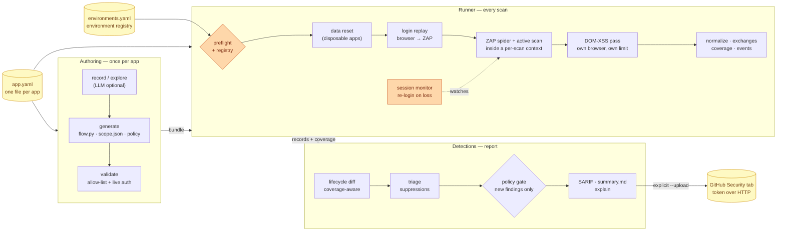
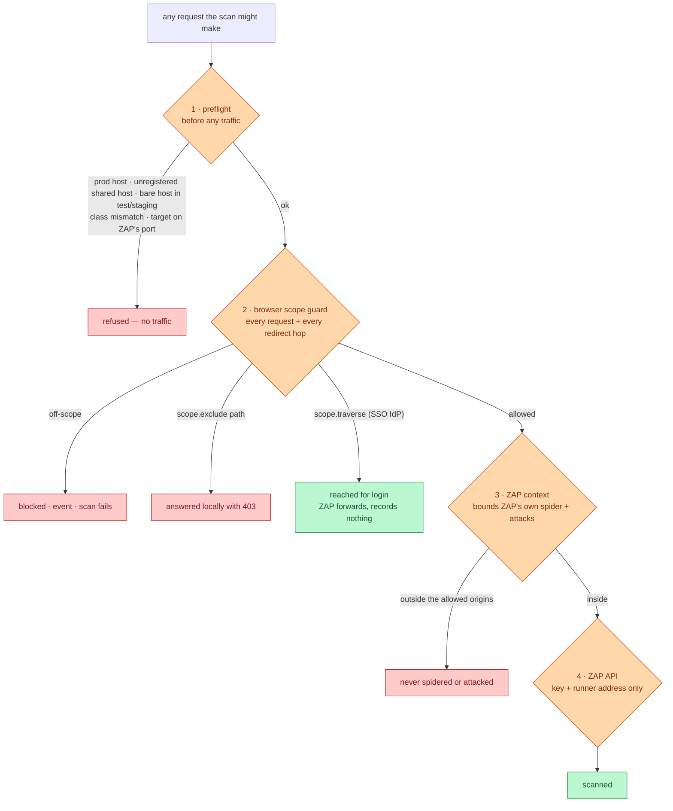
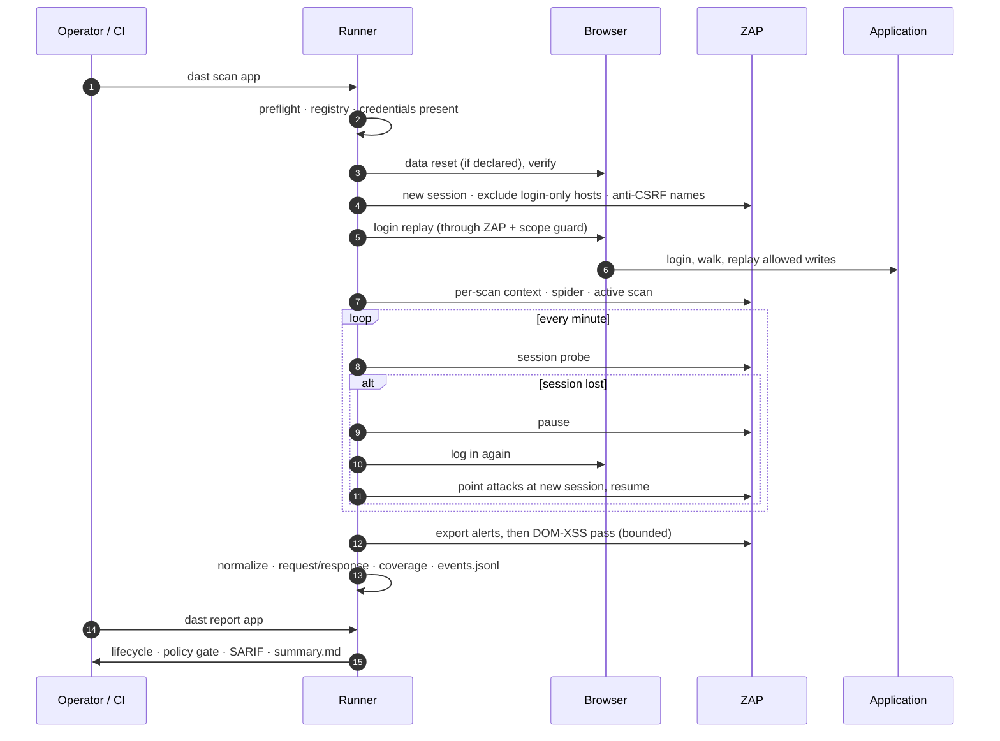
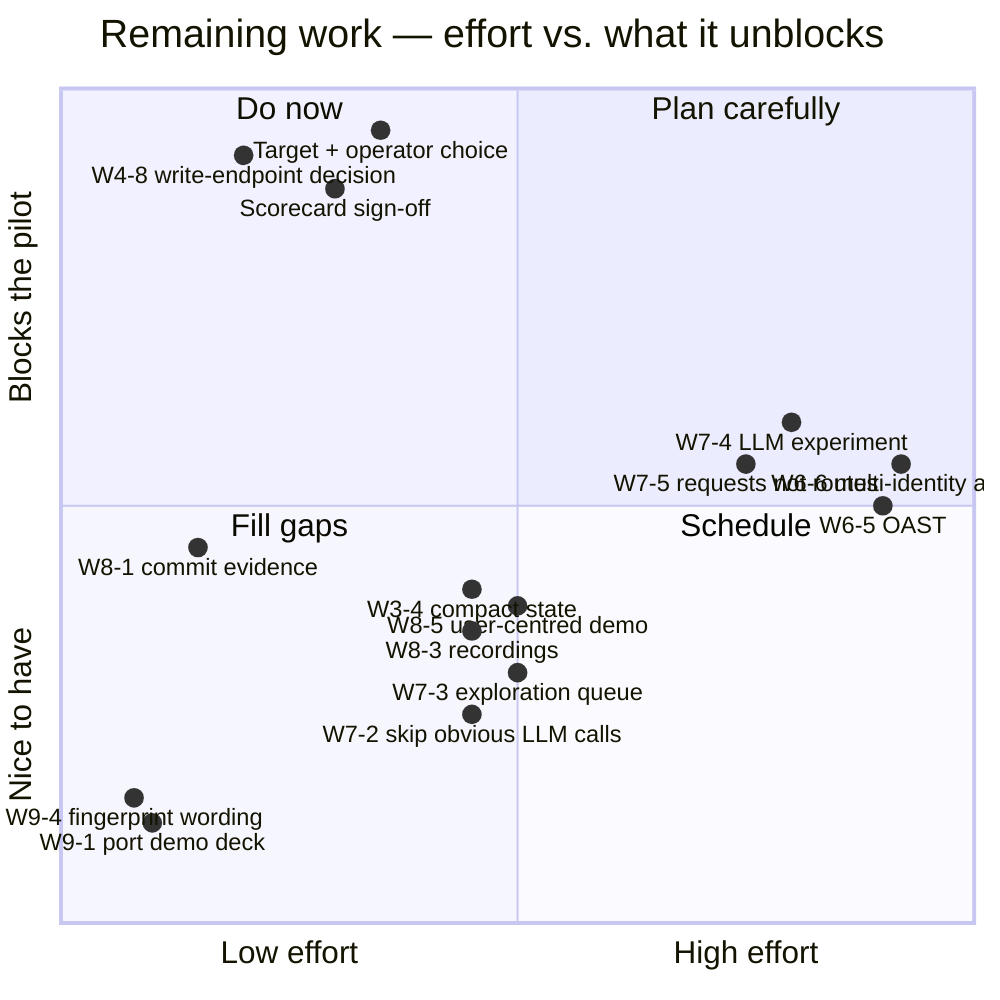
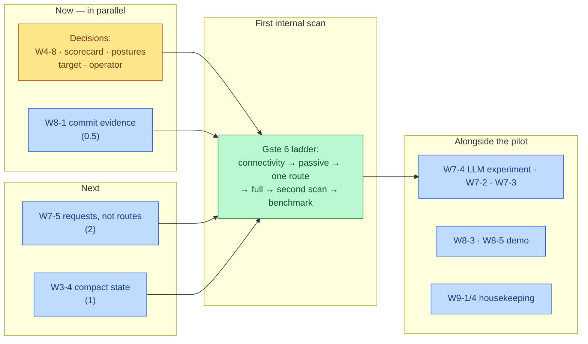

# Status and roadmap

*As of 2026-10-03, `main` after PR #9 (`parallel-poc-branch` merged in). The issue-by-issue history is in
[`dast_poc_remediation_plan.md`](dast_poc_remediation_plan.md); this page is the summary.*

## Where we are

The tool authenticates into a web application, drives OWASP ZAP to attack it within an
enforced boundary, and publishes findings a developer can act on. It does so honestly about
what it did *not* test. It started as a Juice Shop demo. It now onboards an application from
one config file and is ready for a first scan of a real internal application in a shared
non-production environment. **No code item blocks that scan; what remains on the critical path
is decisions.**

| | Start of 2026-09-30 | 2026-10-01 | Now (2026-10-03) |
|---|---|---|---|
| Open register items | 43 | 15 (+ 1 effectively done) | **14** (+ 1 effectively done) |
| Tests | 559 | 948 | **1,090** |
| Apps onboarded (config only) | Juice Shop + 2 | same three, all re-verified live | same three, plus the semgate lab |
| DVWA high-severity findings | 7 | 17 (10 from the new DOM-XSS pass) | **19**¹ |
| Lifecycle "fix → re-scan → resolved" | never demonstrated | [demonstrated](proof/fix_rescan_resolved.md) | same |

¹ Hand-picked `record` path with the DOM-XSS pass, measured 2026-10-03. It was identical before
and after the merge: 522 findings with the same fingerprints. The Juice Shop self-test also held
steady: 1,351 findings over 359 routes, against 1,350 before.

### What it does now

| Capability | State |
|---|---|
| **Onboarding** | One `app.yaml`, about 4–5 minutes, no Python. Login of any shape: email, username, multi-step, or a seeded SSO session |
| **Findings worth receiving** | Each alert carries the parameter, payload, evidence and confidence, how to fix it, a replay line, and where the full request/response is. Triage via suppressions, with GitHub dismissals imported back. A one-page summary per scan |
| **Two gates** | *Health* (authenticated, in scope, tested something, session held) and *policy* (fail only on **new** findings at or above a threshold) |
| **Honest lifecycle** | A finding is `resolved` only when its route, parameter and rule were re-tested. An unvisited route stays `not_scanned` and stays published. A scan that lost its session or wrote to the app can never resolve anything |
| **Safe in a shared environment** | ZAP API keyed and bound to the runner. Scope by exact origin, verified against an environment registry, with production hosts refused. ZAP itself confined by a per-scan context. Per-app path exclusions. Login-only hosts for SSO. Off-scope redirects caught. Throttle and stop. ZAP's own port refused |
| **Session integrity** | Session re-probed during the scan. A lost session is re-established by logging in again, with ZAP's attacks pointed at the new session. The stored login comes from a secret store or an owner-only, expiring file. Login failures are one line, never a traceback |
| **Coverage that means something** | Script-driven API writes replayed into ZAP (disposable apps). Data reset before each scan. DOM-XSS in its own bounded pass. OpenAPI import, with "N of M declared routes" |
| **Unattended operation** | Per-run `events.jsonl` audit trail. GitHub over HTTP by token (no `gh` needed). Lint and tests on every push, plus a weekly self-test |
| **Model provider** | Anthropic or the GitHub Copilot CLI, chosen by `LLM_PROVIDER`. `--require-llm` fails loudly instead of quietly falling back, so a misconfigured provider cannot pass for a deliberate `--no-llm` run |
| **Exploration that gets past forms** | Can answer a question a form asks (an arithmetic gate, say), but only with a value of the shape declared in `explore.inferred_fields`; anything else is refused before it is sent. Keeps a list of links it has not followed yet, returns to pages where it saw a form, and reports whether the app accepted each submit. The semgate lab shows the difference: 3 pages without the model, 6 with it |
| **Publishing without Advanced Security** | `dast report --issues` files findings as GitHub Issues for repositories without code scanning |
| **Runs inside Nationwide** | Podman path, Playwright image prepull, pip through Artifactory, and the corporate CA staged at build time from the operator's machine. Never committed. See [`nationwide_test_checklist.md`](nationwide_test_checklist.md) |

## Architecture

### The whole pipeline

### The safety boundary: four layers, each fail-closed

### One scan, in order

## What's left

### By kind

### Decisions — the critical path

None of these can be closed by code. They have the longest lead time, so they should start now.

| Item | The question | Ready to decide because |
|---|---|---|
| **W4-8** | Which write endpoints does ZAP's active scan stay off? It attacks every POST it sees, even when exploration is read-only | `scope.exclude` exists; the decision is which paths |
| **Scorecard (W6-7)** | Who signs the weights, the must-win criteria and the end conditions? | [Drafted](evaluation_scorecard.md) with current measurements |
| **Scan postures SP-1…SP-7** | Write paths, DOM-XSS budget, spec import, OAST, authorization testing: in, out, or disclosed? | Each now has a working option and a measured cost |
| **W6-5 OAST** | In the pilot (callback host + network approval), or a disclosed exclusion? | Capability project, not a setting |
| **W6-6 Authorization** | Fund multi-identity scanning, or exclude and name the control that covers it? | Capability project |
| **W8-4 Build vs buy** | What do we build regardless of which scanner we buy? | The governed discovery and honest-lifecycle layers are engine-agnostic |
| **Gate 0** | Which application, and who runs the scans? | No code blocker remains |

### Code — not blocking the first scan

| Item | What | Size | Why it matters |
|---|---|---|---|
| **W7-5** | Discovery emits routes, not full requests | 2 | The strongest coverage gain left: ZAP attacks only what it has seen sent (DVWA went 0 → 5 highs on this alone) |
| **W7-4** | Measure the LLM's increment over deterministic discovery, on three apps | 2 | Part of the funding case rests on this number |
| **W3-4** | `state.json` is the database; compact it (fingerprints + coverage) or move to SQLite | 1 | Before app #3 runs on a schedule |
| **W7-2** | Skip the model when the next step is obvious | 1 | Cost and speed of exploration |
| **W7-3** | **Partly done (PR #9).** The link frontier and form revisits landed; depth/time limits remain | 0.5 | Exploration no longer stops at the first dead end, but nothing yet bounds how deep or how long it goes |
| **W6-2** | (effectively done: per-rule outcomes and truncation recorded) | — | Row needs closing |

### Evidence and demo

| Item | What | Size |
|---|---|---|
| **W8-1** | Commit the no-LLM comparison and the live false-"fixed" incident (both only in run logs) | 0.5 |
| **W8-3** | Screenshots/recordings; the live runbook is a rehearsal risk | 1 |
| **W8-5** | Re-cut the demo around a user, not the architecture | 1 |

### Housekeeping

| Item | What | Size |
|---|---|---|
| **W9-1** | Port the demo deck. The rest of the upstream reconciliation landed in PR #9: Copilot backend, helper scripts, Nationwide path | 0.2 |
| ~~W9-2~~ | ✅ Stray upstream files: none remain on `main` (PR #9) | — |
| **W9-4** | Restate the fingerprint formula honestly: three effective dimensions, not four | 0.2 |

### Smaller known gaps (not register rows)

- **Scope matching:** host aliases and IPv6/IP-literal forms (the rest of KI2).
- **Environment registry:** a YAML file today; a CMDB/inventory plugs in behind `lookup()`.
- **ZAP 500s:** ZAP occasionally answers a session probe with HTTP 500 under load. It is
  harmless (the end-of-scan check covers it), but unexplained.
- **DOM-XSS cost:** a full-site pass needs ~5 GiB for ZAP and about 15 minutes on DVWA;
  `routes:` narrows it to minutes.

## Suggested order

The decisions gate the pilot; the code items improve what the pilot measures. W8-1 is quick
and should land before anyone outside the team reads the results. W7-5 is the most valuable
remaining code change for the benchmark comparison.

## What two days of live testing taught us

- **Most "missing findings" were configuration, not the engine.** On DVWA, unseen parameters,
  unseen writes, a disabled rule and lost sessions together explained the gap from 0 to 17
  highs.
- **Every live test changed the design.** A unit test could not have revealed any of these:
  - ZAP checks the Host header as well as the caller's IP;
  - compose read `|` as a shell pipe and silently dropped flags;
  - the DOM-XSS rule's browsers did not carry the login;
  - aborting a navigation crashed the flow;
  - a scope block surfaced as an authentication error.

  Most were fixed on the spot rather than added to the register, which is why it shrank.
- **The honesty features are the differentiator.** That means `not_scanned` vs `resolved`,
  degraded scans, coverage with a denominator, and the audit trail. They are also exactly what
  a vendor comparison will probe, so the [fix → re-scan demonstration](proof/fix_rescan_resolved.md)
  is the piece of evidence to lead with.
